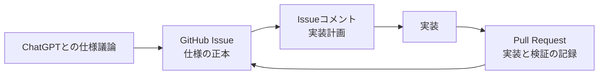
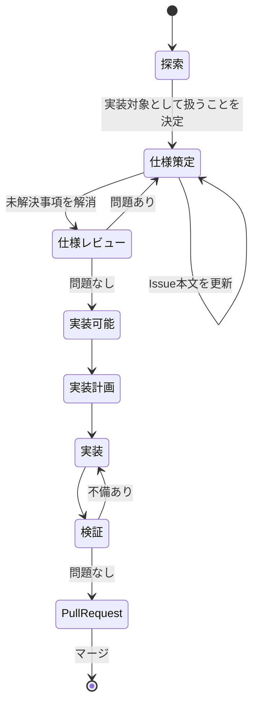

# Issue Driven Development

## 目的

Pantryでは、仕様策定と実装を異なるAIエージェントや人間が担当しても、情報が失われたり、会話履歴に依存したりしない開発プロセスを採用する。

そのため、GitHub Issueを中心に開発状態を管理する。

ChatGPTは主に仕様策定を担当し、Cursorなどの実装エージェントはGitHub Issueを入力として実装する。

会話ログ自体は引き渡さない。

## 基本原則

### Issue本文が仕様の正本

Issue本文には、現在有効な仕様だけを記述する。

Issue本文とコメントが矛盾する場合は、Issue本文を優先する。

コメントで仕様上の決定が行われた場合は、Issue本文へ反映する。

### Issueコメントは補助情報

Issueコメントには以下を記録する。

- 議論
- 調査結果
- 判断理由
- 実装計画
- ブロッカー
- 質問
- Pull Requestへのリンク

コメントだけに存在する内容を正式な仕様として扱わない。

### Pull Requestは実装記録

Pull Requestには、Issueを「どう実現したか」と「どう検証したか」を記録する。

Issue本文のコピーにはしない。

## 成果物の関係



## リポジトリ構成

```text
<project-root>/
├── .agents/
│   └── rules/
│       ├── issue-specification.md
│       └── issue-driven-development.md
├── .github/
│   ├── ISSUE_TEMPLATE/
│   │   ├── feature.md
│   │   ├── bug.md
│   │   ├── uiux.md
│   │   ├── chore.md
│   │   └── config.yml
│   └── PULL_REQUEST_TEMPLATE.md
├── docs/
│   ├── chatgpt-project-instructions.md
│   └── issue-driven-development.md
└── AGENTS.md
```

## 役割

### 人間

- 何を作るか、何を優先するかを決める
- 仕様上の最終判断を行う
- ChatGPTの指摘を採用するか判断する
- 実装計画やPull Requestを必要に応じてレビューする

### ChatGPT

- 要求を明確化する
- UI/UXや設計を批判的に検討する
- 暗黙の前提、矛盾、エッジケースを洗い出す
- Issueを作成・更新する
- 仕様確定前に批判的レビューを行う
- 仕様が実装可能になったら `spec:ready` にする
- 必要に応じてPull RequestをIssueと照合してレビューする

### 実装エージェント

- `spec:ready` のIssueを読む
- リポジトリを調査する
- 実装計画を作成する
- 実装計画をIssueコメントに記録する
- 実装する
- テスト・型チェック・Lint・ビルドなどを実行する
- Issueの受け入れ条件を検証する
- Pull Requestを作成する

## ラベル

### `spec:draft`

仕様策定中であることを示す。

この状態では原則として実装を開始しない。

### `spec:ready`

仕様レビューが完了し、実装計画を開始してよいことを示す。

実装開始済みや実装完了を意味しない。

### ラベルと作業状態は分離する

`spec:draft` / `spec:ready` は仕様の成熟度を表す。

Backlog、Ready、In Progress、Review、Doneなどの作業進行状態とは別概念として扱う。

## 開発フロー



## 1. 探索

アイデアや技術選定を自由に議論する。

この時点ではIssue作成を必須としない。

例:

- このUIは本当に必要か
- PopoverとBottom Sheetのどちらがよいか
- oRPCを導入する価値があるか

探索段階では、選択肢やトレードオフを広く検討してよい。

## 2. Issue作成

具体的な変更として実装対象にすることが決まったらIssueを作成する。

Issueの種類に応じてMarkdownテンプレートを選ぶ。

- 機能追加・仕様変更: `feature.md`
- バグ: `bug.md`
- UI/UX改善: `uiux.md`
- 内部作業: `chore.md`

仕様策定中は `spec:draft` を付ける。

Issue作成時点で仕様が完全である必要はない。

## 3. 仕様策定

ChatGPTとの会話で仕様を詰める。

重要な決定が行われたら、会話だけで終わらせずIssue本文を更新する。

Issue本文は変更履歴ではなく、現在有効な仕様のスナップショットとして維持する。

### Issue本文に置くもの

- 概要
- 背景
- 要件
- 受け入れ条件
- 対象外
- 制約
- エッジケース
- 未解決事項
- 参考資料

### Issue本文に原則として置かないもの

- 議論の時系列
- 却下した案
- 古い仕様
- 特定ファイルを変更する指示
- 特定関数やクラスを作る指示
- 単なる実装上の好み
- 実装タスク一覧

## 4. 仕様レビュー

仕様確定の意思が示されたら、直ちに `spec:ready` にせず、先に批判的レビューを行う。

最低限、以下を確認する。

- 要件同士に矛盾がない
- 要件と受け入れ条件が対応している
- 隠れた要件がない
- 対象外と要件が矛盾していない
- 暗黙の前提が残っていない
- 実装担当者が複数の合理的な解釈をできない
- 実装方法を不必要に固定していない
- 完了を客観的に判定できる
- 必要なパフォーマンス要件が抜けていない
- 必要なアクセシビリティ要件が抜けていない
- 必要なセキュリティ・互換性要件が抜けていない

問題があれば仕様策定へ戻る。

## 5. 実装可能状態

仕様レビューを通過したら以下を行う。

1. Issue本文を最新仕様へ整理する
2. 空になった不要セクションを削除する
3. `spec:draft` を削除する
4. `spec:ready` を付ける

この時点が、仕様策定担当から実装担当への正式な引き渡しとなる。

実装エージェントへの依頼は、原則として次の程度でよい。

```text
Issue #123 を実装してください。
```

会話履歴を追加で渡さない。

## 6. 実装計画

実装エージェントは、コード変更前に以下を行う。

1. Issue本文を読む
2. Issueコメントを補助情報として読む
3. `.agents/rules/issue-driven-development.md` を読む
4. リポジトリを調査する
5. 既存アーキテクチャ、抽象化、テスト、規約を把握する
6. 実装計画を作成する
7. 実装計画をIssueコメントへ記録する

実装計画は「How」であり、仕様ではない。

Issue本文を上書きしない。

## 7. 実装

実装計画に従って実装する。

実装中に仕様上の問題が判明した場合、独断で仕様を変更しない。

例:

- 要件同士が実際には両立しない
- 既存データとの互換性が保てない
- セキュリティ上危険
- 想定より大幅に複雑
- パフォーマンス要件を満たせない

この場合は実装を止め、Issue上で問題を報告する。

必要ならIssueを `spec:draft` へ戻し、仕様を再策定する。

## 8. 検証

実装完了後にIssue本文をもう一度読む。

以下を確認する。

- すべての要件を満たしている
- すべての受け入れ条件を検証した
- 制約を守っている
- エッジケースを扱っている
- 不要なスコープ拡大がない

リポジトリで必要な自動検証も実施する。

代表例:

```sh
pnpm run format:check
pnpm run lint
pnpm run typecheck
pnpm run test
pnpm run build
```

## 9. Pull Request

Pull Requestには対象Issueを記載する。

Issueを完全に解決する場合はClosing Keywordを使用する。

```text
Closes #123
```

Pull Requestには以下を記録する。

- 実装概要
- 主な実装上の判断
- 受け入れ条件の検証結果
- 自動検証結果
- Issue仕様との差異
- 必要な補足

Issue本文の受け入れ条件のチェックボックスを実装進捗管理として変更しない。

検証結果はPull Request側へ記録する。

## 仕様変更

### `spec:draft` 中

仕様上の決定があればIssue本文を直接最新状態へ更新する。

過去仕様を追記しない。

### `spec:ready` 後

実装前または実装中に仕様変更が必要になった場合は、変更の影響を評価する。

実装計画や受け入れ条件に影響する変更であれば、原則として次の手順を踏む。

1. `spec:ready` を外す
2. `spec:draft` を付ける
3. Issue本文を更新する
4. 仕様レビューをやり直す
5. 問題がなければ再び `spec:ready` にする
6. 実装計画を更新する

軽微な文章修正など、意味を変えない変更では再レビューを必須としない。

## アンチパターン

### 会話ログを実装エージェントへ渡す

避ける。

議論途中の古い案や矛盾した発言まで入力され、どれが現在仕様か不明になる。

### コメントを最新仕様として扱う

避ける。

最新コメントが正しいとは限らない。

現在仕様は常にIssue本文へ統合する。

### Issueに実装計画を書く

原則として避ける。

Issue本文はWhat / Why、実装計画はHowとして分離する。

実装計画はIssueコメントへ置く。

### 受け入れ条件を作業タスクにする

避ける。

悪い例:

```text
- [ ] コンポーネントを作る
- [ ] テストを書く
```

良い例:

```text
- [ ] キーボードだけでタグを追加・削除できる
- [ ] 320px幅でも選択済みタグが主要操作を妨げない
```

### Issueのチェックボックスを実装進捗に使う

避ける。

Issueの受け入れ条件は仕様表現であり、検証結果はPull Requestへ記録する。

## ChatGPTでの利用例

### 仕様策定を始める

```text
この変更をGitHub Issueとして仕様化したい。
実装方法を決める前に、要件・受け入れ条件・対象外・制約・エッジケースを詰めたい。
```

### 仕様をレビューする

```text
ここまでの仕様を批判的にレビューして。
実装担当が判断に迷う箇所、矛盾、暗黙の前提、検証不能な受け入れ条件を洗い出して。
```

### 仕様を確定する

```text
指摘事項を解消したので、Issue本文を最終状態へ更新して spec:ready にして。
```

## 実装エージェントでの利用例

```text
Issue #123 を実装してください。
```

追加の会話ログや仕様書を渡す必要はない。

## ルールの正本

仕様策定ルール:

```text
.agents/rules/issue-specification.md
```

実装ルール:

```text
.agents/rules/issue-driven-development.md
```

このドキュメントはプロセス全体を人間向けに説明する。

エージェントが従うべき規範的なルールは `.agents/rules/` を正本とする。
