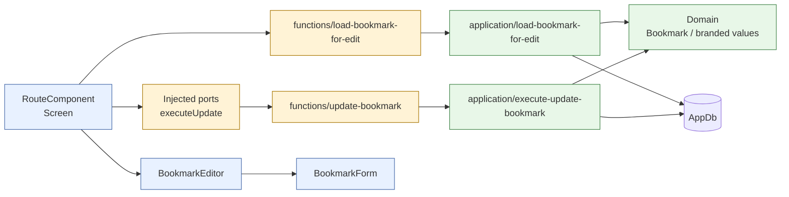
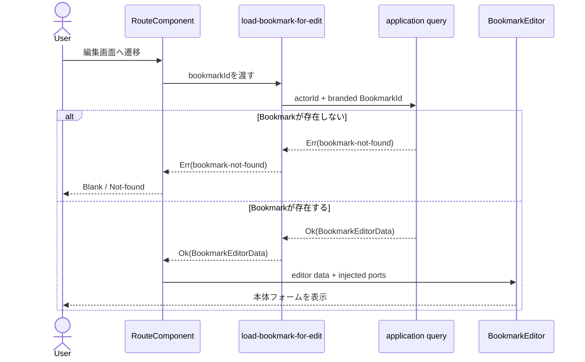
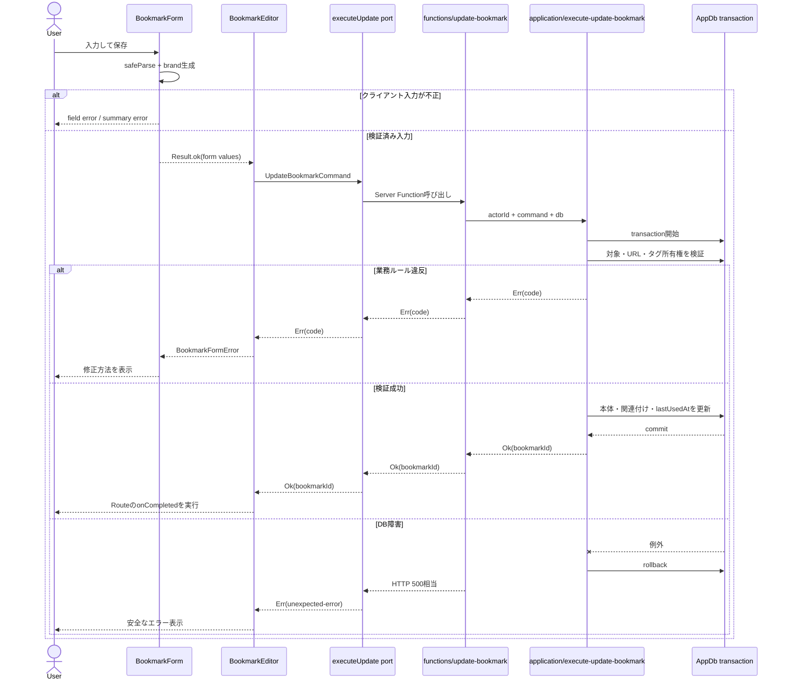
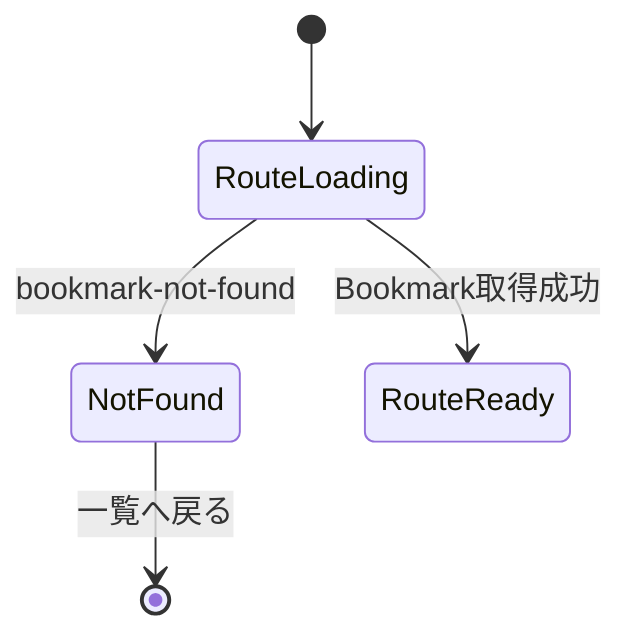
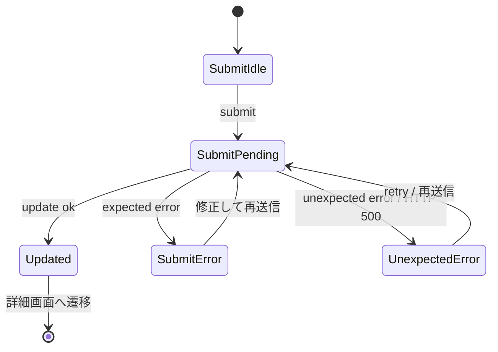

# ブックマーク編集画面 DDD 縦切り設計

## 目的

`src/routes/_protected/bookmarks/$id/edit.tsx`をScreenの境界として維持しながら、ブックマーク編集ユースケースをDomain・Application・Server Function・UIへ分離する。

この設計はBookmarks機能全体を一度にDDD化するものではない。編集画面で確立した境界、brand値、Result契約、Storybookテスト方針を、登録・詳細・削除などの画面へ段階的に展開できる形にする。

## 対象範囲

- ブックマーク編集画面の読み取りと更新
- `BookmarkEditor`、`BookmarkForm`の責務分離
- Domain値のbrand化
- Application Result契約
- Route StoryとStorybook `play`テストによるUI状態検証

対象外:

- Repository抽象化の導入
- Bookmarks機能全体の一括移行
- Vitest Browser Modeの導入
- 登録・詳細・削除画面の同時移行

## 基本方針

RouteComponentはScreenとして扱う。StorybookのRoute Storyはこのコンポーネントを起点に画面全体を検証する。

`BookmarkEditor`はScreenとは名乗らず、編集操作のオーケストレーターとする。`BookmarkForm`は入力フォームを担当する。

DomainとApplicationはRouterを知らない。UIコンポーネントはServer Function、Router、DBを直接importせず、必要な操作をcallbackまたはportとして注入する。

## レイヤー構成

```text
RouteComponent（Screen）
  -> functions/load-bookmark-for-edit.ts
      -> application/load-bookmark-for-edit.ts
          -> domain Bookmark / branded values

RouteComponent
  -> BookmarkEditor
      -> BookmarkForm

RouteComponent
  -> injected executeUpdate
      -> functions/update-bookmark.ts
          -> application/execute-update-bookmark.ts
               -> domain Bookmark
               -> transaction
```

### 依存関係



RouteからDomain・DBへ直接矢印を引かないことが、この図の重要な制約である。UIコンポーネントからServer Functionへ直接依存せず、注入されたportを通ることでStorybookのfakeへ差し替えられる。

## 命名規則

- `load`: 画面用データを組み立てる読み取り処理
- `get`: 単一リソースを取得するApplication query
- `list`: コレクションを取得するApplication query
- `fetch`: 外部HTTPリソースを取得する処理

編集画面では`loadBookmarkForEdit`を使う。外部ページのタイトル取得は`fetchPageTitle`とする。

## 読み取りフロー

Route loaderはブックマーク編集データをawaitし、成功した編集データを画面へ渡す。

```text
1. loadBookmarkForEditをawaitする
2. not-foundならRouteがBlank/Not-foundを表示する
3. 成功ならBookmarkEditorへ編集データを渡す
4. BookmarkEditorはフォームを表示する
```



`loadBookmarkForEdit`は編集画面に必要な次のDTOを返す。

```ts
type BookmarkEditorData = {
  readonly bookmarkId: BookmarkId
  readonly url: BookmarkUrl
  readonly title: BookmarkTitle
  readonly note: BookmarkNote
  readonly tagIds: readonly TagId[]
}
```

DB行の`userId`、日時、`deletedAt`などはUI DTOへ含めない。

タグ設定UIを持たないため、編集フォームは既存の`tagIds`を変更せずに更新Commandへ渡す。

## Domain値とbrand

```text
src/shared/domain/result.ts
src/features/auth/domain/auth-values.ts
src/features/bookmarks/domain/bookmark-values.ts
src/features/tags/domain/tag-values.ts
```

`UserId`はAuth Contextが所有する。`BookmarkId`、`BookmarkUrl`、`BookmarkTitle`、`BookmarkNote`はBookmarks Contextが所有し、`TagId`と`TagName`はTags Contextが所有する。

brand付き値はValibotのschemaを`v.safeParse`した出力だけから生成する。`as BookmarkId`などの型アサーションや、未検証値の直接brand化は行わない。

検証規則:

- `BookmarkId`: UUID v7
- `BookmarkUrl`: `http`または`https`の有効URL。canonicalizationは行わない
- `BookmarkTitle`: trim後に空でない。前後空白は保持する
- `BookmarkNote`: 空文字・空白だけを`null`へ正規化する
- `TagId`: 正の整数
- `TagName`: trim、小文字化、空文字拒否、32文字以内
- `UserId`: Auth Contextが発行したユーザーID

未検証のRoute params、フォーム値、Server Function入力、DB行は、Domain/Applicationへ入る前にbrand付き値へ変換する。

## 集約境界

BookmarkはタグIDの関連付けを含む集約ルートとする。Tagオブジェクト全体はBookmark集約へ内包しない。

Bookmarkが守るルール:

- URL、タイトル、メモは対応するbrand値である
- タグIDは重複しない集合である
- タグなしは許可する
- タグIDの存在や所有者は判断しない

Tagの存在・所有者確認は、認証済み`UserId`を持つApplication層が行う。

## 更新フロー

Applicationの契約:

```ts
type UpdateBookmarkCommand = {
  readonly bookmarkId: BookmarkId
  readonly url: BookmarkUrl
  readonly title: BookmarkTitle
  readonly note: BookmarkNote
  readonly tagIds: readonly TagId[]
}

type UpdateBookmarkResult = Result<{ readonly bookmarkId: BookmarkId }, UpdateBookmarkError>
```

Applicationへは`AppDb`と`UserId`を明示的に注入する。Application層はRouterやセッションAPIを直接呼ばない。

処理順:

1. `UserId`条件付きで対象Bookmarkを取得する
2. 不在またはソフトデリート済みなら`bookmark-not-found`
3. 自分自身以外の同一URLを確認する
4. 重複があれば`duplicate-url`
5. タグID重複をDomain規則で拒否する
6. 全タグIDが同じユーザーのものか確認する
7. 不在・所有者不一致があれば`invalid-tag`
8. Bookmark本体、タグ関連付け、`lastUsedAt`を一つのtransactionで更新する
9. `{ bookmarkId }`を返す

対象取得、重複確認、タグ所有確認、書き込みは同一transactionに含める。

DBの書き込み失敗はrollbackのためにtransaction境界で一時的にthrowし、外側でResultへ変換する。この例外は業務エラーの制御フローではなく、DB rollback adapterである。この理由をApplication層の日本語コメントに残す。

DB一意制約の競合も`duplicate-url`へ変換する。



## Resultとエラー

共有Resultは次の形にする。

```ts
type Result<T, E> =
  { readonly ok: true; readonly value: T } | { readonly ok: false; readonly error: E }
```

`src/shared/domain/result.ts`には`ok`と`err`だけを置く。`map`、`match`、`andThen`などは導入しない。

エラーunionはユースケース単位で定義する。Bookmarks全体の巨大なエラーunionは作らない。

```ts
type InvalidTagCause =
  | { readonly code: 'tag-not-found'; readonly tagId: TagId }
  | { readonly code: 'tag-not-owned'; readonly tagId: TagId }

type UpdateBookmarkError =
  | { readonly code: 'bookmark-not-found' }
  | { readonly code: 'duplicate-url' }
  | { readonly code: 'invalid-title'; readonly field: 'title' }
  | { readonly code: 'invalid-url'; readonly field: 'url' }
  | {
      readonly code: 'duplicate-tag-id'
      readonly field: 'tags'
      readonly tagId: TagId
    }
  | {
      readonly code: 'invalid-tag'
      readonly field: 'tags'
      readonly cause: InvalidTagCause
    }
  | { readonly code: 'unexpected-error' }
```

期待される業務エラーはシリアライズ可能なResultデータで表す。予期しないDBエラーは`@praha/error-factory`でcauseを保持し、サーバーログと診断にだけ使う。

Application内部では`unexpected-error`もResultとして扱う。Server Function境界では、既知の業務エラーはResultとして返し、`unexpected-error`は安全な情報へ変換した上でHTTP 500相当として扱う。クライアントへ内部Errorやcauseは返さない。

## UIコンポーネント契約

`RouteComponent`はScreenとして、Route params、search、loader、not-found、Route固有のリンク、navigationを担当する。

`BookmarkEditor`は次の依存を注入で受け取る。

```ts
type BookmarkEditorProps = {
  readonly initialData: BookmarkEditorData
  readonly executeUpdate: ExecuteUpdateBookmark
  readonly onCompleted: (bookmarkId: BookmarkId) => Promise<void>
}
```

`BookmarkEditor`は更新Resultの表示用変換と成功後callbackを担当する。Server Function、Router、DBは直接importしない。

`BookmarkForm`は未検証の入力値を管理し、submit時に`v.safeParse`を行う。検証成功後のbrand値を`BookmarkEditor`へ渡し、`BookmarkFormError`だけを表示する。`UpdateBookmarkError`は知らない。

## The five UI states

編集画面と送信処理で状態を明示的に設計する。

- Ideal: Bookmarkが取得済みで、エラーがない
- Blank: Bookmarkが存在しない
- Loading: 初期Bookmark取得中、更新中
- Error: 通信障害、更新失敗、予期しない読み取り失敗

`BookmarkIsNotFound`はサーバー障害ではなくBlank/Not-found stateとして扱う。

### 状態遷移

この画面はRouteと送信処理という独立した状態を持つ。これらを一つの巨大な状態機械へ統合しない。状態遷移図は状態の洗い出しとStoryの網羅性を確認するために使う。

#### Route状態



#### 送信状態



現時点ではXStateなどのステートマシンライブラリを導入しない。独立した状態が増え、競合・キャンセル・再利用される遷移の不具合が実際に現れた時点で再評価する。

## Storybookとテスト

UIブラウザテストの正本はStorybookのStoryと`play`関数にする。Vitest Browser Modeは追加しない。

Route Story:

- `Default`
- `InitialLoading`
- `BookmarkIsNotFound`
- `UpdateHasDuplicateUrl`
- `UpdateHasUnexpectedError`

Component Story:

- `BookmarkEditor`: 更新Result分岐、既存タグIDの保持
- `BookmarkForm`: 入力、field error、summary error、pending

通常のVitestでは、brand schema、Result、Domain規則、Application transaction、DB統合を検証する。

## 将来のReact非同期処理

今後の画面改修では、Reactの非同期プリミティブを、処理の意味とUXに合わせて積極的に採用する。すべての処理へ機械的に導入するのではなく、Promiseの境界、緊急度、再描画コストを確認して選択する。

- `use`とSuspense: Routeから渡された遅延Promiseや、コンポーネント境界で読み取る非同期データに使う。
- `useTransition`: 検索結果の更新、保存後の画面更新など、入力や現在の操作をブロックしない非緊急更新に使う。
- `useDeferredValue`: 検索結果の絞り込みなど、入力値をすぐ反映しつつ重い表示更新だけを遅延させる場合に使う。データ取得そのものの代替にはしない。
- `useEffectEvent`: Effect内から最新のイベント処理や依存値を参照する必要がある場合に使う。Effectの依存関係を隠す目的では使わない。

これらの採用理由とLoading stateの対応を、該当コンポーネントの日本語コメントとStorybook Storyで確認できるようにする。非同期Hookの導入によってResultのエラー契約、入力状態、アクセシビリティ、Storybookでの再現性を損なわないことを条件とする。

## コメントによる設計記録

次の箇所に、日本語で設計理由を短く記録する。

- `src/routes/_protected/bookmarks/$id/edit.tsx`: RouteComponentがScreenおよびStorybookのRoute Story起点である理由
- `src/features/bookmarks/components/bookmark-editor/index.tsx`: Server FunctionとRouterを直接importせず依存注入する理由
- `src/features/bookmarks/application/execute-update-bookmark.ts`: transaction、Result、rollback adapterの関係
- `src/shared/domain/result.ts`: 共有Resultを最小APIにする理由

コメントは実装手順ではなく、将来の画面へ同じ境界を適用するための設計理由だけを記述する。全体のテスト方針は`docs/testing.md`へ追記する。
