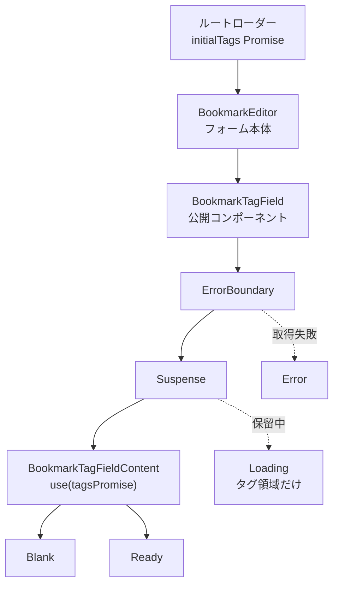
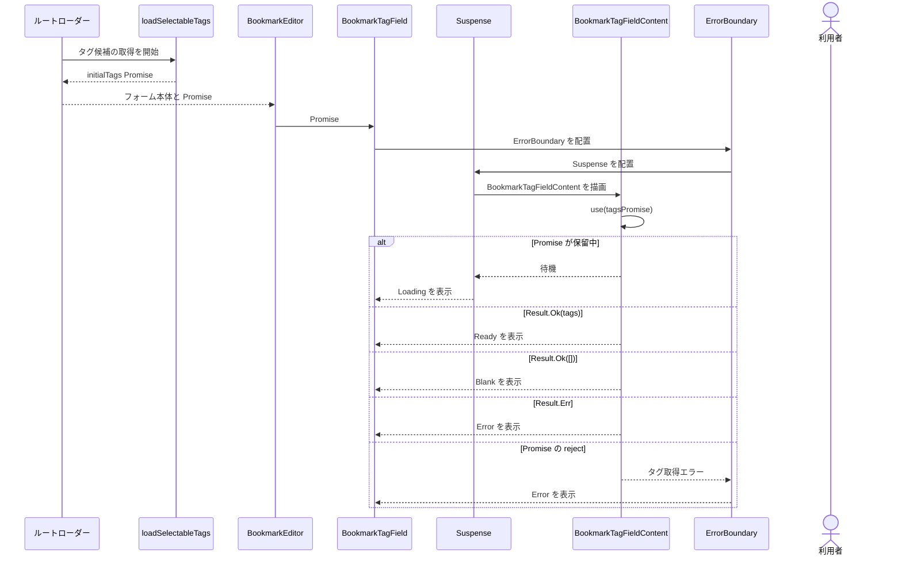

# BookmarkTagField の Suspense 設計

## 目的

現在の `BookmarkEditor` は、タグ候補の読み込み状態を `useEffect` と `useState` で管理している。

この状態管理を、`Suspense`、`ErrorBoundary`、`use()` を使う構成へ置き換える。

ブックマークのフォーム本体はタグ候補の読み込みを待たずに表示する。

読み込み中または読み込み失敗時に置き換わるのは、タグ領域だけとする。

## 目標

- `BookmarkTagField` を、利用側から直接使える React コンポーネントにする。
- タグ候補の Promise が保留中のときは `Suspense` でタグ領域だけを待機させる。
- タグ候補の取得失敗は `ErrorBoundary` で表示する。
- アプリケーション層と Server Function の境界では、既存の `Result` 型を使い続ける。
- ブックマークフォームのエラーとタグ領域のエラーを分離する。
- 既存のタグ作成、タグ選択、更新エラーの動作を維持する。

## 対象外

- タグ候補の取得に `useActionState` を導入しない。
- タグ作成 Action やブックマーク保存 Action の設計は変更しない。
- ルートローダーがフォーム本体を先に表示する設計は変更しない。
- タグフィールドの見た目は変更しない。
- この画面に TanStack Query を導入しない。

## コンポーネント構成

`BookmarkTagField` が公開コンポーネントとなり、非同期処理の境界を所有する。

```text
BookmarkTagField
|- ErrorBoundary
|  `- Suspense
|     `- BookmarkTagFieldContent
|        `- Blank または Ready
```



### BookmarkTagField

`BookmarkTagField` は、利用側が使う公開コンポーネントである。

- 初回のタグ候補 Promise を受け取る。
- `ErrorBoundary` と `Suspense` を配置する。
- `Suspense` の fallback として既存の `Loading` を表示する。
- `ErrorBoundary` の fallback として既存の `Error` を表示する。
- 読み込み中と読み込み失敗時の両方で、タグ更新エラーを表示できるようにする。

### BookmarkTagFieldContent

`BookmarkTagFieldContent` は、タグ候補 Promise を読む内部コンポーネントである。

- `use()` でタグ候補 Promise を読む。
- `Result.Err` なら既存の Error 表示を返す。
- タグ候補が空なら `Blank` を表示する。
- タグ候補が存在すれば `Ready` を表示する。
- タグ作成後の候補リスト更新を管理する。
- 公開 API には含めない。

### 表示コンポーネント

`Loading`、`Error`、`Blank`、`Ready` は表示だけを担当する。

これらのコンポーネントは、タグ候補の読み込み状態を管理しない。

## 公開 API

`BookmarkEditor` は、タグの状態に応じて表示コンポーネントを選ぶのではなく、`BookmarkTagField` を一つだけ表示する。

```tsx
<BookmarkTagField
  initialTags={initialTags}
  selectedTagIds={selectedTagIds}
  onSelectedTagIdsChange={setSelectedTagIds}
  onCreateTag={onCreateTag}
  serverError={editorError?.tags ?? null}
  onClearServerError={clearTagsError}
/>
```

公開 Props には、既存の選択、タグ作成、更新エラー用の Props に加えて、次を追加する。

- `initialTags: Promise<SelectableTagsResult>`：初回に読み込むタグ候補。

現在の `BookmarkTagField.Loading`、`BookmarkTagField.Error`、`BookmarkTagField.Blank`、`BookmarkTagField.Ready` という名前空間オブジェクトは廃止する。

公開 API は `BookmarkTagField` コンポーネントそのものとする。

## データの流れとエラー処理



1. ルートローダーは `loadSelectableTags()` を開始するが、完了を待たずにフォームのデータを返す。
2. ルートはタグ候補 Promise を `BookmarkEditor` に渡す。
3. `BookmarkEditor` は Promise を `BookmarkTagField` に渡す。
4. `BookmarkTagFieldContent` は `use(tagsPromise)` で Promise を読む。
5. Promise が保留中なら、タグ領域だけが `Suspense` の fallback になる。
6. `Result.Ok` なら、タグ候補の件数に応じて `Blank` または `Ready` を表示する。
7. `Result.Err` になった場合は、タグ候補の取得エラーを表示する。
8. Promise が reject した場合は、`ErrorBoundary` が同じタグ候補取得エラーを表示する。

利用者には、例外オブジェクトのメッセージをそのまま表示しない。

SSR では `ErrorBoundary` が描画中の例外を捕捉できないため、`Result.Err` を直接 `Error` 表示へ変換する。

これにより、タグ候補の取得に失敗しても、フォーム本体の SSR は継続する。

アプリケーション層の `Result` 契約は変更しない。

`Result.Err` は例外へ変換せず、`BookmarkTagFieldContent` が表示へ変換する。

タグ候補の取得は、`use()` が読むリソースである。

## タグ作成後の動作

`BookmarkTagFieldContent` は、画面に表示するタグ候補の一覧を管理する。

- タグ作成に成功したら、同じ ID のタグがない場合だけ候補一覧へ追加する。
- 作成したタグが未選択なら、`onSelectedTagIdsChange` で選択済みタグへ追加する。
- 検索入力を空にする。
- 初期候補が空だった場合は、作成したタグを選択した状態で `Blank` から `Ready` へ切り替える。

選択済みタグ ID はブックマーク更新コマンドに含まれるため、引き続き `BookmarkEditor` が所有する。

画面に表示する候補一覧だけを `BookmarkTagField` が所有する。

## BookmarkEditor から削除する責務

`BookmarkEditor` から、タグ候補の読み込みを管理する次のコードを削除する。

- `TagsViewState`
- `tagsState`
- `resolveTagsState`
- `loadTagsState`
- `latestTagsRequest`
- タグ読み込み用の `useEffect`
- タグ読み込み用の `useTransition`
- `handleTagCreated`

選択済みタグ ID、ブックマーク更新処理、更新エラーの所有、フォーム送信処理は維持する。

## 検証項目

UI の検証には、既存方針どおり Storybook の `play` 関数を使う。

次の動作を確認する。

- タグ候補の初回読み込み中もフォーム本体を操作でき、タグ領域だけが待機する。
- タグ候補を取得できた場合に `Ready` が表示される。
- タグ候補が空の場合に `Blank` が表示される。
- `Result.Err` の場合にタグ領域の Error 表示が表示される。
- `Blank` でタグを作成すると、新しい候補が追加されて選択される。
- `Ready` でタグを作成すると、新しい候補が追加されて選択される。
- タグ領域の更新エラーが表示され、タグ操作で消える。
- URL やタイトルを変更しても、タグ領域の更新エラーは消えない。

`recoverSelectableTagsPromise` のアプリケーションテストは維持する。

Promise を正規化する処理をアプリケーション層へ切り出す場合だけ、その処理に対する小さなテストを追加する。

実装後は、次のコマンドを実行する。

```sh
pnpm run format:check
pnpm run lint
pnpm run typecheck
pnpm run test
pnpm run build
```

## 変更するファイル

- `src/features/bookmarks/components/bookmark-editor/bookmark-tag-field/index.tsx`：公開コンポーネント、非同期境界、成功状態の分岐。
- `src/features/bookmarks/components/bookmark-editor/bookmark-tag-field/views.tsx`：表示コンポーネントの整理。
- `src/features/bookmarks/components/bookmark-editor/bookmark-tag-field/types.ts`：公開 Props の定義。
- `src/features/bookmarks/components/bookmark-editor/bookmark-tag-field/index.stories.tsx`：タグフィールド単体の Storybook 検証。
- `src/features/bookmarks/components/bookmark-editor/index.tsx`：手動のタグ読み込み状態管理の削除。
- `src/features/bookmarks/components/bookmark-editor/index.stories.tsx`：ブックマーク編集画面の Storybook 検証の更新。

ルートとアプリケーション層の読み込み契約は変更しない。
