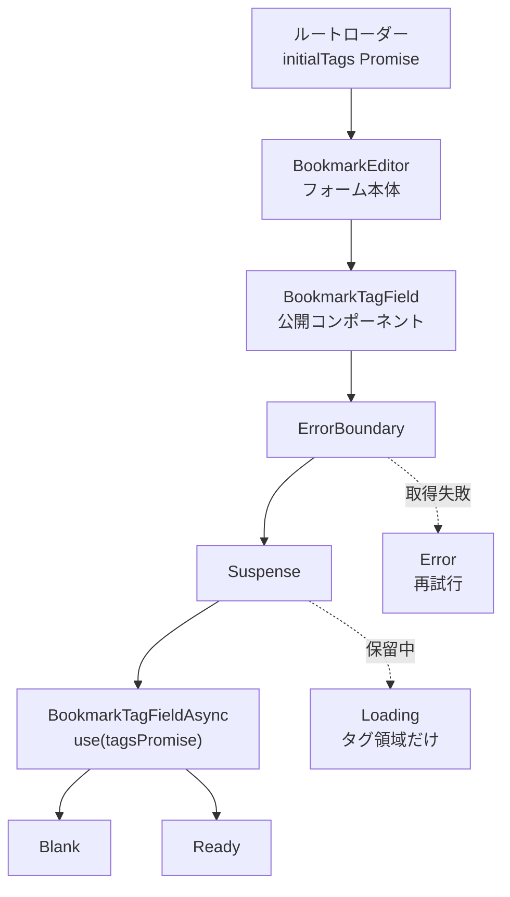
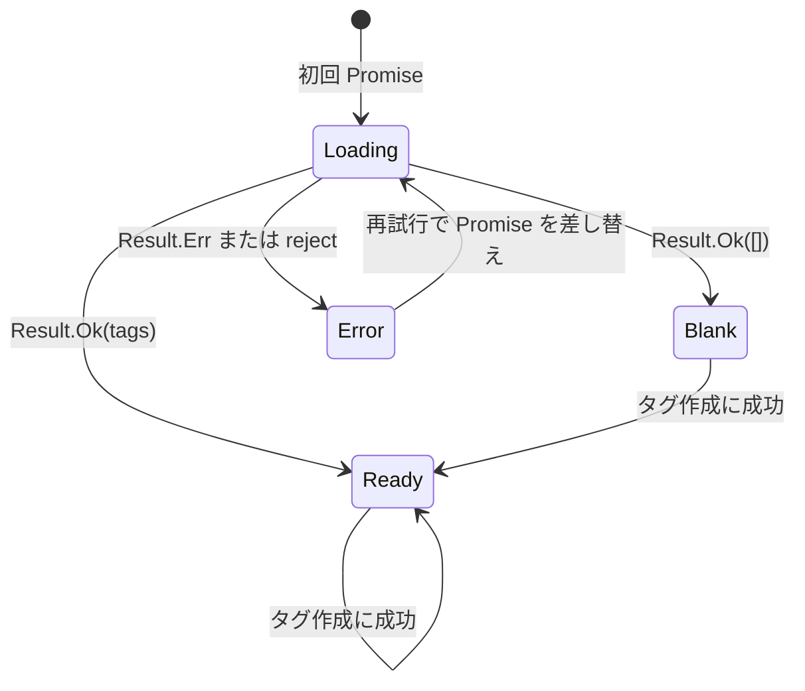

# BookmarkTagField の Suspense 設計

## 目的

現在の `BookmarkEditor` は、タグ候補の読み込み状態を `useEffect` と `useState` で管理している。

この状態管理を、`Suspense`、`ErrorBoundary`、`use()` を使う構成へ置き換える。

ブックマークのフォーム本体はタグ候補の読み込みを待たずに表示する。

読み込み中または読み込み失敗時に置き換わるのは、タグ領域だけとする。

## 目標

- `BookmarkTagField` を、利用側から直接使える React コンポーネントにする。
- タグ候補の Promise が保留中のときは `Suspense` でタグ領域だけを待機させる。
- タグ候補の取得失敗は `ErrorBoundary` で表示する。
- アプリケーション層と Server Function の境界では、既存の `Result` 型を使い続ける。
- 再試行では、親の読み込み状態を作り直さず、新しいタグ候補 Promise に差し替える。
- ブックマークフォームのエラーとタグ領域のエラーを分離する。
- 既存のタグ作成、タグ選択、更新エラーの動作を維持する。

## 対象外

- タグ候補の取得に `useActionState` を導入しない。
- タグ作成 Action やブックマーク保存 Action の設計は変更しない。
- ルートローダーがフォーム本体を先に表示する設計は変更しない。
- タグフィールドの見た目は変更しない。
- この画面に TanStack Query を導入しない。

## コンポーネント構成

`BookmarkTagField` が公開コンポーネントとなり、非同期処理の境界を所有する。

```text
BookmarkTagField
|- ErrorBoundary
|  `- Suspense
|     `- BookmarkTagFieldAsync
|        `- Blank または Ready
```



### BookmarkTagField

`BookmarkTagField` は、利用側が使う公開コンポーネントである。

- 初回のタグ候補 Promise と、再読み込み用の関数を受け取る。
- 現在の再試行用リソースだけを保持する。
- 再試行時には、新しい Promise へ差し替える。
- `initialTags` の Promise が差し替わった場合は、新しい Promise を使用する。
- 古い Promise に対する再試行が、新しい初期データを上書きしないようにする。
- `ErrorBoundary` と `Suspense` を配置する。
- `Suspense` の fallback として既存の `Loading` を表示する。
- `ErrorBoundary` の fallback として既存の `Error` を表示する。
- 読み込み中と読み込み失敗時の両方で、タグ更新エラーを表示できるようにする。

### BookmarkTagFieldAsync

`BookmarkTagFieldAsync` は、タグ候補 Promise を読む内部コンポーネントである。

- `use()` でタグ候補 Promise を読む。
- `Result.Err` をタグ候補の取得エラーへ変換して throw する。
- タグ候補が空なら `Blank` を表示する。
- タグ候補が存在すれば `Ready` を表示する。
- タグ作成後の候補リスト更新を管理する。
- 公開 API には含めない。

### 表示コンポーネント

`Loading`、`Error`、`Blank`、`Ready` は表示だけを担当する。

これらのコンポーネントは、タグ候補の読み込み状態を管理しない。

## 公開 API

`BookmarkEditor` は、タグの状態に応じて表示コンポーネントを選ぶのではなく、`BookmarkTagField` を一つだけ表示する。

```tsx
<BookmarkTagField
  initialTags={initialTags}
  onLoadSelectableTags={onLoadSelectableTags}
  selectedTagIds={selectedTagIds}
  onSelectedTagIdsChange={setSelectedTagIds}
  onCreateTag={onCreateTag}
  serverError={editorError?.tags ?? null}
  onClearServerError={clearTagsError}
/>
```

公開 Props には、既存の選択、タグ作成、更新エラー用の Props に加えて、次の二つを追加する。

- `initialTags: Promise<SelectableTagsResult>`：初回に読み込むタグ候補。
- `onLoadSelectableTags: LoadSelectableTags`：再試行時にタグ候補を読み込む関数。

現在の `BookmarkTagField.Loading`、`BookmarkTagField.Error`、`BookmarkTagField.Blank`、`BookmarkTagField.Ready` という名前空間オブジェクトは廃止する。

公開 API は `BookmarkTagField` コンポーネントそのものとする。

## データの流れとエラー処理

1. ルートローダーは `loadSelectableTags()` を開始するが、完了を待たずにフォームのデータを返す。
2. ルートはタグ候補 Promise を `BookmarkEditor` に渡す。
3. `BookmarkEditor` は Promise と再読み込み関数を `BookmarkTagField` に渡す。
4. `BookmarkTagFieldAsync` は `use(tagsPromise)` で Promise を読む。
5. Promise が保留中なら、タグ領域だけが `Suspense` の fallback になる。
6. `Result.Ok` なら、タグ候補の件数に応じて `Blank` または `Ready` を表示する。
7. `Result.Err` なら、タグ候補の取得エラーを throw する。
8. Promise が reject した場合も、同じタグ候補取得エラーとして扱う。
9. `ErrorBoundary` は `タグ候補の取得に失敗しました` と再試行ボタンを表示する。

利用者には、例外オブジェクトのメッセージをそのまま表示しない。

アプリケーション層の `Result` 契約は変更しない。

`Result.Err` を throw する処理は、`BookmarkTagFieldAsync` の表示境界にだけ置く。

## 再試行の動作

再試行ボタンは、`useActionState` の Action ではなく、タグ候補リソースを差し替えるイベントとして扱う。



1. `onLoadSelectableTags()` を呼び出して、新しい Promise を作る。
2. 同期的な throw と Promise の reject を、既存のタグ読み込みエラー契約へ正規化する。
3. `BookmarkTagField` が保持する Promise を新しいものへ差し替える。
4. `ErrorBoundary` をリセットする。
5. 新しい Promise が保留中の間は、タグ領域だけに `Loading` を表示する。
6. Promise の結果に応じて `Blank`、`Ready`、または `Error` を表示する。

再試行によって、ブックマークフォーム、選択済みタグ ID、タグ領域以外の更新エラーはリセットしない。

タグ候補の取得は、`use()` が読むリソースである。

`useActionState` を使うと、初回読み込みの Suspense と再試行の Action state が別々の状態管理になる。

その構成では、タグ候補の読み込み状態を手動で再び管理することになるため、今回の設計では採用しない。

`useActionState` は、将来タグ作成やブックマーク保存のような更新処理を整理するときの候補として残す。

## タグ作成後の動作

`BookmarkTagFieldAsync` は、画面に表示するタグ候補の一覧を管理する。

- タグ作成に成功したら、同じ ID のタグがない場合だけ候補一覧へ追加する。
- 作成したタグが未選択なら、`onSelectedTagIdsChange` で選択済みタグへ追加する。
- 検索入力を空にする。
- 初期候補が空だった場合は、作成したタグを選択した状態で `Blank` から `Ready` へ切り替える。

選択済みタグ ID はブックマーク更新コマンドに含まれるため、引き続き `BookmarkEditor` が所有する。

画面に表示する候補一覧だけを `BookmarkTagField` が所有する。

## BookmarkEditor から削除する責務

`BookmarkEditor` から、タグ候補の読み込みを管理する次のコードを削除する。

- `TagsViewState`
- `tagsState`
- `resolveTagsState`
- `loadTagsState`
- `latestTagsRequest`
- タグ読み込み用の `useEffect`
- タグ読み込み用の `useTransition`
- `handleTagCreated`

選択済みタグ ID、ブックマーク更新処理、更新エラーの所有、フォーム送信処理は維持する。

## 検証項目

UI の検証には、既存方針どおり Storybook の `play` 関数を使う。

次の動作を確認する。

- タグ候補の初回読み込み中もフォーム本体を操作でき、タグ領域だけが待機する。
- タグ候補を取得できた場合に `Ready` が表示される。
- タグ候補が空の場合に `Blank` が表示される。
- `Result.Err` の場合に `ErrorBoundary` の fallback が表示される。
- Promise が reject した場合も同じ fallback が表示され、内部エラーの内容が表示されない。
- 再試行によって Promise が差し替わり、成功後に `Ready` が表示される。
- 再試行も失敗した場合に、再び `ErrorBoundary` の fallback が表示される。
- `Blank` でタグを作成すると、新しい候補が追加されて選択される。
- `Ready` でタグを作成すると、新しい候補が追加されて選択される。
- タグ領域の更新エラーが表示され、タグ操作で消える。
- URL やタイトルを変更しても、タグ領域の更新エラーは消えない。
- 新しい `initialTags` が届いた場合に、古い再試行 Promise の結果が新しい候補を上書きしない。

`recoverSelectableTagsPromise` のアプリケーションテストは維持する。

Promise を正規化する処理をアプリケーション層へ切り出す場合だけ、その処理に対する小さなテストを追加する。

実装後は、次のコマンドを実行する。

```sh
pnpm run format:check
pnpm run lint
pnpm run typecheck
pnpm run test
pnpm run build
```

## 変更するファイル

- `src/features/bookmarks/components/bookmark-editor/bookmark-tag-field/index.tsx`：公開コンポーネントと非同期境界。
- `src/features/bookmarks/components/bookmark-editor/bookmark-tag-field/async.tsx`：`use()` による Promise の読み込みと成功状態の分岐。
- `src/features/bookmarks/components/bookmark-editor/bookmark-tag-field/views.tsx`：表示コンポーネントの整理。
- `src/features/bookmarks/components/bookmark-editor/bookmark-tag-field/types.ts`：公開 Props の定義。
- `src/features/bookmarks/components/bookmark-editor/bookmark-tag-field/index.stories.tsx`：タグフィールド単体の Storybook 検証。
- `src/features/bookmarks/components/bookmark-editor/index.tsx`：手動のタグ読み込み状態管理の削除。
- `src/features/bookmarks/components/bookmark-editor/index.stories.tsx`：ブックマーク編集画面の Storybook 検証の更新。

ルートとアプリケーション層の読み込み契約は変更しない。

実装中に Promise の reject を安全に扱うための具体的な修正が必要になった場合だけ、関連する読み込み処理を変更する。
