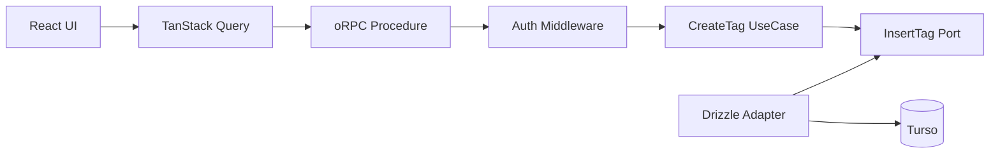

# CreateTag pilot アーキテクチャ RFC

## Status

Draft。

この RFC は Pantry 全体の最終アーキテクチャを定義しない。

**CreateTag を代表ユースケースとして、認証済みの単純 Command に対する新しい実装形を pilot する。**

pilot 完了後に `Adopt / Modify / Reject` を判断する。

---

## Goal

現在の CreateTag は TanStack Start Server Function の中に、認証・DB 操作・重複判定・エラー変換が集まっている。

この pilot では次を検証する。

- oRPC を型付き RPC 境界として使う価値があるか
- TanStack Query を browser 側の mutation 経路として使う価値があるか
- Application / UseCase を transport から分離するとテストしやすくなるか
- Expected Error を既存 `Result` で表現すると責務が明確になるか
- Application から Drizzle を narrow function port で分離する価値があるか
- その代わりに増える実装量・bundle・latency が許容できるか

---

## Non-goals

この RFC では次を決めない。

- Pantry 全体の最終レイヤリング
- UpdateBookmark など transaction を伴う workflow の設計
- read query 全体の設計
- 外部 HTTP / Gateway の設計
- Better Auth endpoint の再設計
- 全 Server Function の migration 計画
- Hono 導入
- 汎用 Repository / UnitOfWork の設計

これらは pilot が成功し、実際に該当ユースケースを移行するときに改めて設計する。

---

## Decision

CreateTag pilot は次の形にする。



責務は次のように分ける。

| 層 | 責務 |
| --- | --- |
| UI / TanStack Query | submit、loading、表示用エラー、cache 更新 |
| oRPC | input validation、認証境界、HTTP/RPC error への変換 |
| Application | CreateTag の expected outcome を `Result` で表現 |
| Port | UseCase が必要とする永続化能力だけを定義 |
| Drizzle Adapter | SQL、unique constraint の解釈、Turso へのアクセス |

Application は oRPC、HTTP status、Cookie、Drizzle、Turso、React を知らない。

---

## Error model

失敗を3種類に分ける。

| 種類 | 例 | 扱い |
| --- | --- | --- |
| Application Expected Error | 同名タグが既に存在 | `Result.err` |
| Boundary Rejection | 未認証、input 不正 | oRPC error |
| Unexpected Error | DB 障害、未知の例外 | `throw` |

CreateTag の Expected Error は現時点では1つだけにする。

```ts
export type CreateTagError = {
  readonly code: 'tag-name-already-exists'
}
```

既存の `Result` をそのまま使う。

```ts
export type Result<T, E> =
  | { readonly ok: true; readonly value: T }
  | { readonly ok: false; readonly error: E }
```

`unexpected-error` を `Result` に入れない。未知の失敗は throw し、transport 境界で 500 として扱う。

---

## Application boundary

### Port

汎用 `TagRepository` は作らず、CreateTag が必要とする能力だけを定義する。

```ts
export type InsertTagInput = {
  readonly actorId: UserId
  readonly name: TagName
  readonly pinned?: boolean
  readonly sortOrder?: number
  readonly color?: string | null
}

export type InsertTagOutcome =
  | {
      readonly kind: 'created'
      readonly tag: {
        readonly id: TagId
        readonly name: string
        readonly pinned: boolean
        readonly sortOrder: number
        readonly color: string | null
      }
    }
  | { readonly kind: 'name-conflict' }

export type InsertTag = (
  input: InsertTagInput
) => Promise<InsertTagOutcome>
```

### UseCase

```ts
export type CreateTagCommand = Omit<InsertTagInput, 'actorId'>

export type CreateTagResult = Result<
  {
    readonly id: TagId
    readonly name: string
    readonly pinned: boolean
    readonly sortOrder: number
    readonly color: string | null
  },
  CreateTagError
>

export function createCreateTagUseCase(insertTag: InsertTag) {
  return async (params: {
    readonly actorId: UserId
    readonly command: CreateTagCommand
  }): Promise<CreateTagResult> => {
    const outcome = await insertTag({
      actorId: params.actorId,
      ...params.command
    })

    if (outcome.kind === 'name-conflict') {
      return err({ code: 'tag-name-already-exists' })
    }

    return ok(outcome.tag)
  }
}
```

UseCase が薄いことは許容する。

この pilot で確認したいのは「層を増やせるか」ではなく、**Drizzle から切り離した unit test の価値が追加ファイル数に見合うか**である。

---

## Persistence

`tags` table には `(userId, normalizedName)` の unique constraint がある。

CreateTag では事前の duplicate `SELECT` を削除し、DB constraint を重複判定の正本にする。

```text
現在
SELECT duplicate
INSERT

pilot
INSERT
```

事前 `SELECT` は race condition を防げず、正常系の DB round trip を1回増やすためである。

Adapter は known unique violation だけを `name-conflict` へ変換する。

```ts
export function createDrizzleInsertTag(db: AppDb): InsertTag {
  return async (input) => {
    try {
      const [created] = await db
        .insert(tagsTable)
        .values({
          userId: input.actorId,
          name: input.name.display,
          normalizedName: input.name.normalized,
          ...(input.pinned !== undefined ? { pinned: input.pinned } : {}),
          ...(input.sortOrder !== undefined ? { sortOrder: input.sortOrder } : {}),
          ...(input.color !== undefined ? { color: input.color } : {})
        })
        .returning({
          id: tagsTable.id,
          name: tagsTable.name,
          pinned: tagsTable.pinned,
          sortOrder: tagsTable.sortOrder,
          color: tagsTable.color
        })

      if (created == null) {
        throw new Error('Tag insert returned no row')
      }

      return {
        kind: 'created',
        tag: {
          id: v.parse(tagIdSchema, created.id),
          name: created.name,
          pinned: created.pinned,
          sortOrder: created.sortOrder,
          color: created.color
        }
      }
    } catch (error) {
      if (isTagNameUniqueConstraintError(error)) {
        return { kind: 'name-conflict' }
      }

      throw error
    }
  }
}
```

`isTagNameUniqueConstraintError` は libSQL / Drizzle の実際の error shape を確認して実装する。無関係な unique constraint を誤ってタグ名重複へ変換してはいけない。

---

## RPC boundary

認証は UseCase に session を持ち込まず、RPC middleware で `actorId` へ変換する。

```ts
const base = os.$context<{ readonly headers: Headers }>()

const requireAuth = base.middleware(async ({ context, next }) => {
  const session = await getAuth().api.getSession({
    headers: context.headers
  })

  if (!session) {
    throw new ORPCError('UNAUTHORIZED')
  }

  return next({
    context: {
      actorId: v.parse(userIdSchema, session.user.id)
    }
  })
})

export const authed = base.use(requireAuth)
```

CreateTag procedure は Application Error を transport error へ変換するだけにする。

```ts
export const createTagProcedure = authed
  .input(createTagInputSchema)
  .errors({
    'tag-name-already-exists': {
      status: 409
    }
  })
  .handler(async ({ input, context, errors }) => {
    const result = await createTag({
      actorId: context.actorId,
      command: input
    })

    if (!result.ok) {
      throw errors['tag-name-already-exists']()
    }

    return result.value
  })
```

Unexpected Error を catch して独自の `INTERNAL_SERVER_ERROR` に包み直さない。

logging は HTTP / SSR の server-side entry point で一度だけ行い、repository / UseCase / procedure で重複 logging しない。

---

## Client boundary

TanStack Query から oRPC mutation を呼ぶ。

```ts
export function useCreateTagMutation() {
  const queryClient = useQueryClient()

  return useMutation(
    orpc.tags.create.mutationOptions({
      onSuccess: (created) => {
        queryClient.setQueryData<ShelfTag[]>(
          shelfTagsQueryOptions.queryKey,
          (current) => {
            if (current === undefined) {
              return current
            }

            return [
              ...current,
              {
                ...created,
                bookmarkCount: 0,
                lastUsedAt: null
              }
            ]
          }
        )
      }
    })
  )
}
```

CreateTag 直後の `bookmarkCount = 0` と `lastUsedAt = null` は確定しているため、成功直後に同じ情報を Turso へ再取得しない。

この RFC は shelf tags query 自体の ownership / read architecture は扱わない。既存 cache がある前提で CreateTag 成功時の更新だけを扱う。

### UI error mapping

```ts
export function getCreateTagErrorMessage(
  error: unknown
): string | null {
  if (isDefinedError(error)) {
    switch (error.code) {
      case 'UNAUTHORIZED':
        return null

      case 'tag-name-already-exists':
        return 'そのタグ名は既に存在します'
    }
  }

  return 'タグの作成に失敗しました'
}
```

401 は browser RPC client の共通処理で sign-in へ遷移する。mutation は rejected のまま維持し、フォームには generic な「作成失敗」を表示しない。

---

## SSR / performance guardrails

pilot では機能だけでなく性能も確認する。

- SSR では可能な限り server-side router client を使い、同一 Worker への不要な HTTP round trip を作らない
- RPC handler / client を request ごとに不要に再生成しない
- browser bundle に DB / auth の server-only code を混入させない
- CreateTag 正常系の DB query は `INSERT` 1回を目標にする
- CreateTag 成功直後の不要な refetch を増やさない

実装 PR では before / after を比較する。

- client bundle size
- Worker bundle size
- CreateTag latency
- DB query count
- SSR 時の不要な HTTP request 数

明確な性能劣化があり、保守性改善がそれに見合わない場合は設計を縮小する。

---

## Tests

### Application unit test

Drizzle mock を使わず、function stub だけで検証できることを確認する。

```ts
it('name conflict を expected error に変換する', async () => {
  const insertTag: InsertTag = async () => ({
    kind: 'name-conflict'
  })

  const createTag = createCreateTagUseCase(insertTag)

  const result = await createTag({
    actorId,
    command
  })

  expect(result).toEqual(
    err({ code: 'tag-name-already-exists' })
  )
})
```

unknown exception は `Result.err` に変換せず、そのまま reject することも確認する。

### Adapter integration test

最低限、次を確認する。

- 同一 user + 同一 normalized name は conflict
- 別 user なら同名を作成できる
- display name を保持する
- 正常系は事前 duplicate SELECT を要求しない
- unknown DB error は throw する

### RPC integration test

最低限、次を確認する。

- invalid input -> 4xx
- unauthenticated -> 401
- duplicate name -> 409
- success -> created tag
- unknown exception -> 500
- internal error detail を client へ漏らさない

### UI test

最低限、次を確認する。

- duplicate name の既存メッセージを維持する
- 401 で generic な「タグの作成に失敗しました」を表示しない
- 500 を duplicate name と誤認しない
- success 時に cache が更新される

---

## Pilot success criteria

次を満たした場合に、同種の Simple Command へ展開する候補とする。

1. Application unit test から Drizzle fluent API mock を排除できる
2. Expected / Boundary / Unexpected Error の責務がコード上で明確になる
3. UI の Error class name 依存を削除できる
4. 正常系の DB round trip が増えない
5. client / Worker bundle に許容できない増加がない
6. request latency に明確な劣化がない
7. port / adapter / procedure の追加量が保守性改善に見合う

pilot 完了後に次のどれかを選ぶ。

- **Adopt**: Simple Command の標準パターンとして再利用する
- **Modify**: 問題点を修正して再評価する
- **Reject**: 既存構成またはより単純な構成へ戻す

---

## Open questions

実装時に確認が必要なのは次の2点だけ残す。

1. libSQL / Drizzle の unique constraint error を、タグ名 constraint に限定して安全に識別できるか
2. SSR direct client の構成で server-only module が browser bundle に混入しないか

それ以外のアーキテクチャ論点はこの RFC のスコープ外とする。
