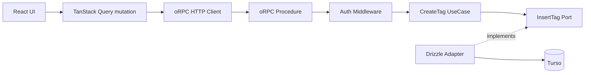

# CreateTag pilot アーキテクチャ RFC

## Status

Draft。

この RFC は Pantry 全体の最終アーキテクチャを定義しない。

**CreateTag を代表ユースケースとして、認証済みの単純 Command に対する新しい実装形を pilot する。**

pilot 完了後に `Adopt / Modify / Reject` を判断する。

## 既存文書との整合

`docs/architecture.md` の設計原則は、ブラウザのデータ操作を TanStack Start Server Function に限定し、独立した HTTP API を持たないと定めている。

この pilot が導入する `/api/rpc` は第一のクライアントであるブラウザ向けの HTTP 経路であり、この原則と矛盾する。pilot のあいだは、architecture.md を現行の Server Function 構成の正本とし、本 RFC は試行の提案として扱う。なお architecture.md §8 の「MVP外：外部クライアント向けのHTTP API」には抵触しない。`/api/rpc` は自前のブラウザクライアント専用であり、外部向け API にはしないためである。

pilot 結果と文書更新の対応は次のとおり。

- `Adopt`: `docs/architecture.md` の §2 設計原則、§3 システム構成、および AGENTS.md の設計方針を、Command 経路の HTTP RPC 化を前提に改訂する
- `Modify`: 採用した範囲に合わせて、上記と同じ箇所を改訂する
- `Reject`: 既存文書は変更しない

## 目的

現在の CreateTag は TanStack Start Server Function の中に、認証、DB 操作、重複判定、エラー変換が集まっている。

この pilot では次の点を検証する。

- oRPC を型付き RPC 境界として使う価値があるか
- TanStack Query をブラウザ側の mutation 状態管理に使う価値があるか
- Application / UseCase を transport と Drizzle から分離するとテストしやすくなるか
- Expected Error を既存 `Result` で表現すると責務が明確になるか
- 正常系の DB 往復、バンドルサイズ、レイテンシを悪化させずに導入できるか

## スコープ外

この RFC では次を決めない。

- Pantry 全体の最終レイヤリング
- トランザクションを伴うワークフロー
- read query 全体
- shelf tags の TanStack Query 化
- SSR 用 oRPC server client / `createRouterClient`
- 外部 HTTP / Gateway
- Better Auth エンドポイント
- 全 Server Function の migration
- Hono
- 汎用 Repository / UnitOfWork

pilot の対象は、ブラウザから `/api/rpc` へ送る CreateTag mutation の HTTP 経路だけである。SSR 側は既存の Server Function / Router loader を維持する。

## 採用する構成

CreateTag のリクエストは次の経路をたどる。



各層の責務は次のとおり。

| 層                      | 責務                                          |
| ----------------------- | --------------------------------------------- |
| UI / TanStack Query     | submit、pending、表示用エラー                 |
| oRPC client / procedure | HTTP、input validation、認証、transport error |
| Application             | CreateTag command と Expected Error           |
| Port                    | UseCase が必要とする永続化能力だけを定義      |
| Drizzle Adapter         | INSERT、conflict target、Turso access         |

Application は oRPC、HTTP、Cookie、Drizzle、Turso、React を知らない。

## 入出力の契約

入力境界には既存の `tagNameSchema` をそのまま使う。`tagNameSchema` は raw string を trim して NFC 正規化し、比較用の `normalized` を lower-case で生成する。

```ts
const createTagInputSchema = v.object({
  name: tagNameSchema,
  pinned: v.optional(v.boolean()),
  sortOrder: v.optional(v.number()),
  color: v.optional(v.nullable(v.string()))
})

type CreateTagWireInput = v.InferInput<typeof createTagInputSchema>
type CreateTagValidatedInput = v.InferOutput<typeof createTagInputSchema>
```

HTTP をまたぐ入力の時点で `name` は `string` であり、validation 後には既存の `TagName` 型になる。

この pilot で新しい validation rule は追加しない。`pinned`、`sortOrder`、`color` の省略時は、現行 DB default と同じ値へ procedure が明示的に確定させる。

```ts
export type CreateTagCommand = {
  readonly name: TagName
  readonly pinned: boolean
  readonly sortOrder: number
  readonly color: string | null
}

function toCreateTagCommand(input: CreateTagValidatedInput): CreateTagCommand {
  return {
    name: input.name,
    pinned: input.pinned ?? false,
    sortOrder: input.sortOrder ?? 0,
    color: input.color ?? null
  }
}
```

戻り値は現行と同じく、作成後の navigation に必要な ID だけである。

```ts
export type CreatedTag = {
  readonly id: TagId
}

export type CreateTagOutput = {
  readonly id: number
}
```

Application の branded `TagId` は procedure の出口で plain number へ変換する。branded 型は型システム上の情報であり、wire 上では保持されないためである。`normalizedName` は client へ返さない。

## エラーモデル

エラーを3種類に分類し、扱いを固定する。Expected Error は業務上起こり得る失敗であり、呼び出し側が処理できる。Boundary Rejection は認証や input validation がリクエストを拒否したものである。Unexpected Error は障害やバグであり、呼び出し側に処理を期待しない。

| 種類                       | 例                  | 扱い         |
| -------------------------- | ------------------- | ------------ |
| Application Expected Error | 同名タグが既に存在  | `Result.err` |
| Boundary Rejection         | 未認証、input 不正  | oRPC error   |
| Unexpected Error           | DB 障害、未知の例外 | `throw`      |

```ts
export type CreateTagError = {
  readonly code: 'tag-name-already-exists'
}
```

`unexpected-error` を `Result` に入れない。Unexpected Error は呼び出し側が処理できないため、`Result` に入れても無意味な分岐を強いるだけになる。

## Application 境界

汎用 `TagRepository` は作らない。CreateTag が必要とする永続化の能力だけを port として定義する。

```ts
export type InsertTagInput = {
  readonly actorId: UserId
  readonly name: TagName
  readonly pinned: boolean
  readonly sortOrder: number
  readonly color: string | null
}

export type InsertTagOutput =
  { readonly kind: 'created'; readonly id: TagId } | { readonly kind: 'name-conflict' }

export type InsertTag = (input: InsertTagInput) => Promise<InsertTagOutput>
```

UseCase は port の output を Application の `Result` へ変換する。

```ts
export async function executeCreateTag(params: {
  readonly insertTag: InsertTag
  readonly actorId: UserId
  readonly command: CreateTagCommand
}): Promise<Result<CreatedTag, CreateTagError>> {
  const output = await params.insertTag({
    actorId: params.actorId,
    ...params.command
  })

  if (output.kind === 'name-conflict') {
    return err({ code: 'tag-name-already-exists' })
  }

  return ok({ id: output.id })
}
```

UseCase が薄いこと自体は問題にしない。**Drizzle fluent API mock を Application unit test から排除する価値が、追加ファイル数に見合うか**を pilot で評価する。

## 永続化

重複判定の正本は、`tags` table の `(userId, normalizedName)` unique constraint にする。

```text
現在: SELECT duplicate -> INSERT
pilot: INSERT ... ON CONFLICT (user_id, normalized_name) DO NOTHING
```

事前 `SELECT` をやめる理由は2つある。SELECT と INSERT のあいだに他の insert が割り込むと重複を見逃すため、race condition を防げない。そのうえ、正常系の DB 往復が1回増える。

UNIQUE violation の原因を libSQL の error code / message から後付けで推測しない。Drizzle の conflict target を `(userId, normalizedName)` に限定し、INSERT の結果が空なら `name-conflict` と判定する。

```ts
const [created] = await db
  .insert(tagsTable)
  .values({
    userId: input.actorId,
    name: input.name.display,
    normalizedName: input.name.normalized,
    pinned: input.pinned,
    sortOrder: input.sortOrder,
    color: input.color
  })
  .onConflictDoNothing({
    target: [tagsTable.userId, tagsTable.normalizedName]
  })
  .returning({ id: tagsTable.id })

if (created === undefined) {
  return { kind: 'name-conflict' }
}

return {
  kind: 'created',
  id: v.parse(tagIdSchema, created.id)
}
```

これにより、汎用の `isSqliteUniqueConstraintError` を CreateTag の業務エラー分類に使わない。それ以外の constraint 違反や DB 障害は、通常どおり throw する。

## RPC 境界

`UNAUTHORIZED` は共通 error として base procedure に定義する。これにより auth middleware と client が、同じ error code の契約を共有できる。

```ts
const base = os.$context<{ readonly headers: Headers }>().errors({
  UNAUTHORIZED: { status: 401 }
})

const requireAuth = base.middleware(async ({ context, next, errors }) => {
  const session = await getAuth().api.getSession({
    headers: context.headers
  })

  if (!session) {
    throw errors.UNAUTHORIZED()
  }

  return next({
    context: {
      actorId: v.parse(userIdSchema, session.user.id)
    }
  })
})

const authed = base.use(requireAuth)
```

Procedure は validation 後の入力を明示的な Application command へ変換し、Application Expected Error を transport error へ変換する。

```ts
export const createTagProcedure = authed
  .input(createTagInputSchema)
  .errors({
    'tag-name-already-exists': { status: 409 }
  })
  .handler(async ({ input, context, errors }) => {
    const result = await executeCreateTag({
      insertTag,
      actorId: context.actorId,
      command: toCreateTagCommand(input)
    })

    if (!result.ok) {
      throw errors['tag-name-already-exists']()
    }

    return {
      id: result.value.id
    } satisfies CreateTagOutput
  })
```

Unexpected Error を独自の 500 error に包み直さない。oRPC は捕捉しなかった例外をそのまま 500 として client へ返すため、包み直しても判別に使える情報は増えない。

## HTTP entry point

認証 middleware が Cookie を読めるよう、request ごとに `request.headers` を context へ渡す。

`RPCHandler.handle()` の `response` は必ず server route から返す。

```ts
const handler = new RPCHandler(router)

export const Route = createFileRoute('/api/rpc/$')({
  server: {
    handlers: {
      ANY: async ({ request }) => {
        const { response } = await handler.handle(request, {
          prefix: '/api/rpc',
          context: {
            headers: request.headers
          }
        })

        return response ?? new Response('Not Found', { status: 404 })
      }
    }
  }
})
```

CreateTag pilot では SSR direct client を導入しないため、SSR request context 用の別経路は作らない。

## Client 境界

CreateTag client は HTTP RPC 専用とし、runtime router を browser bundle へ import しない。router は type-only import で、client の型にのみ使う。

```ts
import { createORPCClient, onError, ORPCError } from '@orpc/client'
import { RPCLink } from '@orpc/client/fetch'
import type { RouterClient } from '@orpc/server'
import type { AppRouter } from './router'

const link = new RPCLink({
  url: () => {
    if (typeof window === 'undefined') {
      throw new Error('CreateTag RPC client is browser-only')
    }

    return `${window.location.origin}/api/rpc`
  },
  interceptors: [
    onError((error) => {
      if (!(error instanceof ORPCError) || error.code !== 'UNAUTHORIZED') {
        return
      }

      const redirect = window.location.pathname + window.location.search + window.location.hash
      const signIn = new URL('/sign-in/', window.location.origin)
      signIn.searchParams.set('redirect', redirect)
      window.location.replace(signIn)
    })
  ]
})

export const client: RouterClient<AppRouter> = createORPCClient(link)
```

この client は SSR render 中に生成された場合でも network request を発行しない。CreateTag mutation を server 側で実行しようとした場合は、lazy `url` が明示的に失敗する。

## UI エラー契約

現行 UI の `error.name === 'TagNameAlreadyExistsError'` 判定は、CreateTag pilot で削除する。代わりに共通 mapping で typed error code を見る。

```ts
export function getCreateTagErrorMessage(error: unknown): string | null {
  if (isDefinedError(error)) {
    if (error.code === 'UNAUTHORIZED') {
      return null
    }

    if (error.code === 'tag-name-already-exists') {
      return 'そのタグ名は既に存在します'
    }
  }

  return 'タグの作成に失敗しました'
}
```

`TagForm` は session expiry 時に generic error を出さない。そのため `mapError` の戻り値を `string | null` に変更し、null のときはフォームエラーを設定しない。

```ts
type TagFormProps = {
  // ...
  readonly mapError: (error: unknown) => string | null
}
```

```ts
try {
  await onSubmit(values)
} catch (error) {
  const message = mapError(error)
  if (message !== null) {
    setFormError(message)
  }
}
```

CreateTag で必須の UI migration は次の2箇所である。

- `new-tag-screen.tsx`: `TagForm` の `mapError` に `getCreateTagErrorMessage` を使う
- `inline-add-tag.tsx`: `Error.name` 判定を削除し、同じ helper を使う

UpdateTag の `edit-tag-form.tsx` はこの pilot の対象外である。

## commit 後の画面更新

現在の shelf tags の表示は TanStack Query ではなく、TanStack Router loader の `fetchShelfTags()` が正本である。この pilot では read architecture を移行しないため、この構成を維持する。

DB commit と route loader refresh は別々の成功条件として扱う。**作成が成功したあとの invalidate 失敗を、CreateTag mutation の失敗へ変換しない。**

TanStack Query の `onSuccess` では、invalidate の Promise を return / await しない。mutation options の出所は、Client 境界で定義した client から生成する TanStack Query 用の `orpc` utils である。

```ts
import { createORPCReactQueryUtils } from '@orpc/react-query'

export const orpc = createORPCReactQueryUtils(client)
```

```ts
const router = useRouter()

const mutation = useMutation(
  orpc.tags.create.mutationOptions({
    onSuccess: () => {
      void router.invalidate().catch((error) => {
        console.error('Failed to refresh route data after CreateTag', error)
      })
    }
  })
)
```

結果として、mutation の成功と loader の再取得は独立に進む。

```text
DB INSERT 成功
  -> mutation は success
  -> loader refresh は best-effort で開始
      -> 成功: sidebar / list が更新
      -> 失敗: stale 表示は残り得るが「タグ作成失敗」にはしない
```

shelf tags を TanStack Query 化して mutation output から cache 更新する最適化は、read query migration の検討時に扱う。

## テスト

### Application unit test

- Drizzle mock なしで成功 / `name-conflict` を検証する
- `pinned=false`、`sortOrder=0`、`color=null` を command で明示的に扱う

### Persistence integration test

- 同一 user + 同一 normalized name は `name-conflict`
- 別 user なら同名作成可能
- 同一 user / 同一 normalized name の insert を2件 `Promise.all` で開始し、結果が `created` 1件 + `name-conflict` 1件になる
- concurrent insert 後の DB row は1件だけである
- CreateTag は generic unique-error classifier に依存しない

### RPC integration test

- invalid input -> 4xx
- unauthenticated -> 401 / `UNAUTHORIZED`
- 認証済みリクエストの Cookie が auth middleware へ届く
- duplicate name -> 409 / `tag-name-already-exists`
- unknown exception -> 500
- RPC server route が `handler.handle()` の `response` をブラウザへ返す

### UI test

- `new-tag-screen.tsx` / `inline-add-tag.tsx` は Error class name に依存しない
- `UNAUTHORIZED` では generic な「タグの作成に失敗しました」を表示しない
- loader refresh が reject しても、成功済み CreateTag mutation を error 表示へ戻さない

### Bundle test

production build の client output に次を含めない。

- Drizzle / Turso client
- `getDB`
- Better Auth server implementation
- oRPC procedure handler / persistence adapter の runtime code

`AppRouter` は type-only import のままにし、runtime import しない。

## 性能の基準

この pilot で新規に依存するのは `@orpc/server`、`@orpc/client`、および TanStack Query 統合パッケージ（oRPC v1 では `@orpc/react-query`）である。client bundle の増分上限は、主にこれらの client 側コードで消える前提の閾値である。

実装 PR では **変更前の `main` と pilot head を同じ環境・同じ計測手順で測る**。baseline のない「体感で問題なし」を採用理由にしない。

| Metric                                   | Baseline                   | 採用の上限              |
| ---------------------------------------- | -------------------------- | ----------------------- |
| CreateTag 正常系の write DB statement 数 | 現行 `SELECT + INSERT` = 2 | 1                       |
| client production JS gzip 合計           | 実装 PR 開始時の `main`    | `+15 KiB` 以下          |
| Worker deployable JS gzip 合計           | 同じ `main`                | `+50 KiB` 以下          |
| warm CreateTag latency median            | 同一環境で50回             | baseline の `+10%` 以下 |
| warm CreateTag latency p95               | 同一環境で50回             | baseline の `+15%` 以下 |
| server-only code in client bundle        | 0                          | 0                       |

latency は同じ Worker runtime / Turso DB を使い、各比較の前に warm-up を行う。baseline 自体の再計測差が 5% を超えるときは benchmark が不安定である。閾値を緩めず、先に計測方法を修正する。

上限を超えても、ただちに Reject するわけではない。増加要因を特定して設計を縮小し、`Modify` として扱う。server-only code の browser 混入だけは即 `Reject` とする。

## pilot の成功条件

1. CreateTag の input / output / error contract が実装前に一意に決まっている
2. Application unit test から Drizzle fluent API mock を排除できる
3. `UNAUTHORIZED` と `tag-name-already-exists` を UI まで error code 契約で接続できる
4. race condition を DB unique constraint + conflict target で処理できる
5. DB commit 後の refresh 失敗が mutation 成功を覆さない
6. 正常系の write DB statements が2回から1回に減る
7. バンドルサイズとレイテンシが性能の基準内に収まる
8. browser bundle に server-only code が入らない
9. `pnpm run format:check`、typecheck、対象 test が通る

pilot 完了後に `Adopt / Modify / Reject` を判断する。

## References

- oRPC TanStack Start adapter: `RPCHandler.handle()` の response を server route から返す
- oRPC Error Handling: common `.errors()` で `UNAUTHORIZED` を type-safe に定義できる
- oRPC RPCLink: lazy URL により server 側での HTTP client 実行を禁止できる
- Drizzle Insert: `onConflictDoNothing` は明示的な conflict target を指定できる
- TanStack Router Data Mutations: `router.invalidate()` は loader data の再検証に使う
