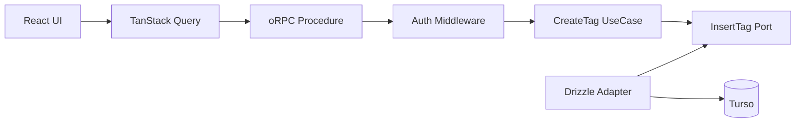

# CreateTag pilot アーキテクチャ RFC

## Status

Draft。

この RFC は Pantry 全体の最終アーキテクチャを定義しない。

**CreateTag を代表ユースケースとして、認証済みの単純 Command に対する新しい実装形を pilot する。**

pilot 完了後に `Adopt / Modify / Reject` を判断する。

---

## Goal

現在の CreateTag は TanStack Start Server Function の中に、認証・DB 操作・重複判定・エラー変換が集まっている。

この pilot では次を検証する。

- oRPC を型付き RPC 境界として使う価値があるか
- TanStack Query を browser 側の mutation 経路として使う価値があるか
- Application / UseCase を transport から分離するとテストしやすくなるか
- Expected Error を既存 `Result` で表現すると責務が明確になるか
- Application から Drizzle を narrow function port で分離する価値があるか
- その代わりに増える実装量・bundle・latency が許容できるか

## Non-goals

この RFC では次を決めない。

- Pantry 全体の最終レイヤリング
- transaction を伴う workflow
- read query 全体
- 外部 HTTP / Gateway
- Better Auth endpoint
- 全 Server Function の migration
- Hono
- 汎用 Repository / UnitOfWork

これらは pilot 成功後、実際に必要になった時点で設計する。

---

## Decision



| 層 | 責務 |
| --- | --- |
| UI / TanStack Query | submit、loading、表示用エラー、cache 更新 |
| oRPC | input validation、認証、transport error |
| Application | Expected Error を `Result` で表現 |
| Port | UseCase が必要とする永続化能力だけを定義 |
| Drizzle Adapter | SQL、constraint の解釈、Turso access |

Application は oRPC、HTTP、Cookie、Drizzle、Turso、React を知らない。

---

## Error model

| 種類 | 例 | 扱い |
| --- | --- | --- |
| Application Expected Error | 同名タグが既に存在 | `Result.err` |
| Boundary Rejection | 未認証、input 不正 | oRPC error |
| Unexpected Error | DB 障害、未知の例外 | `throw` |

```ts
export type CreateTagError = {
  readonly code: 'tag-name-already-exists'
}
```

既存の `Result` を使う。

```ts
export type Result<T, E> =
  | { readonly ok: true; readonly value: T }
  | { readonly ok: false; readonly error: E }
```

`unexpected-error` は `Result` に入れない。

---

## Application boundary

汎用 `TagRepository` は作らない。CreateTag が必要とする能力だけを port にする。

```ts
export type InsertTagInput = {
  readonly actorId: UserId
  readonly name: TagName
  readonly pinned?: boolean
  readonly sortOrder?: number
  readonly color?: string | null
}

export type InsertTagOutcome =
  | {
      readonly kind: 'created'
      readonly tag: CreatedTag
    }
  | { readonly kind: 'name-conflict' }

export type InsertTag = (
  input: InsertTagInput
) => Promise<InsertTagOutcome>
```

UseCase は transport と persistence outcome の間を変換する。

```ts
export function createCreateTagUseCase(insertTag: InsertTag) {
  return async (params: {
    readonly actorId: UserId
    readonly command: CreateTagCommand
  }): Promise<Result<CreatedTag, CreateTagError>> => {
    const outcome = await insertTag({
      actorId: params.actorId,
      ...params.command
    })

    if (outcome.kind === 'name-conflict') {
      return err({ code: 'tag-name-already-exists' })
    }

    return ok(outcome.tag)
  }
}
```

UseCase が薄いこと自体は問題にしない。

pilot では、**Drizzle から切り離した unit test の価値が追加ファイル数に見合うか**を評価する。

---

## Persistence

`tags` table の `(userId, normalizedName)` unique constraint を重複判定の正本にする。

```text
現在: SELECT duplicate -> INSERT
pilot: INSERT
```

事前 `SELECT` は race condition を防げず、正常系の DB round trip を1回増やすため削除する。

```ts
export function createDrizzleInsertTag(db: AppDb): InsertTag {
  return async (input) => {
    try {
      const [created] = await db
        .insert(tagsTable)
        .values({
          userId: input.actorId,
          name: input.name.display,
          normalizedName: input.name.normalized,
          ...(input.pinned !== undefined ? { pinned: input.pinned } : {}),
          ...(input.sortOrder !== undefined ? { sortOrder: input.sortOrder } : {}),
          ...(input.color !== undefined ? { color: input.color } : {})
        })
        .returning()

      if (created == null) {
        throw new Error('Tag insert returned no row')
      }

      return { kind: 'created', tag: toCreatedTag(created) }
    } catch (error) {
      if (isTagNameUniqueConstraintError(error)) {
        return { kind: 'name-conflict' }
      }

      throw error
    }
  }
}
```

`isTagNameUniqueConstraintError` は libSQL / Drizzle の実際の error shape を確認して実装する。

---

## RPC boundary

認証は RPC middleware で `actorId` に変換し、UseCase に session を持ち込まない。

```ts
const requireAuth = base.middleware(async ({ context, next }) => {
  const session = await getAuth().api.getSession({
    headers: context.headers
  })

  if (!session) {
    throw new ORPCError('UNAUTHORIZED')
  }

  return next({
    context: {
      actorId: v.parse(userIdSchema, session.user.id)
    }
  })
})
```

Procedure は Application Error を transport error へ変換する。

```ts
export const createTagProcedure = authed
  .input(createTagInputSchema)
  .errors({
    'tag-name-already-exists': { status: 409 }
  })
  .handler(async ({ input, context, errors }) => {
    const result = await createTag({
      actorId: context.actorId,
      command: input
    })

    if (!result.ok) {
      throw errors['tag-name-already-exists']()
    }

    return result.value
  })
```

Unexpected Error を独自の 500 error に包み直さない。logging も server-side entry point で一度だけ行う。

---

## Client boundary

TanStack Query から oRPC mutation を呼ぶ。

CreateTag 成功時に UI へ必要な値が mutation output だけで確定する場合は、直後に Turso へ同じデータを取り直さず cache を更新する。

```ts
onSuccess: (created) => {
  queryClient.setQueryData<ShelfTag[]>(
    shelfTagsQueryOptions.queryKey,
    (current) => {
      if (current === undefined) return current

      return [
        ...current,
        {
          ...created,
          bookmarkCount: 0,
          lastUsedAt: null
        }
      ]
    }
  )
}
```

この RFC は shelf tags query 自体の read architecture は扱わない。

UI error mapping は error code で行う。

```ts
export function getCreateTagErrorMessage(
  error: unknown
): string | null {
  if (isDefinedError(error)) {
    if (error.code === 'UNAUTHORIZED') {
      return null
    }

    if (error.code === 'tag-name-already-exists') {
      return 'そのタグ名は既に存在します'
    }
  }

  return 'タグの作成に失敗しました'
}
```

401 は共通の sign-in 遷移で扱い、mutation は rejected のまま維持する。

---

## Performance guardrails

実装 PR で before / after を比較する。

- client bundle size
- Worker bundle size
- CreateTag latency
- DB query count

守ること:

- browser bundle に DB / auth の server-only code を混入させない
- 正常系 DB query は `INSERT` 1回を目標にする
- 成功直後の不要な refetch を増やさない
- SSR で同一 Worker への不要な HTTP round trip を作らない

性能劣化が保守性改善に見合わなければ設計を縮小する。

---

## Tests

Application unit test は Drizzle mock を使わず function stub だけで書けることを確認する。

```ts
it('name conflict を expected error に変換する', async () => {
  const insertTag: InsertTag = async () => ({
    kind: 'name-conflict'
  })

  const createTag = createCreateTagUseCase(insertTag)
  const result = await createTag({ actorId, command })

  expect(result).toEqual(
    err({ code: 'tag-name-already-exists' })
  )
})
```

最低限の確認項目:

- 同一 user + 同一 normalized name -> conflict
- 別 user -> 同名作成可能
- invalid input -> 4xx
- unauthenticated -> 401
- duplicate name -> 409
- unknown exception -> 500
- 401 で generic な作成失敗を表示しない
- success 時に cache が更新される

---

## Pilot success criteria

1. Application unit test から Drizzle fluent API mock を排除できる
2. Expected / Boundary / Unexpected Error の責務が明確になる
3. UI の Error class name 依存を削除できる
4. 正常系の DB round trip が増えない
5. client / Worker bundle に許容できない増加がない
6. request latency に明確な劣化がない
7. 追加された port / adapter / procedure が保守性改善に見合う

pilot 完了後に `Adopt / Modify / Reject` を判断する。

## Open questions

実装時に確認するのは次の2点だけとする。

1. libSQL / Drizzle の unique constraint error をタグ名 constraint に限定して安全に識別できるか
2. SSR direct client で server-only module が browser bundle に混入しないか

それ以外はこの RFC のスコープ外とする。
