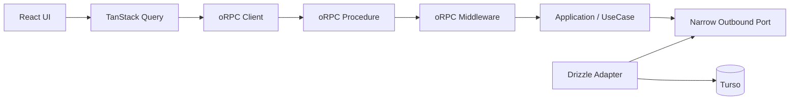
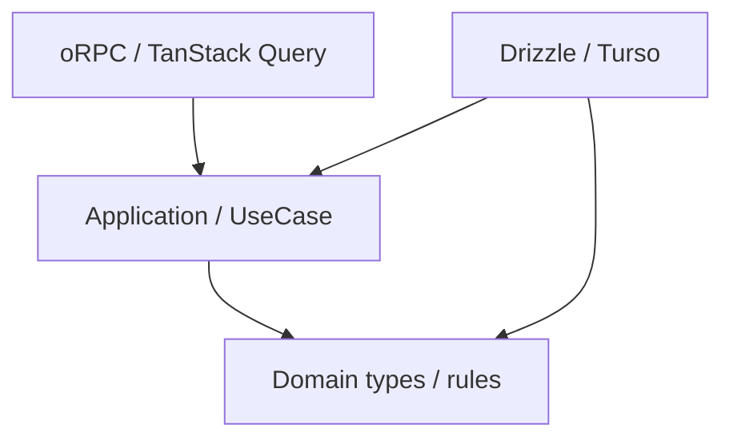

# アプリケーションアーキテクチャ改善設計

## 1. 結論

Pantry のバックエンド境界を、現在の TanStack Start Server Function 直結構成から段階的に変更する。

採用する方針は次のとおり。

1. **oRPC を型付き RPC 境界として導入する**
2. **TanStack Query をサーバー状態へアクセスする標準経路として使う**
3. **Application / UseCase 層を設け、アプリケーションロジックを TanStack Start と oRPC から分離する**
4. **業務上予想できる失敗は、既存の `src/shared/domain/result.ts` の `Result` で表現する**
5. **認証失敗や入力不正は UseCase の `Result` に混ぜず、RPC 境界の失敗として扱う**
6. **予期しない例外は `throw` のまま oRPC へ渡し、500 への変換を oRPC に任せる**
7. **Application から Drizzle を追い出すため、必要な箇所では狭い outbound port を使う**
8. **ただし汎用的な `TagRepository` のような CRUD interface は作らない**
9. **read-only projection は無理に UseCase / Repository 化せず、query service として分離してよい**
10. **SSR では oRPC の server-side client を使い、同一 Worker 内で HTTP を往復しない**
11. **Hono は現時点では導入しない**

今回の再検討で、前案の「CreateTag は `AppDb` を Application に直接注入する」という判断は撤回する。

理由は、既存実装に合わせることよりも **テスタビリティを改善するという今回の目的**を優先するためである。

既存の Bookmark Application test では Drizzle の fluent API を模倣するために `createThenableChain` と `as unknown as AppDb` を使っている。

これはテストが業務仕様ではなく query builder の呼び出し方に依存している状態であり、新しい設計の標準にはしない。

一方で、すべてを Repository Pattern にするのも過剰である。

そのため Pantry では、**UseCase が本当に必要とする1つの能力だけを関数型の port として渡す**。

CreateTag なら `TagRepository` ではなく `InsertTag` だけを定義する。

---

## 2. 現在の問題

現在の `src/features/tags/functions/add-tag.ts` は、1つの Server Function の中で次を行っている。

- request から認証セッションを取得する
- DB を取得する
- 同名タグを事前に検索する
- タグを INSERT する
- SQLite の unique constraint error を業務エラーへ変換する
- UI に返す値を作る

概念的には次の形である。

```ts
export const addTag = createServerFn({ method: 'POST' })
  .validator(addTagInputSchema)
  .handler(async ({ data }) => {
    const session = await requireRequestSession()
    const db = getDB()

    const [duplicate] = await db
      .select({ id: tagsTable.id })
      .from(tagsTable)
      .where(
        and(
          eq(tagsTable.userId, session.user.id),
          eq(tagsTable.normalizedName, data.name.normalized)
        )
      )
      .limit(1)

    if (duplicate != null) {
      throw new TagNameAlreadyExistsError()
    }

    try {
      const [created] = await db
        .insert(tagsTable)
        .values({
          userId: session.user.id,
          name: data.name.display,
          normalizedName: data.name.normalized
        })
        .returning({ id: tagsTable.id })

      return created
    } catch (error) {
      if (isSqliteUniqueConstraintError(error)) {
        throw new TagNameAlreadyExistsError()
      }

      throw error
    }
  })
```

この構成では、次の変更理由が1つの関数に混ざる。

- 認証方式を変える
- RPC framework を変える
- 業務エラーの表現を変える
- SQL / Drizzle query を変える
- UI へ返す transport error を変える

Application boundary を設ける目的は、これらを別々に変更できるようにすることである。

---

## 3. CreateTag の DB round trip を減らす

`tags` table にはすでに次の unique constraint がある。

```ts
unique().on(t.userId, t.normalizedName)
```

そのため CreateTag の正常系で毎回

```text
SELECT duplicate
INSERT tag
```

の2 query を発行する必要はない。

事前 SELECT をしても、並行 request が来れば SELECT と INSERT の間で race condition が発生する。

最終的には DB の unique constraint が正本になる。

pilot では次の形に変更する。

```text
INSERT tag
  ├─ success
  │    -> created
  ├─ (user_id, normalized_name) unique violation
  │    -> name-conflict
  └─ other error
       -> throw
```

これにより正常系の DB round trip を1回減らす。

---

## 4. shelf tag の二重取得も pilot で解消する

現在の protected layout は `fetchShelfTags()` を呼んでいる。

```ts
// src/routes/_protected.tsx
loader: async () => {
  const shelfTagsPromise = fetchShelfTags()
  return { shelfTagsPromise }
}
```

一方、`/tags` の route も同じ `fetchShelfTags()` を呼んでいる。

```ts
// src/routes/_protected/tags/index.tsx
loader: async () => {
  const { user } = await ensureSession()
  const tagsPromise = fetchShelfTags()

  return {
    user,
    tagsPromise
  }
}
```

タグ管理画面は protected layout の配下なので、同じ shelf projection を親と子が別々に要求している。

TanStack Query 移行後は、shelf tags を **protected layout が所有する共通 query** にする。

子 route は同じ fetch を持たない。

```text
/_protected loader
  -> shelfTagsQuery を prefetch

ShelfSidebar
  -> same query cache

MobileShelfDialog
  -> same query cache

/tags TagTable
  -> same query cache
```

CreateTag mutation 後は、この query key だけを invalidate する。

これにより TanStack Query を単なる mutation wrapper として導入するのではなく、実際に

- cache
- query ownership
- deduplication
- invalidation
- SSR hydration / streaming

まで検証できる。

---

## 5. 目標アーキテクチャ



依存方向は次のようにする。



重要なのは、Infrastructure が Application の port 契約を実装することである。

Application が Drizzle の型を import する構成にはしない。

---

## 6. `AppDb` 直接注入と narrow port の比較

### 案A: Application に `AppDb` を直接渡す

```ts
export async function executeCreateTag(params: {
  readonly db: AppDb
  readonly actorId: UserId
  readonly command: CreateTagCommand
}): Promise<CreateTagResult> {
  // Drizzle query
}
```

#### Pros

- ファイル数が少ない
- interface が増えない
- 実装を追いやすい

#### Cons

- Application が Drizzle に依存する
- unit test が Drizzle の fluent API に依存する
- `select().from().where()` や `insert().values().returning()` の mock が必要になる
- DB implementation の変更が Application test を壊しやすい

既存 Bookmark Application test で `createThenableChain` が必要になっていることは、この欠点がすでに現れている例である。

### 案B: 汎用 `TagRepository` を作る

```ts
interface TagRepository {
  create(...): Promise<...>
  update(...): Promise<...>
  findById(...): Promise<...>
  list(...): Promise<...>
  // ...
}
```

#### Pros

- Drizzle から切り離せる

#### Cons

- 今使わないメソッドまで1つの abstraction に集まりやすい
- Repository が巨大化しやすい
- read model と write model の要求が混ざりやすい
- fake の実装量も増える

Pantry では採用しない。

### 案C: UseCase が必要な能力だけを port にする

```ts
export type InsertTag = (
  input: InsertTagInput
) => Promise<InsertTagOutcome>
```

#### Pros

- Drizzle を Application から追い出せる
- unit test が単純な関数 stub だけで書ける
- UseCase が依存する能力が型から読める
- generic repository より abstraction surface が小さい

#### Cons

- port と adapter のファイルは増える
- CreateTag のような小さい処理では UseCase が薄く見える

**案Cを採用する。**

テスタビリティ改善が今回の主要目的なので、追加される小さな abstraction cost は許容する。

---

## 7. CreateTag Application の具体形

`src/features/tags/application/create-tag.ts` を次の形にする。

```ts
import { err, ok } from '../../../shared/domain/result'
import type { Result } from '../../../shared/domain/result'
import type { UserId } from '../../auth/domain/auth-values'
import type { TagId, TagName } from '../domain/tag-values'

export type CreateTagCommand = {
  readonly name: TagName
  readonly pinned?: boolean
  readonly sortOrder?: number
  readonly color?: string | null
}

export type CreateTagError = {
  readonly code: 'tag-name-already-exists'
}

export type CreatedTag = {
  readonly id: TagId
  readonly name: TagName
  readonly pinned: boolean
  readonly sortOrder: number
  readonly color: string | null
}

export type CreateTagResult = Result<CreatedTag, CreateTagError>

export type InsertTagInput = {
  readonly actorId: UserId
  readonly name: TagName
  readonly pinned: boolean
  readonly sortOrder: number
  readonly color: string | null
}

export type InsertTagOutcome =
  | { readonly kind: 'created'; readonly id: TagId }
  | { readonly kind: 'name-conflict' }

export type InsertTag = (
  input: InsertTagInput
) => Promise<InsertTagOutcome>

export async function executeCreateTag(params: {
  readonly insertTag: InsertTag
  readonly actorId: UserId
  readonly command: CreateTagCommand
}): Promise<CreateTagResult> {
  const pinned = params.command.pinned ?? false
  const sortOrder = params.command.sortOrder ?? 0
  const color = params.command.color ?? null

  const outcome = await params.insertTag({
    actorId: params.actorId,
    name: params.command.name,
    pinned,
    sortOrder,
    color
  })

  switch (outcome.kind) {
    case 'name-conflict':
      return err({ code: 'tag-name-already-exists' })

    case 'created':
      return ok({
        id: outcome.id,
        name: params.command.name,
        pinned,
        sortOrder,
        color
      })
  }
}
```

この UseCase はまだ小さいが、少なくとも次を Application の責務として持つ。

- default 値を確定する
- persistence の `name-conflict` を業務エラーへ変換する
- transport から独立した成功値を作る

将来ルールが増えても oRPC procedure や Drizzle adapter へ散らばらない。

---

## 8. Drizzle adapter の具体形

`src/features/tags/infrastructure/insert-tag.server.ts` のイメージは次のとおり。

```ts
import * as v from 'valibot'

import type { AppDb } from '../../../db/app-db'
import { getDB } from '../../../db/get-db.server'
import { tagsTable } from '../../../db/schema/tag'
import type { InsertTag } from '../application/create-tag'
import { tagIdSchema } from '../domain/tag-values'
import { isSqliteUniqueConstraintError } from './is-sqlite-unique-constraint-error'

export async function insertTagWithDrizzle(params: {
  readonly db: AppDb
  readonly input: Parameters<InsertTag>[0]
}): ReturnType<InsertTag> {
  try {
    const [created] = await params.db
      .insert(tagsTable)
      .values({
        userId: params.input.actorId,
        name: params.input.name.display,
        normalizedName: params.input.name.normalized,
        pinned: params.input.pinned,
        sortOrder: params.input.sortOrder,
        color: params.input.color
      })
      .returning({ id: tagsTable.id })

    if (created == null) {
      throw new Error('Tag insert returned no row')
    }

    return {
      kind: 'created',
      id: v.parse(tagIdSchema, created.id)
    }
  } catch (error) {
    if (isSqliteUniqueConstraintError(error)) {
      return { kind: 'name-conflict' }
    }

    throw error
  }
}

export const insertTag: InsertTag = (input) =>
  insertTagWithDrizzle({
    db: getDB(),
    input
  })
```

ここでは事前 SELECT を行わない。

SQLite / libSQL 固有の error 判定も Application へ持ち込まない。

`isSqliteUniqueConstraintError` は `tags/lib` より infrastructure 配下へ移す方が責務として自然である。

---

## 9. UseCase test は Drizzle を mock しない

Application test は次の程度でよい。

```ts
import { expect, test } from 'vitest'

import type { InsertTag } from './create-tag'
import { executeCreateTag } from './create-tag'

// test helper で brand 済み UserId / TagName / TagId を生成するとする

test('未指定の値を default 化して tag を作成する', async () => {
  let received: Parameters<InsertTag>[0] | undefined

  const insertTag: InsertTag = async (input) => {
    received = input
    return { kind: 'created', id: tagId(1) }
  }

  const result = await executeCreateTag({
    insertTag,
    actorId: userId('user-1'),
    command: {
      name: tagName('TypeScript')
    }
  })

  expect(received).toMatchObject({
    pinned: false,
    sortOrder: 0,
    color: null
  })

  expect(result).toMatchObject({
    ok: true,
    value: {
      id: 1,
      pinned: false,
      sortOrder: 0,
      color: null
    }
  })
})

test('name conflict を業務エラーへ変換する', async () => {
  const insertTag: InsertTag = async () => ({
    kind: 'name-conflict'
  })

  const result = await executeCreateTag({
    insertTag,
    actorId: userId('user-1'),
    command: {
      name: tagName('TypeScript')
    }
  })

  expect(result).toStrictEqual({
    ok: false,
    error: {
      code: 'tag-name-already-exists'
    }
  })
})
```

このテストは Drizzle の query builder を一切知らない。

これを UseCase 層導入の重要な成功条件とする。

---

## 10. Infrastructure test は DB の事実を確認する

一方、次は Application unit test ではなく infrastructure test で確認する。

- `(user_id, normalized_name)` unique constraint が実際に効く
- unique violation が `name-conflict` へ変換される
- その他の DB error は握り潰さず throw される

ここでは Drizzle fluent API を細かく mock するより、可能なら一時的な libSQL / SQLite compatible DB を使う。

Application test は速く純粋に保ち、DB adapter の correctness は integration test で確認する。

---

## 11. エラーを3種類に分ける

| 種類 | 例 | 表現 | 責務 |
| --- | --- | --- | --- |
| 業務上予想できる失敗 | 同名タグ、重複URL、対象なし | `Result.err` | Application |
| RPC 境界で拒否する失敗 | 未認証、入力不正、rate limit | oRPC defined error | RPC / middleware |
| 予期しない例外 | DB障害、invariant violation、実装バグ | `throw` | oRPC まで伝播 |

この3種類を1つの巨大な error union にまとめない。

### 業務エラー

```ts
export type CreateTagError = {
  readonly code: 'tag-name-already-exists'
}
```

### 未認証

未認証は CreateTag という業務の失敗ではない。

UseCase が実行される前に request を拒否する。

### 予期しない例外

次のようにはしない。

```ts
// 採用しない
return err({ code: 'unexpected-error' })
```

未知の障害を業務エラーへ潰すと、UI からも observability からも障害の意味が見えにくくなる。

---

## 12. oRPC 共通 middleware

### 12.1 auth と unexpected error logging

重要な点として、**500 への変換を自前 middleware では行わない**。

oRPC が通常の JavaScript `Error` を `INTERNAL_SERVER_ERROR` へ変換する。

ただし予期しない例外のログは1回だけ残したい。

さらに SSR 最適化で `createRouterClient` を使うと HTTP の `RPCHandler` を通らない。

したがって error logging を `RPCHandler` の interceptor だけに置くと SSR direct call を取りこぼす。

ログは router middleware に置き、**ログした後は同じ error をそのまま rethrow** する。

```ts
import { ORPCError, os } from '@orpc/server'
import * as v from 'valibot'

import { userIdSchema } from '../features/auth/domain/auth-values'
import { getAuth } from '../features/auth/functions/get-auth.server'

type RpcInitialContext = {
  readonly headers: Headers
}

const base = os
  .$context<RpcInitialContext>()
  .errors({
    UNAUTHORIZED: {}
  })

const logUnexpectedError = base.middleware(async ({ next }) => {
  try {
    return await next()
  } catch (error) {
    if (!(error instanceof ORPCError)) {
      console.error('Unexpected RPC error', error)
    }

    throw error
  }
})

const observed = base.use(logUnexpectedError)

const requireAuth = observed.middleware(
  async ({ context, next, errors }) => {
    const session = await getAuth().api.getSession({
      headers: context.headers
    })

    if (!session) {
      throw errors.UNAUTHORIZED()
    }

    return next({
      context: {
        actorId: v.parse(userIdSchema, session.user.id)
      }
    })
  }
)

export const authed = observed.use(requireAuth)
```

この順序なら次のようになる。

```text
plain Error
  -> log once
  -> rethrow
  -> oRPC が INTERNAL_SERVER_ERROR / 500 へ変換

UNAUTHORIZED
  -> ORPCError なので unexpected log しない
  -> 401

application defined error
  -> ORPCError なので unexpected log しない
  -> 指定した 4xx
```

---

## 13. CreateTag procedure

procedure は transport adapter に限定する。

```ts
import * as v from 'valibot'

import { executeCreateTag } from '../application/create-tag'
import { tagNameSchema } from '../domain/tag-values'
import { insertTag } from '../infrastructure/insert-tag.server'
import { authed } from '../../../rpc/base'

const createTagInputSchema = v.object({
  name: tagNameSchema,
  pinned: v.optional(v.boolean()),
  sortOrder: v.optional(v.number()),
  color: v.optional(v.nullable(v.string()))
})

export const createTagProcedure = authed
  .input(createTagInputSchema)
  .errors({
    'tag-name-already-exists': {
      status: 409
    }
  })
  .handler(async ({ input, context, errors }) => {
    const result = await executeCreateTag({
      insertTag,
      actorId: context.actorId,
      command: input
    })

    if (!result.ok) {
      switch (result.error.code) {
        case 'tag-name-already-exists':
          throw errors['tag-name-already-exists']()
      }
    }

    return {
      id: result.value.id,
      name: result.value.name.display,
      pinned: result.value.pinned,
      sortOrder: result.value.sortOrder,
      color: result.value.color
    }
  })
```

procedure に SQL、SQLite error 判定、Cookie 読み取りを書かない。

---

## 14. read query は無理に UseCase 化しない

`shelfTags` は画面表示用 projection であり、現在は業務上の分岐をほとんど持たない。

これを CreateTag と同じ形にするためだけに `ShelfTagRepository` や `ListShelfTagsUseCase` を増やす価値は低い。

read-only projection は server-only query service として分ける。

```ts
// src/features/tags/infrastructure/list-shelf-tags.server.ts
export async function listShelfTags(params: {
  readonly db: AppDb
  readonly actorId: UserId
}): Promise<ShelfTag[]> {
  return params.db
    .select({
      id: tagsTable.id,
      name: tagsTable.name,
      pinned: tagsTable.pinned,
      sortOrder: tagsTable.sortOrder,
      color: tagsTable.color,
      lastUsedAt: tagsTable.lastUsedAt,
      bookmarkCount: sql<number>`count(${bookmarkTable.id})`.mapWith(Number)
    })
    .from(tagsTable)
    .leftJoin(bookmarkTagsTable, eq(bookmarkTagsTable.tagId, tagsTable.id))
    .leftJoin(
      bookmarkTable,
      and(
        eq(bookmarkTable.id, bookmarkTagsTable.bookmarkId),
        isNull(bookmarkTable.deletedAt)
      )
    )
    .where(eq(tagsTable.userId, params.actorId))
    .groupBy(tagsTable.id)
}
```

RPC procedure は認証済み actorId を渡すだけにする。

```ts
export const shelfTagsProcedure = authed.handler(({ context }) =>
  listShelfTags({
    db: getDB(),
    actorId: context.actorId
  })
)
```

この非対称性は意図したものである。

- **mutation / workflow**: UseCase + narrow port
- **単純な read projection**: query service

すべてを同じ形に揃えることより、変更理由に合った境界を選ぶ。

---

## 15. SSR では HTTP を往復しない

ブラウザでは通常の RPCLink を使う。

SSR では同じ Worker の `/api/rpc` へ `fetch` し直さず、`createRouterClient` で router を直接呼ぶ。

```ts
import { createORPCClient } from '@orpc/client'
import { RPCLink } from '@orpc/client/fetch'
import { createRouterClient } from '@orpc/server'
import type { RouterClient } from '@orpc/server'
import { createIsomorphicFn } from '@tanstack/react-start'
import { getRequestHeaders } from '@tanstack/react-start/server'

import { router } from './router.server'

const getClient = createIsomorphicFn()
  .server(() =>
    createRouterClient(router, {
      context: async () => ({
        headers: getRequestHeaders()
      })
    })
  )
  .client((): RouterClient<typeof router> => {
    const link = new RPCLink({
      url: `${window.location.origin}/api/rpc`
    })

    return createORPCClient(link)
  })

export const client: RouterClient<typeof router> = getClient()
```

これにより SSR の data fetch は次になる。

```text
SSR
  -> TanStack Query
  -> server-side oRPC client
  -> router
  -> middleware
  -> procedure
```

次の余計な経路を作らない。

```text
SSR
  -> fetch(http://same-worker/api/rpc)
  -> HTTP parse
  -> RPCHandler
  -> router
```

---

## 16. HTTP RPC handler

ブラウザからの RPC request は TanStack Start Server Route で受ける。

```ts
import { RPCHandler } from '@orpc/server/fetch'
import { createFileRoute } from '@tanstack/react-router'

import { router } from '../../rpc/router.server'

const handler = new RPCHandler(router)

export const Route = createFileRoute('/api/rpc/$')({
  server: {
    handlers: {
      ANY: async ({ request }) => {
        const { response } = await handler.handle(request, {
          prefix: '/api/rpc',
          context: {
            headers: request.headers
          }
        })

        return response ?? new Response('Not Found', { status: 404 })
      }
    }
  }
})
```

Unexpected Error の application logging は router middleware で行うので、ここで同じ error を重複 logging しない。

---

## 17. TanStack Query integration

```ts
import { createTanstackQueryUtils } from '@orpc/tanstack-query'

import { client } from './client'

export const orpc = createTanstackQueryUtils(client)
```

shelf tags は共通 query options にする。

```ts
export const shelfTagsQueryOptions = orpc.tags.shelf.queryOptions({
  staleTime: 30_000
})
```

`staleTime` を少し持たせる理由は、SSR hydration 直後の不要な refetch を避けるためである。

Tag mutation は明示的に invalidate するので、同一画面内の変更反映に staleTime を待つ必要はない。

---

## 18. protected loader で shelf query を1回だけ開始する

現在の Promise prop plumbing は TanStack Query cache へ置き換える。

`/_protected` loader で prefetch を開始する。

```ts
export const Route = createFileRoute('/_protected')({
  // beforeLoad は省略
  loader: ({ context }) => {
    void context.queryClient.prefetchQuery(shelfTagsQueryOptions)
  },
  component: Layout
})
```

ここでは `await` しない。

現在と同様、shelf tags の取得で document 全体の SSR を不必要に block せず、Suspense boundary から stream できる形を維持する。

`/tags` の子 loader からは `fetchShelfTags()` を削除する。

---

## 19. component は Promise ではなく query cache を読む

現在の `ShelfSidebar -> ShelfNavPanel -> ShelfNavAsync` の Promise prop を減らす。

たとえば query を読む component を Suspense boundary の内側へ置く。

```tsx
function ShelfNavQuery(props: ShelfNavQueryProps) {
  const { data: tags } = useSuspenseQuery(shelfTagsQueryOptions)

  return (
    <ShelfNav
      tags={tags}
      selection={props.selection}
      listSearch={props.listSearch}
      onNavigate={props.onNavigate}
    />
  )
}
```

タグ管理画面も同じ query を読む。

```tsx
function TagTableQuery() {
  const { data: tags } = useSuspenseQuery(shelfTagsQueryOptions)

  return <TagTable tags={tags} />
}
```

`TagTable` 自体は pure component にできる。

```tsx
export function TagTable({ tags }: { readonly tags: readonly ShelfTag[] }) {
  const sorted = sortTagsForNav([...tags])

  // render
}
```

これにより同じデータを Promise prop で複数経路へ配る必要がなくなる。

---

## 20. CreateTag mutation の invalidation

CreateTag を呼ぶ UI は共通 hook を使う。

```ts
import { useMutation, useQueryClient } from '@tanstack/react-query'

import { orpc } from '../../../rpc/query-utils'

export function useCreateTagMutation() {
  const queryClient = useQueryClient()

  return useMutation(
    orpc.tags.create.mutationOptions({
      onSuccess: async () => {
        await queryClient.invalidateQueries({
          queryKey: orpc.tags.shelf.key()
        })
      }
    })
  )
}
```

最初の pilot では invalidation の完了を待つ。

理由は、新規タグ作成直後に sidebar とタグ一覧へ必ず反映される現在の UX を維持するためである。

この1回の shelf query が latency 上問題になる場合は、次の段階で mutation output を使った `setQueryData` を検討する。

先に optimistic / manual cache update を導入して複雑性を増やさない。

---

## 21. UI は Error class name を見ない

現在は次のような判定がある。

```ts
if (
  error instanceof Error &&
  error.name === 'TagNameAlreadyExistsError'
) {
  return 'そのタグ名は既に存在します'
}
```

これを oRPC の typed error contract へ変更する。

```ts
import { isDefinedError } from '@orpc/client'

export function getCreateTagErrorMessage(error: unknown): string {
  if (
    isDefinedError(error) &&
    error.code === 'tag-name-already-exists'
  ) {
    return 'そのタグ名は既に存在します'
  }

  return 'タグの作成に失敗しました'
}
```

`new-tag-screen.tsx` と `inline-add-tag.tsx` は同じ helper を使う。

`edit-tag-form.tsx` は UpdateTag の移行時に同じ方針へ変更する。

---

## 22. テスト戦略

### 22.1 Application unit test

目的:

- business flow
- default 値
- Expected Error mapping

特徴:

- TanStack Start 不要
- oRPC 不要
- Drizzle 不要
- Turso 不要
- Cloudflare Workers runtime 不要

### 22.2 Infrastructure integration test

目的:

- SQL / Drizzle query の correctness
- unique constraint
- SQLite / libSQL error classification

ここは実 DB compatible environment で確認する。

fluent API の細かい mock を中心にしない。

### 22.3 RPC integration test

最低限次を確認する。

```text
invalid input
  -> 4xx validation error

unauthenticated
  -> UNAUTHORIZED / 401

duplicate tag name
  -> tag-name-already-exists / 409

unknown Error
  -> INTERNAL_SERVER_ERROR / 500

unknown Error detail
  -> client へ漏れない
```

特に SSR direct client と HTTP RPC handler の両方で auth middleware が機能することを確認する。

### 22.4 Query / UI test

確認する。

- parent loader が shelf query を prefetch する
- タグ管理画面が同じ query key を使う
- CreateTag 成功後に shelf query が invalidate される
- 新しいタグが sidebar / table に反映される
- duplicate error が既存メッセージになる
- 500 系 error を duplicate と誤表示しない

---

## 23. パフォーマンス上の期待値

今回の変更は abstraction を増やすので、パフォーマンス面では利益を明示的に取りに行く。

### CreateTag

現在:

```text
duplicate SELECT
+ INSERT
```

移行後:

```text
INSERT
```

正常系 DB round trip を1回削減する。

### `/tags` shelf query

現在は親 route と子 route が同じ `fetchShelfTags()` を要求している。

移行後は protected layout が1つの TanStack Query を所有し、すべての consumer が同じ cache を読む。

### SSR

server-side oRPC client を使い、同一 Worker 内の HTTP round trip を避ける。

### client hydration

`shelfTags` に短い `staleTime` を持たせ、SSR 直後の意味のない refetch を避ける。

### logging

同じ error を repository / UseCase / procedure / handler の全層で重複 logging しない。

---

## 24. ディレクトリ構成案

```text
src/
  rpc/
    base.server.ts
    router.server.ts
    client.ts
    query-utils.ts

  features/
    tags/
      application/
        create-tag.ts
        create-tag.test.ts

      domain/
        tag-values.ts

      infrastructure/
        insert-tag.server.ts
        insert-tag.test.ts
        is-sqlite-unique-constraint-error.ts
        list-shelf-tags.server.ts

      rpc/
        create-tag.ts
        shelf-tags.ts

      queries/
        shelf-tags-query.ts
        use-create-tag-mutation.ts

      components/
        ...

  routes/
    api/
      rpc.$.ts
```

feature locality は維持する。

ただし shared RPC 基盤だけは `src/rpc/` に置く。

---

## 25. CreateTag pilot の移行手順

1. oRPC server / client 基盤を追加する
2. `logUnexpectedError` middleware を追加する
3. auth middleware を追加する
4. browser は RPCLink、SSR は `createRouterClient` を使う
5. `InsertTag` narrow port を定義する
6. `executeCreateTag` を追加する
7. Drizzle adapter `insertTag` を追加する
8. CreateTag の事前 duplicate SELECT を廃止する
9. CreateTag procedure を追加する
10. `shelfTags` read query を oRPC procedure へ移す
11. protected layout で shelf query を prefetch する
12. `/tags` 側の重複 fetch を削除する
13. Promise prop を `useSuspenseQuery` へ置き換える
14. CreateTag mutation hook を追加する
15. 成功後に shelf query を invalidate する
16. `new-tag-screen.tsx` を新 mutation へ移す
17. `inline-add-tag.tsx` を新 mutation へ移す
18. `Error.name` 判定を typed error `code` 判定へ変更する
19. Application / Infrastructure / RPC / UI test を追加する
20. bundle size、request latency、cold start を比較する
21. 旧 `addTag` Server Function を削除する

---

## 26. Definition of Done

CreateTag pilot は次をすべて満たして完了とする。

- Application が TanStack Start に依存していない
- Application が oRPC に依存していない
- Application が Drizzle / `AppDb` に依存していない
- Application unit test に Drizzle fluent mock がない
- 既存 `Result` を再利用している
- CreateTag の業務エラーは `tag-name-already-exists` のみ
- duplicate check の事前 SELECT がない
- unique constraint race が正しく `tag-name-already-exists` になる
- 未認証が 401 になる
- duplicate が 409 になる
- unknown error が 500 になる
- unknown error の詳細が client へ漏れない
- SSR direct call でも auth / logging middleware が動く
- browser RPC でも同じ middleware が動く
- `/tags` で shelf query を親子が二重取得しない
- CreateTag 後に sidebar / table が更新される
- UI が Error class name に依存しない
- client bundle / Worker bundle の増分を確認している
- cold start / request latency に目立つ悪化がない

---

## 27. 今後 Repository / Port を増やす基準

Port は「Clean Architecture だから」では追加しない。

次のどれかを満たす場合に追加する。

1. Application test で infrastructure の mock が複雑になっている
2. 同じ外部能力を複数 UseCase が使う
3. DB / external service の error を業務上の意味へ変換する必要がある
4. transaction の中で複数の infrastructure 操作を協調させたい
5. implementation detail が Application の型へ漏れている

逆に、単純な read projection のように Application logic が存在しない場合は、無理に port を作らない。

---

## 28. Hono を今は導入しない

oRPC + Hono の組み合わせ自体に問題はない。

しかし今回必要なのは

- typed RPC
- middleware
- auth context
- error contract
- TanStack Query integration

であり、oRPC + TanStack Start で満たせる。

Hono を加えると request lifecycle と middleware の配置候補が増える。

次が必要になったら再評価する。

- RPC 以外の HTTP endpoint が多数増える
- webhook / callback / streaming response を共通 router で扱いたい
- oRPC adapter では routing 要件が不足する
- API surface を TanStack Start から独立させる

現段階では導入しない。

---

## 29. Pros / Cons

### Pros

- Application test が Drizzle から独立する
- transport / application / infrastructure の変更理由を分けられる
- Expected Error が型で読める
- auth failure を 500 と誤分類しにくい
- UI が Error class serialization に依存しない
- CreateTag の DB round trip を減らせる
- shelf query の ownership が明確になる
- SSR 内部 HTTP を避けられる
- read projection に不要な abstraction を増やさない

### Cons

- ファイル数は増える
- `InsertTag` のような port という概念が増える
- CreateTag 単体では UseCase が薄く見える
- `Result` と oRPC defined error の2段階を理解する必要がある
- migration 中は Server Function と oRPC が共存する

このコストを許容するのは、**テスト容易性と責務境界が実際に改善する場合だけ**である。

pilot 後に改善が確認できなければ、抽象化を縮小する。

---

## 30. 最終判断

採用する構成は次である。

```text
React UI
  -> TanStack Query
  -> oRPC
  -> auth / logging middleware
  -> Application UseCase
  -> narrow outbound port
  -> Drizzle adapter
  -> Turso
```

ただし read-only projection は次でよい。

```text
React UI
  -> TanStack Query
  -> oRPC
  -> auth middleware
  -> server-side query service
  -> Drizzle
  -> Turso
```

つまり Pantry では、レイヤーを揃えること自体を目的にしない。

**変更理由を分離できるか、テストが簡単になるか、性能を悪化させないか**で境界を決める。

CreateTag pilot では、特に次の4点を実証する。

1. narrow port により UseCase test が Drizzle から独立する
2. unique constraint を正本にして正常系 query を1回減らす
3. TanStack Query で shelf query の二重取得と invalidation を整理する
4. SSR server-side client で Worker 内部 HTTP を避ける

この4点に実益がなければ、アーキテクチャを増やしたこと自体を成果とはみなさない。

## 参考

- oRPC TanStack Start Adapter: https://orpc.dev/docs/adapters/tanstack-start
- oRPC Optimize SSR: https://orpc.dev/docs/best-practices/optimize-ssr
- oRPC Error Handling: https://orpc.dev/docs/error-handling
- oRPC TanStack Query Integration: https://orpc.dev/docs/integrations/tanstack-query
- TanStack Router + Query Integration: https://tanstack.com/router/latest/docs/integrations/query
