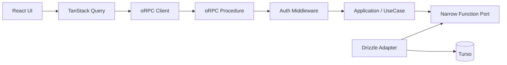
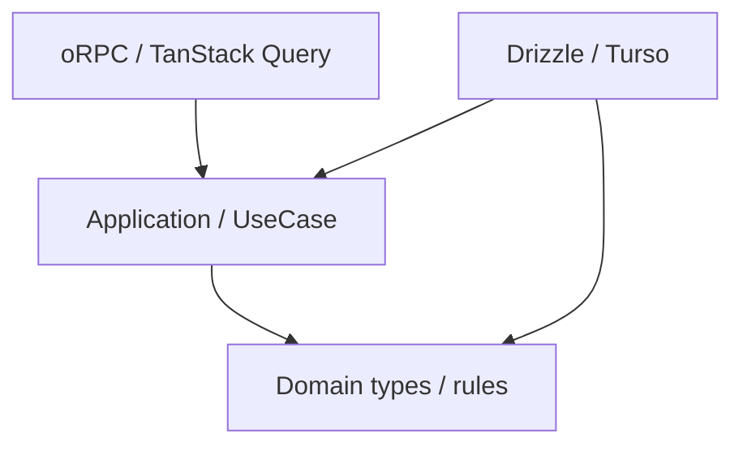

# アプリケーションアーキテクチャ改善設計

## 1. 結論

Pantry のバックエンド境界を、現在の TanStack Start Server Function 直結構成から段階的に変更する。

採用する方針は次のとおり。

1. **oRPC を型付き RPC 境界として導入する**
2. **TanStack Query をサーバー状態へアクセスする標準経路として使う**
3. **Application / UseCase 層を設け、業務処理を TanStack Start と oRPC から分離する**
4. **Expected Error は既存の `src/shared/domain/result.ts` の `Result` で表現する**
5. **未認証・入力不正は Application Error に混ぜず、RPC 境界の失敗として扱う**
6. **Unexpected Error は `throw` のまま oRPC に渡し、500 変換を自前実装しない**
7. **Application から Drizzle を追い出す箇所では、汎用 Repository ではなく狭い function port を使う**
8. **単純な read projection は無理に UseCase / Repository 化せず query service として分離してよい**
9. **SSR は `createRouterClient` を使い、同一 Worker 内の HTTP round trip を避ける**
10. **Unexpected Error の logging は HTTP と SSR で共有できる server-side interceptor に置く**
11. **ブラウザでセッション切れが起きた場合は RPC client interceptor で共通処理し、各フォームに 401 処理を散らさない**
12. **CreateTag 成功後は、直後に同じデータを再取得せず mutation output から TanStack Query cache を更新する**
13. **oRPC は stable 版を関連3パッケージで同一versionに exact pin し、pilot 中に v2 beta へ追従しない**
14. **Hono は現時点では導入しない**

今回の設計では、既存実装との一貫性よりも **今後のテスタビリティ・依存方向・ユーザー体験・性能**を優先する。

既存の Bookmark Application は `AppDb` を直接注入しているが、その unit test では Drizzle の fluent API を模倣するために `createThenableChain` と `as unknown as AppDb` を使っている。

この状態は「Application を DB 実装から切り離してテストしたい」という今回の目的には合わない。

そのため CreateTag pilot では、既存パターンを踏襲せず **UseCase が本当に必要とする能力だけを port として渡す**。

---

## 2. 現在の問題

現在の `src/features/tags/functions/add-tag.ts` は、1つの Server Function の中で次を行っている。

- request から認証セッションを取得する
- DB を取得する
- 同名タグを事前に検索する
- タグを INSERT する
- SQLite unique constraint error を業務エラーへ変換する
- transport へ返す値を作る

概念的には次の形である。

```ts
export const addTag = createServerFn({ method: 'POST' })
  .validator(addTagInputSchema)
  .handler(async ({ data }) => {
    const session = await requireRequestSession()
    const db = getDB()

    const [duplicate] = await db
      .select({ id: tagsTable.id })
      .from(tagsTable)
      .where(
        and(
          eq(tagsTable.userId, session.user.id),
          eq(tagsTable.normalizedName, data.name.normalized)
        )
      )
      .limit(1)

    if (duplicate != null) {
      throw new TagNameAlreadyExistsError()
    }

    try {
      const [created] = await db
        .insert(tagsTable)
        .values({
          userId: session.user.id,
          name: data.name.display,
          normalizedName: data.name.normalized
        })
        .returning({ id: tagsTable.id })

      return created
    } catch (error) {
      if (isSqliteUniqueConstraintError(error)) {
        throw new TagNameAlreadyExistsError()
      }

      throw error
    }
  })
```

この形だと、次の変更理由が同じ関数に混ざる。

- 認証方式を変える
- RPC framework を変える
- 業務エラーの型を変える
- SQL / Drizzle query を変える
- transport error を変える

Application boundary を置く目的は、これらを別々に変更できるようにすることである。

---

## 3. CreateTag の事前 SELECT を削除する

`tags` table にはすでに次の unique constraint がある。

```ts
unique().on(t.userId, t.normalizedName)
```

現在は正常系でも毎回、

```text
SELECT duplicate
INSERT tag
```

の2 query を発行する。

しかし事前 SELECT をしても、並行 request が来れば SELECT と INSERT の間に race condition がある。

最終的な正本は DB の unique constraint である。

pilot では次の形にする。

```text
INSERT tag
  ├─ success
  │    -> created
  ├─ unique violation
  │    -> name-conflict
  └─ other error
       -> throw
```

正常系の DB round trip を1回減らせる。

現在 `tags` で CreateTag が触れる値のうち、auto increment primary key 以外の unique constraint は `(user_id, normalized_name)` である。

将来別の unique constraint を追加する場合は、`name-conflict` への変換条件を再検討する。

---

## 4. shelf tags の所有者を1つにする

現在の protected layout は `fetchShelfTags()` を呼んでいる。

```ts
// src/routes/_protected.tsx
loader: async () => {
  const shelfTagsPromise = fetchShelfTags()
  return { shelfTagsPromise }
}
```

一方 `/tags` route も同じ `fetchShelfTags()` を呼んでいる。

```ts
// src/routes/_protected/tags/index.tsx
loader: async () => {
  const { user } = await ensureSession()
  const tagsPromise = fetchShelfTags()

  return {
    user,
    tagsPromise
  }
}
```

`/tags` は protected layout 配下なので、同じ projection を親と子が別々に要求している。

TanStack Query 移行後は shelf tags を **protected layout が所有する共通 query** にする。

```text
/_protected loader
  -> shelfTagsQuery を prefetch

ShelfSidebar
  -> same query cache

MobileShelfDialog
  -> same query cache

/tags TagTable
  -> same query cache
```

`/tags` 子 route からは同じ取得処理を削除する。

---

## 5. 目標アーキテクチャ

Mutation / workflow は次の形を基本とする。



依存方向は次のようにする。



Application は次を知らない。

- TanStack Start
- oRPC
- HTTP status
- Cookie
- Drizzle
- `AppDb`
- Turso
- React
- TanStack Query

---

## 6. `AppDb` 直接注入と narrow port の比較

### 案A: `AppDb` を Application に直接渡す

```ts
export async function executeCreateTag(params: {
  readonly db: AppDb
  readonly actorId: UserId
  readonly command: CreateTagCommand
}): Promise<CreateTagResult> {
  // Drizzle query
}
```

#### Pros

- ファイル数が少ない
- 実装が直接的

#### Cons

- Application が Drizzle に依存する
- unit test が query builder の呼び出し方に依存する
- `insert().values().returning()` などの mock が必要になる
- DB 実装の変更で Application test まで壊れやすい

今回の主目的がテスタビリティ改善なので採用しない。

### 案B: 汎用 `TagRepository`

```ts
interface TagRepository {
  create(...): Promise<...>
  update(...): Promise<...>
  findById(...): Promise<...>
  list(...): Promise<...>
}
```

#### Pros

- Drizzle を隠せる

#### Cons

- 今使わない能力まで interface に入りやすい
- read model と write model が混ざりやすい
- fake の実装量が増える
- Repository が巨大化しやすい

採用しない。

### 案C: 必要な能力だけ function port にする

```ts
export type InsertTag = (
  input: InsertTagInput
) => Promise<InsertTagOutcome>
```

#### Pros

- Application が Drizzle を知らない
- unit test は単純な function stub だけでよい
- 依存している能力が型から読める
- generic Repository より surface が小さい

#### Cons

- port と adapter のファイルは増える
- 小さい UseCase では層が薄く見える

**案Cを採用する。**

---

## 7. CreateTag Application

`src/features/tags/application/create-tag.ts` のイメージ。

```ts
import { err, ok } from '../../../shared/domain/result'
import type { Result } from '../../../shared/domain/result'
import type { UserId } from '../../auth/domain/auth-values'
import type { TagId, TagName } from '../domain/tag-values'

export type CreateTagCommand = {
  readonly name: TagName
  readonly pinned?: boolean
  readonly sortOrder?: number
  readonly color?: string | null
}

export type CreateTagError = {
  readonly code: 'tag-name-already-exists'
}

export type CreatedTag = {
  readonly id: TagId
  readonly name: TagName
  readonly pinned: boolean
  readonly sortOrder: number
  readonly color: string | null
}

export type CreateTagResult = Result<CreatedTag, CreateTagError>

export type InsertTagInput = {
  readonly actorId: UserId
  readonly name: TagName
  readonly pinned: boolean
  readonly sortOrder: number
  readonly color: string | null
}

export type InsertTagOutcome =
  | { readonly kind: 'created'; readonly id: TagId }
  | { readonly kind: 'name-conflict' }

export type InsertTag = (
  input: InsertTagInput
) => Promise<InsertTagOutcome>

export async function executeCreateTag(params: {
  readonly insertTag: InsertTag
  readonly actorId: UserId
  readonly command: CreateTagCommand
}): Promise<CreateTagResult> {
  const pinned = params.command.pinned ?? false
  const sortOrder = params.command.sortOrder ?? 0
  const color = params.command.color ?? null

  const outcome = await params.insertTag({
    actorId: params.actorId,
    name: params.command.name,
    pinned,
    sortOrder,
    color
  })

  switch (outcome.kind) {
    case 'name-conflict':
      return err({ code: 'tag-name-already-exists' })

    case 'created':
      return ok({
        id: outcome.id,
        name: params.command.name,
        pinned,
        sortOrder,
        color
      })
  }
}
```

この UseCase は小さいが、少なくとも次を Application の責務として持つ。

- default 値を確定する
- persistence の conflict を業務エラーへ変換する
- transport から独立した成功値を作る

---

## 8. Drizzle adapter

`src/features/tags/infrastructure/insert-tag.server.ts` のイメージ。

```ts
import * as v from 'valibot'

import type { AppDb } from '../../../db/app-db'
import { getDB } from '../../../db/get-db.server'
import { tagsTable } from '../../../db/schema/tag'
import type { InsertTag } from '../application/create-tag'
import { tagIdSchema } from '../domain/tag-values'
import { isSqliteUniqueConstraintError } from './is-sqlite-unique-constraint-error'

export async function insertTagWithDrizzle(params: {
  readonly db: AppDb
  readonly input: Parameters<InsertTag>[0]
}): ReturnType<InsertTag> {
  try {
    const [created] = await params.db
      .insert(tagsTable)
      .values({
        userId: params.input.actorId,
        name: params.input.name.display,
        normalizedName: params.input.name.normalized,
        pinned: params.input.pinned,
        sortOrder: params.input.sortOrder,
        color: params.input.color
      })
      .returning({ id: tagsTable.id })

    if (created == null) {
      throw new Error('Tag insert returned no row')
    }

    return {
      kind: 'created',
      id: v.parse(tagIdSchema, created.id)
    }
  } catch (error) {
    if (isSqliteUniqueConstraintError(error)) {
      return { kind: 'name-conflict' }
    }

    throw error
  }
}

export const insertTag: InsertTag = (input) =>
  insertTagWithDrizzle({
    db: getDB(),
    input
  })
```

SQLite / libSQL 固有の error 判定は infrastructure に閉じ込める。

---

## 9. UseCase test は Drizzle を mock しない

```ts
import { expect, test } from 'vitest'

import type { InsertTag } from './create-tag'
import { executeCreateTag } from './create-tag'

test('未指定値を default 化する', async () => {
  let received: Parameters<InsertTag>[0] | undefined

  const insertTag: InsertTag = async (input) => {
    received = input
    return { kind: 'created', id: tagId(1) }
  }

  const result = await executeCreateTag({
    insertTag,
    actorId: userId('user-1'),
    command: {
      name: tagName('TypeScript')
    }
  })

  expect(received).toMatchObject({
    pinned: false,
    sortOrder: 0,
    color: null
  })

  expect(result).toMatchObject({
    ok: true,
    value: {
      id: 1,
      pinned: false,
      sortOrder: 0,
      color: null
    }
  })
})

test('name conflict を Expected Error へ変換する', async () => {
  const insertTag: InsertTag = async () => ({
    kind: 'name-conflict'
  })

  const result = await executeCreateTag({
    insertTag,
    actorId: userId('user-1'),
    command: {
      name: tagName('TypeScript')
    }
  })

  expect(result).toStrictEqual({
    ok: false,
    error: {
      code: 'tag-name-already-exists'
    }
  })
})
```

Application test に Drizzle fluent mock を持ち込まないことを成功条件にする。

---

## 10. Infrastructure test は DB の事実を確認する

Infrastructure test では次を確認する。

- unique constraint が実際に効く
- unique violation が `name-conflict` へ変換される
- その他の DB error は throw される

ここでは fluent API の細かい mock より、可能なら一時的な libSQL / SQLite compatible DB を使う。

Application test は速く純粋に保ち、DB adapter の correctness は integration test で確認する。

---

## 11. read projection は query service でよい

`shelfTags` は画面表示用 projection で、現時点では業務上の分岐をほとんど持たない。

これを mutation と同じ形に揃えるためだけに `ShelfTagRepository` や `ListShelfTagsUseCase` を作る価値は低い。

read-only projection は server-only query service として分離する。

```ts
export async function listShelfTags(params: {
  readonly db: AppDb
  readonly actorId: UserId
}): Promise<ShelfTag[]> {
  return params.db
    .select({
      id: tagsTable.id,
      name: tagsTable.name,
      pinned: tagsTable.pinned,
      sortOrder: tagsTable.sortOrder,
      color: tagsTable.color,
      lastUsedAt: tagsTable.lastUsedAt,
      bookmarkCount: sql<number>`count(${bookmarkTable.id})`.mapWith(Number)
    })
    .from(tagsTable)
    .leftJoin(bookmarkTagsTable, eq(bookmarkTagsTable.tagId, tagsTable.id))
    .leftJoin(
      bookmarkTable,
      and(
        eq(bookmarkTable.id, bookmarkTagsTable.bookmarkId),
        isNull(bookmarkTable.deletedAt)
      )
    )
    .where(eq(tagsTable.userId, params.actorId))
    .groupBy(tagsTable.id)
}
```

非対称性は意図したものである。

```text
mutation / workflow
  -> UseCase + narrow port

simple read projection
  -> query service
```

全処理を同じ形に揃えること自体を目的にしない。

---

## 12. Error model

失敗を次の3種類に分ける。

| 種類 | 例 | 表現 | 責務 |
| --- | --- | --- | --- |
| Expected Application Error | 同名タグ、重複URL、対象なし | `Result.err` | Application |
| Boundary Rejection | 未認証、入力不正、rate limit | oRPC error | RPC boundary |
| Unexpected Error | DB障害、invariant violation、実装バグ | `throw` | oRPC まで伝播 |

### Expected Error

```ts
export type CreateTagError = {
  readonly code: 'tag-name-already-exists'
}
```

### Boundary Rejection

未認証は CreateTag という業務の失敗ではない。

UseCase が実行される前に拒否する。

### Unexpected Error

次のようにはしない。

```ts
// 採用しない
return err({ code: 'unexpected-error' })
```

未知の障害を Expected Error に潰さない。

---

## 13. Auth middleware

共通 auth middleware は actorId を context へ追加する。

```ts
import { os } from '@orpc/server'
import * as v from 'valibot'

import { userIdSchema } from '../features/auth/domain/auth-values'
import { getAuth } from '../features/auth/functions/get-auth.server'

type RpcInitialContext = {
  readonly headers: Headers
}

const base = os
  .$context<RpcInitialContext>()
  .errors({
    UNAUTHORIZED: {}
  })

const requireAuth = base.middleware(
  async ({ context, next, errors }) => {
    const session = await getAuth().api.getSession({
      headers: context.headers
    })

    if (!session) {
      throw errors.UNAUTHORIZED()
    }

    return next({
      context: {
        actorId: v.parse(userIdSchema, session.user.id)
      }
    })
  }
)

export const authed = base.use(requireAuth)
```

`UNAUTHORIZED` は oRPC の標準的な 401 code である。

UseCase は Cookie や session API を知らない。

---

## 14. Unexpected Error logging は server-side interceptor で共通化する

HTTP の `RPCHandler` だけに logging を置くと、SSR の `createRouterClient` が HTTP handler を通らないため取りこぼす。

同じ interceptor を、

- browser request を受ける `RPCHandler`
- SSR direct call の `createRouterClient`

の両方へ渡す。

```ts
import { onError, ORPCError } from '@orpc/server'

export const serverInterceptors = [
  onError((error) => {
    if (error instanceof ORPCError && error.status < 500) {
      return
    }

    console.error('Unexpected RPC error', error)
  })
]
```

この interceptor は error を変換しない。

```text
validation error / 4xx
  -> Unexpected Error として log しない

UNAUTHORIZED / 401
  -> Unexpected Error として log しない

defined conflict / 409
  -> Unexpected Error として log しない

plain Error
  -> log
  -> oRPC にそのまま処理させる

output validation failure / 5xx
  -> log
```

同じ例外を infrastructure / UseCase / procedure で重複 logging しない。

---

## 15. CreateTag procedure

Valibot は Standard Schema として直接利用する。

CreateTag のためだけに `@orpc/valibot` は追加しない。

`tagNameSchema` は文字列を `TagName` へ transform するため、browser 側の入力は `string`、handler 側では validation 済みの `TagName` として扱う。

```ts
import * as v from 'valibot'

import { executeCreateTag } from '../application/create-tag'
import { tagNameSchema } from '../domain/tag-values'
import { insertTag } from '../infrastructure/insert-tag.server'
import { authed } from '../../../rpc/base.server'

const createTagInputSchema = v.object({
  name: tagNameSchema,
  pinned: v.optional(v.boolean()),
  sortOrder: v.optional(v.number()),
  color: v.optional(v.nullable(v.string()))
})

export const createTagProcedure = authed
  .input(createTagInputSchema)
  .errors({
    'tag-name-already-exists': {
      status: 409
    }
  })
  .handler(async ({ input, context, errors }) => {
    const result = await executeCreateTag({
      insertTag,
      actorId: context.actorId,
      command: input
    })

    if (!result.ok) {
      switch (result.error.code) {
        case 'tag-name-already-exists':
          throw errors['tag-name-already-exists']()
      }
    }

    return {
      id: result.value.id,
      name: result.value.name.display,
      pinned: result.value.pinned,
      sortOrder: result.value.sortOrder,
      color: result.value.color
    }
  })
```

procedure は transport adapter に限定する。

SQL、Cookie 読み取り、SQLite error 判定を書かない。

---

## 16. shelfTags procedure

read query は query service を呼ぶだけにする。

```ts
export const shelfTagsProcedure = authed.handler(({ context }) =>
  listShelfTags({
    db: getDB(),
    actorId: context.actorId
  })
)
```

SQL は procedure に直接書かない。

---

## 17. Browser RPC handler

```ts
import { RPCHandler } from '@orpc/server/fetch'
import { createFileRoute } from '@tanstack/react-router'

import { router } from '../../rpc/router.server'
import { serverInterceptors } from '../../rpc/server-interceptors'

const handler = new RPCHandler(router, {
  interceptors: serverInterceptors
})

export const Route = createFileRoute('/api/rpc/$')({
  server: {
    handlers: {
      ANY: async ({ request }) => {
        const { response } = await handler.handle(request, {
          prefix: '/api/rpc',
          context: {
            headers: request.headers
          }
        })

        return response ?? new Response('Not Found', { status: 404 })
      }
    }
  }
})
```

`RPCHandler` の Strict GET Method plugin は既定値のまま有効にする。

mutation を GET で呼べるようにするためにこの保護を無効化しない。

pilot では RPCLink の既定 POST を利用し、HTTP cache のための GET 化は行わない。

---

## 18. SSR は `createRouterClient` で直接呼ぶ

SSR では同じ Worker の `/api/rpc` に fetch し直さない。

```ts
import { createORPCClient, onError, ORPCError } from '@orpc/client'
import { RPCLink } from '@orpc/client/fetch'
import { createRouterClient } from '@orpc/server'
import type { RouterClient } from '@orpc/server'
import { createIsomorphicFn } from '@tanstack/react-start'
import { getRequestHeaders } from '@tanstack/react-start/server'

import { router } from './router.server'
import { serverInterceptors } from './server-interceptors'

const getClient = createIsomorphicFn()
  .server(() =>
    createRouterClient(router, {
      context: async () => ({
        headers: getRequestHeaders()
      }),
      interceptors: serverInterceptors
    })
  )
  .client((): RouterClient<typeof router> => {
    const link = new RPCLink({
      url: `${window.location.origin}/api/rpc`,
      interceptors: [
        onError((error) => {
          if (!(error instanceof ORPCError) || error.code !== 'UNAUTHORIZED') {
            return
          }

          const redirect =
            window.location.pathname +
            window.location.search +
            window.location.hash

          const signIn = new URL('/sign-in/', window.location.origin)
          signIn.searchParams.set('redirect', redirect)

          window.location.replace(signIn)
        })
      ]
    })

    return createORPCClient(link)
  })

export const client: RouterClient<typeof router> = getClient()
```

401 を各フォームで個別処理しない。

セッション切れはフォーム固有の失敗ではないため、現在位置を `redirect` に保存して sign-in へ戻す。

`window.location.replace` を使うことで、認証切れ画面へブラウザ Back で戻って再度 401 を踏みやすい履歴を増やさない。

```text
Browser
  -> RPCLink
  -> 401 client interceptor
  -> /sign-in/?redirect=current-url

SSR
  -> createRouterClient
  -> auth middleware
```

SSR 側では通常、protected route の `beforeLoad` が先に未認証を sign-in へ redirect する。

---

## 19. server code が client bundle に漏れないことを確認する

SSR 最適化では server router を参照するため、client build に server 実装が混ざらないことを実際の build で確認する。

特に browser bundle に次が入っていないことを確認する。

- Drizzle server query 実装
- `@libsql/client`
- `getDB`
- Better Auth server 実装
- Turso credentials 関連コード

`createIsomorphicFn` の server branch に置いたから安全、と型だけで判断しない。

`pnpm run build` の生成物を確認する。

---

## 20. TanStack Query integration

```ts
import { createTanstackQueryUtils } from '@orpc/tanstack-query'

import { client } from './client'

export const orpc = createTanstackQueryUtils(client)
```

shelf tags は共通 query options にする。

```ts
export const shelfTagsQueryOptions = orpc.tags.shelf.queryOptions({
  staleTime: 30_000
})
```

短い `staleTime` を持たせ、SSR hydration 直後の不要な refetch を避ける。

---

## 21. protected loader が shelf query を所有する

```ts
export const Route = createFileRoute('/_protected')({
  // beforeLoad は省略
  loader: ({ context }) => {
    void context.queryClient.prefetchQuery(shelfTagsQueryOptions)
  },
  component: Layout
})
```

ここでは `await` しない。

現在と同様に shelf tags 取得で document 全体の SSR を block せず、Suspense boundary から stream できる形を維持する。

`/tags` 子 route からは同じ shelf fetch を削除する。

---

## 22. Promise prop を Query cache へ置き換える

現在の `shelfTagsPromise` の prop drilling を減らす。

```tsx
function ShelfNavQuery(props: ShelfNavQueryProps) {
  const { data: tags } = useSuspenseQuery(shelfTagsQueryOptions)

  return (
    <ShelfNav
      tags={tags}
      selection={props.selection}
      listSearch={props.listSearch}
      onNavigate={props.onNavigate}
    />
  )
}
```

タグ管理画面も同じ query を読む。

```tsx
function TagTableQuery() {
  const { data: tags } = useSuspenseQuery(shelfTagsQueryOptions)

  return <TagTable tags={tags} />
}
```

`TagTable` は pure component にできる。

```tsx
export function TagTable({ tags }: { readonly tags: readonly ShelfTag[] }) {
  const sorted = sortTagsForNav([...tags])

  // render
}
```

---

## 23. CreateTag 成功後は cache を直接更新する

前案では CreateTag 成功後に、

```ts
await queryClient.invalidateQueries(...)
```

として shelf tags を再取得する案だった。

これは採用しない。

新規タグについて shelf projection に必要な値は作成直後に確定している。

```ts
{
  id: created.id,
  name: created.name,
  pinned: created.pinned,
  sortOrder: created.sortOrder,
  color: created.color,
  lastUsedAt: null,
  bookmarkCount: 0
}
```

CreateTag 直後に同じ情報を Turso へ取りに行く価値は低い。

mutation output から cache を即時更新する。

```ts
import { useMutation, useQueryClient } from '@tanstack/react-query'

import { orpc } from '../../../rpc/query-utils'
import { shelfTagsQueryOptions } from './shelf-tags-query'

export function useCreateTagMutation() {
  const queryClient = useQueryClient()

  return useMutation(
    orpc.tags.create.mutationOptions({
      onSuccess: (created) => {
        queryClient.setQueryData<ShelfTag[]>(
          shelfTagsQueryOptions.queryKey,
          (current) => {
            if (current === undefined) {
              return current
            }

            const createdShelfTag: ShelfTag = {
              id: created.id,
              name: created.name,
              pinned: created.pinned,
              sortOrder: created.sortOrder,
              color: created.color,
              lastUsedAt: null,
              bookmarkCount: 0
            }

            return [
              ...current.filter((tag) => tag.id !== created.id),
              createdShelfTag
            ]
          }
        )
      }
    })
  )
}
```

`current === undefined` の場合に `[created]` を作らない。

既存一覧を取得できていない状態で新規タグ1件だけを「一覧全体」として cache すると不正確だからである。

通常の protected route では parent loader が shelf query を開始しているため、CreateTag をユーザーが送信する時点では cache が存在する想定である。

この前提がテストで成立しない場合だけ fallback refetch を追加する。

### なぜ background invalidate もしないのか

CreateTag が変更する shelf projection は新規1行だけで、必要な値は mutation output と仕様から完全に構築できる。

直後に authoritative refetch をすると、submit latency は待たなくても追加の DB query と network traffic は発生する。

single-user の Pantry では、この追加 query の価値は低い。

したがって CreateTag では cache update のみとする。

一方、次のような mutation は invalidate を使う可能性が高い。

- Bookmark 作成で複数タグの `bookmarkCount` が変わる
- derived value を client で安全に再構築できない
- 複数 query の結果が同時に変わる

つまり規約は、

```text
mutation output だけで正しい cache を構築できる
  -> setQueryData

正しい結果を client で再構築できない
  -> invalidateQueries
```

とする。

---

## 24. UI は Error class name を見ない

現在の判定例。

```ts
if (
  error instanceof Error &&
  error.name === 'TagNameAlreadyExistsError'
) {
  return 'そのタグ名は既に存在します'
}
```

移行後。

```ts
import { isDefinedError } from '@orpc/client'

export function getCreateTagErrorMessage(error: unknown): string {
  if (
    isDefinedError(error) &&
    error.code === 'tag-name-already-exists'
  ) {
    return 'そのタグ名は既に存在します'
  }

  return 'タグの作成に失敗しました'
}
```

401 は RPC client interceptor が sign-in へ遷移するため、フォーム固有の「タグ作成失敗」として扱わない。

`new-tag-screen.tsx` と `inline-add-tag.tsx` は同じ helper を使う。

`edit-tag-form.tsx` は UpdateTag 移行時に変更する。

---

## 25. 認証コストについて

`/_protected` の route guard と RPC auth middleware は役割が違う。

- route guard: 未認証ユーザーを sign-in へ redirect する
- RPC auth: data operation 自体を保護する

そのため oRPC 導入後も、route guard があるから RPC auth を省略してはいけない。

ブラウザから `actorId` を渡して auth を省略する案も採用しない。

一方で SSR では同一 request 内で session lookup が複数回起きる可能性がある。

これは pilot で計測する。

Better Auth の cookie cache は session DB lookup を減らせる一方、session 変更の反映遅延という意味変更を伴うため、architecture migration と同時には有効化しない。

まず現在の security semantics を維持して計測する。

必要なら別の最適化として検討する。

---

## 26. Hydration serializer は追加しすぎない

oRPC の TanStack Query integration は、oRPC native type を広く扱う場合に `StandardRPCJsonSerializer` を使った hydration を案内している。

一方、現在の Pantry の shelf query で JSON を超える型は主に `Date` であり、TanStack Router の SSR serializer は `Date` を標準で扱える。

そのため pilot の最初から custom serializer 設定を増やさない。

代わりに integration test で次を確認する。

```ts
expect(hydratedShelfTag.lastUsedAt).toBeInstanceOf(Date)
```

このテストが失敗する、または将来 `Map` / `Set` / `BigInt` などを query data に含める場合に `StandardRPCJsonSerializer` を導入する。

「oRPC を使うから必ず serializer を追加する」とはしない。

---

## 27. oRPC dependency 方針

pilot 中に framework API の変化まで検証対象へ混ぜない。

導入時点の stable 版を次の3パッケージで同一versionに揃え、exact pin する。

```yaml
catalogs:
  rpc:
    '@orpc/client': 1.15.0
    '@orpc/server': 1.15.0
    '@orpc/tanstack-query': 1.15.0
```

2026-08-22 時点の npm stable は3パッケージとも `1.15.0` である。

実装開始時に stable が変わっている場合は、その時点の同一 stable version へ読み替える。

pilot の途中で v2 beta へ移行しない。

また Valibot は Standard Schema として使えるため、OpenAPI schema generation など別の要件が出るまで `@orpc/valibot` は追加しない。

---

## 28. テスト戦略

### Application unit test

確認する。

- default 値
- Expected Error mapping
- business flow

依存しないもの。

- TanStack Start
- oRPC
- Drizzle
- Turso
- Cloudflare Workers runtime

### Infrastructure integration test

確認する。

- SQL / Drizzle query
- unique constraint
- error classification

### RPC integration test

最低限次を確認する。

```text
invalid input
  -> 4xx validation error

unauthenticated
  -> UNAUTHORIZED / 401

duplicate tag name
  -> tag-name-already-exists / 409

unknown Error
  -> INTERNAL_SERVER_ERROR / 500

unknown Error detail
  -> client へ漏れない
```

さらに、

- HTTP `RPCHandler`
- SSR `createRouterClient`

の両方で auth と server interceptor が動くことを確認する。

### Browser auth expiry test

- client RPC が `UNAUTHORIZED` を受ける
- `/sign-in/?redirect=<現在URL>` へ遷移する
- tag form の generic error を主要表示として残さない

### Query / UI test

- protected loader が shelf query を prefetch する
- `/tags` が重複 fetch を持たない
- sidebar / mobile / tag table が同じ query key を使う
- CreateTag 成功後に追加 fetch なしで shelf cache が更新される
- cache 未取得時に `[created]` だけの不完全な一覧を作らない
- duplicate error のメッセージを維持する
- 500 系 error を duplicate と誤表示しない
- SSR hydration 後も `lastUsedAt` が `Date | null` を維持する

---

## 29. パフォーマンス上の期待値

### CreateTag DB query

現在:

```text
SELECT duplicate
+ INSERT
```

移行後:

```text
INSERT
```

正常系 DB round trip を1回削減する。

### CreateTag 後の shelf 更新

前案:

```text
INSERT
-> invalidate
-> shelf SELECT
-> UI update
```

最終案:

```text
INSERT
-> mutation output
-> setQueryData
-> UI update
```

CreateTag のためだけの追加 shelf SELECT を発生させない。

### shelf tags 初期取得

現在は親 route と子 route が同じ projection を要求している。

移行後は protected layout の1 query を全 consumer が共有する。

### SSR

`createRouterClient` で Worker 内部 HTTP を避ける。

### hydration

短い `staleTime` で hydration 直後の不要な refetch を避ける。

### logging

Unexpected Error を1回だけ記録する。

### client bundle

server router / Drizzle / Turso driver が browser bundle に入らないことを確認する。

---

## 30. ディレクトリ構成案

```text
src/
  rpc/
    base.server.ts
    router.server.ts
    server-interceptors.ts
    client.ts
    query-utils.ts

  features/
    tags/
      application/
        create-tag.ts
        create-tag.test.ts

      domain/
        tag-values.ts

      infrastructure/
        insert-tag.server.ts
        insert-tag.test.ts
        is-sqlite-unique-constraint-error.ts
        list-shelf-tags.server.ts

      rpc/
        create-tag.ts
        shelf-tags.ts

      queries/
        shelf-tags-query.ts
        use-create-tag-mutation.ts

      components/
        ...

  routes/
    api/
      rpc.$.ts
```

feature locality は維持し、共通 RPC 基盤だけ `src/rpc/` に置く。

---

## 31. CreateTag pilot の移行手順

1. oRPC stable packages を同一versionで exact pin する
2. oRPC server / client 基盤を追加する
3. auth middleware を追加する
4. 共通 `serverInterceptors` を追加する
5. browser `RPCHandler` に server interceptor を設定する
6. SSR `createRouterClient` に同じ server interceptor を設定する
7. browser RPCLink に 401 redirect interceptor を設定する
8. `InsertTag` narrow port を定義する
9. `executeCreateTag` を追加する
10. Drizzle adapter `insertTag` を追加する
11. CreateTag の事前 duplicate SELECT を廃止する
12. CreateTag procedure を追加する
13. `shelfTags` query service / procedure を追加する
14. protected layout で shelf query を prefetch する
15. `/tags` 側の重複 fetch を削除する
16. Promise prop を `useSuspenseQuery` へ置き換える
17. CreateTag mutation hook を追加する
18. 成功後に `setQueryData` で shelf cache を更新する
19. `new-tag-screen.tsx` を新 mutation へ移す
20. `inline-add-tag.tsx` を新 mutation へ移す
21. `Error.name` 判定を typed `code` 判定へ変更する
22. Application / Infrastructure / RPC / UI test を追加する
23. SSR hydration で `Date` が保たれることを確認する
24. client bundle に server code が入っていないことを確認する
25. bundle size / latency / cold start / auth cost を比較する
26. 旧 `addTag` Server Function を削除する

---

## 32. Definition of Done

CreateTag pilot は次をすべて満たして完了とする。

- Application が TanStack Start に依存しない
- Application が oRPC に依存しない
- Application が Drizzle / `AppDb` に依存しない
- Application unit test に Drizzle fluent mock がない
- 既存 `Result` を再利用している
- CreateTag の Expected Error は `tag-name-already-exists` のみ
- duplicate check の事前 SELECT がない
- unique constraint race が正しく conflict になる
- 未認証が 401 になる
- browser で 401 を受けたら redirect 付き sign-in へ戻る
- duplicate が 409 になる
- unknown error が 500 になる
- unknown error の詳細が client へ漏れない
- validation 4xx を Unexpected Error として logging しない
- HTTP RPC と SSR direct call が同じ Unexpected Error logging 規約を使う
- Strict GET Method plugin を無効化していない
- `/tags` で shelf query を親子が二重取得しない
- CreateTag 後に追加 DB query なしで sidebar / table が更新される
- UI が Error class name に依存しない
- hydration 後も `Date` が壊れない
- browser bundle に Drizzle / Turso server code が混ざっていない
- client bundle / Worker bundle の増分を確認している
- cold start / request latency に目立つ悪化がない
- session lookup の回数とコストを確認している

---

## 33. Port を追加する基準

Port は「Clean Architecture だから」では追加しない。

次のどれかを満たす場合に追加する。

1. Application test で infrastructure mock が複雑になっている
2. 同じ外部能力を複数 UseCase が使う
3. infrastructure error を業務上の意味へ変換する必要がある
4. transaction 内で複数の外部操作を協調させたい
5. implementation detail が Application の型へ漏れている

単純な read projection のように Application logic がない場合は、無理に port を作らない。

---

## 34. Hono を今は導入しない

oRPC + Hono の組み合わせ自体には問題がない。

今回必要なのは、

- typed RPC
- auth middleware
- typed error contract
- server/client interceptor
- TanStack Query integration

であり、oRPC + TanStack Start で満たせる。

Hono を追加すると request lifecycle と middleware の配置候補が増える。

次の要件が出たら再評価する。

- RPC 以外の HTTP endpoint が多数増える
- webhook / callback / streaming response を共通 router で扱いたい
- oRPC adapter だけでは routing 要件が不足する
- API surface を TanStack Start から独立させたい

現段階では導入しない。

---

## 35. Pros / Cons

### Pros

- Application test が Drizzle から独立する
- transport / application / infrastructure の変更理由を分けられる
- Expected Error が型で読める
- auth failure を 500 と誤分類しにくい
- session expiry の UX を各フォームで重複実装しない
- UI が Error class serialization に依存しない
- CreateTag の正常系 DB round trip を減らせる
- CreateTag 後の不要な refetch をなくせる
- shelf query の ownership が明確になる
- SSR 内部 HTTP を避けられる
- HTTP / SSR の Unexpected Error logging を同じ規約にできる
- read projection に不要な abstraction を増やさない

### Cons

- ファイル数は増える
- narrow port という概念が増える
- CreateTag 単体では UseCase が薄く見える
- `Result` と oRPC defined error の2段階を理解する必要がある
- mutation と read query の構造が完全対称ではない
- cache の直接更新と invalidation の使い分け規約が必要になる
- migration 中は Server Function と oRPC が共存する

このコストを許容するのは、テスト容易性・UX・性能が実際に改善する場合だけである。

---

## 36. 最終判断

Mutation / workflow は次の構成を採用する。

```text
React UI
  -> TanStack Query
  -> oRPC
  -> auth middleware
  -> Application UseCase
  -> narrow function port
  -> Drizzle adapter
  -> Turso
```

単純な read projection は次でよい。

```text
React UI
  -> TanStack Query
  -> oRPC
  -> auth middleware
  -> server-side query service
  -> Drizzle
  -> Turso
```

Unexpected Error の観測は procedure の内側へ混ぜない。

```text
Browser RPCHandler ------┐
                         ├-> shared server interceptor -> procedure
SSR createRouterClient --┘
```

ブラウザの session expiry は RPC client の横断処理にする。

```text
RPCLink
  -> UNAUTHORIZED
  -> /sign-in/?redirect=current-url
```

CreateTag の cache 更新は再取得ではなく mutation output を使う。

```text
CreateTag
  -> INSERT
  -> created output
  -> setQueryData
  -> sidebar / table update
```

Pantry では、レイヤーを揃えること自体を目的にしない。

**変更理由を分離できるか、テストが簡単になるか、ユーザー体験が改善するか、性能を悪化させないか**で境界を決める。

CreateTag pilot では特に次を実証する。

1. narrow port で UseCase test を Drizzle から独立できる
2. unique constraint を正本にして正常系 query を1回減らせる
3. mutation output で不要な post-mutation refetch をなくせる
4. TanStack Query で shelf query の ownership を整理できる
5. SSR server-side client で Worker 内部 HTTP を避けられる
6. HTTP と SSR で同じ error observability を成立させられる
7. browser の session expiry を共通 UX として扱える

これらに実益がなければ、アーキテクチャを増やしたこと自体を成果とはみなさない。

## 参考

- oRPC TanStack Start Adapter: https://orpc.dev/docs/adapters/tanstack-start
- oRPC Server-Side Clients / SSR: https://orpc.dev/docs/best-practices/optimize-ssr
- oRPC Error Handling: https://orpc.dev/docs/error-handling
- oRPC Client Error Handling: https://orpc.dev/docs/client/error-handling
- oRPC RPC Handler: https://orpc.dev/docs/rpc-handler
- oRPC TanStack Query Integration: https://orpc.dev/docs/integrations/tanstack-query
- TanStack Router SSR Serialization: https://tanstack.com/router/v1/docs/guide/ssr
- TanStack Router + Query Integration: https://tanstack.com/router/latest/docs/integrations/query
