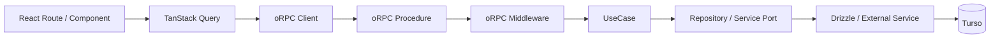
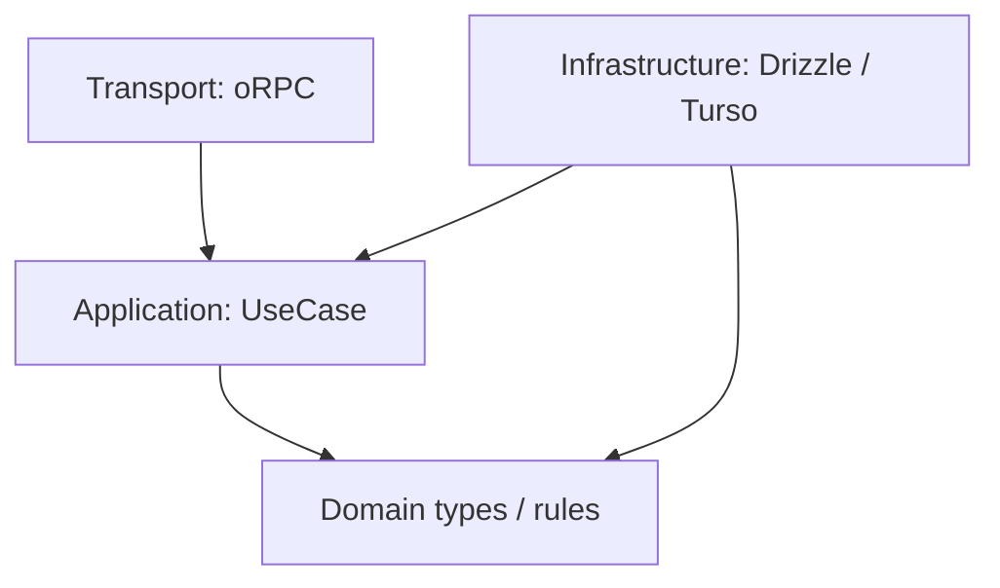
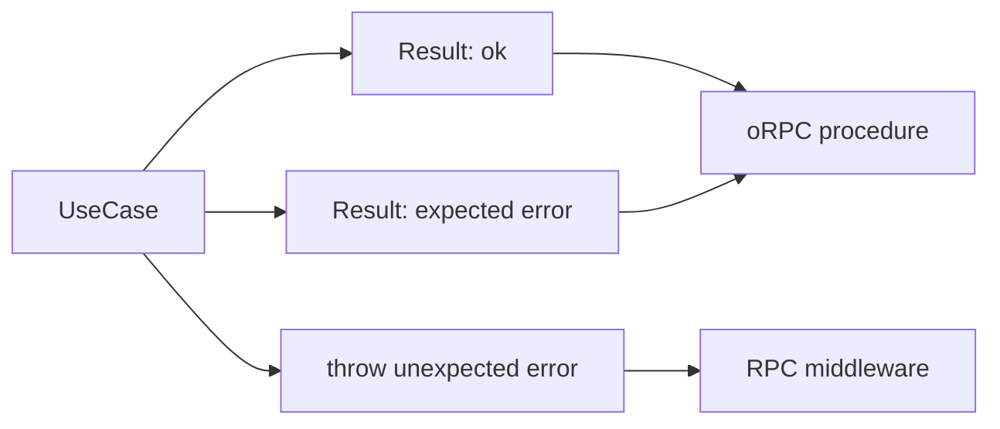
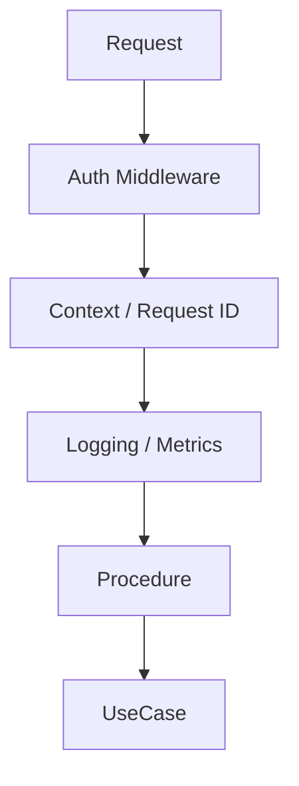
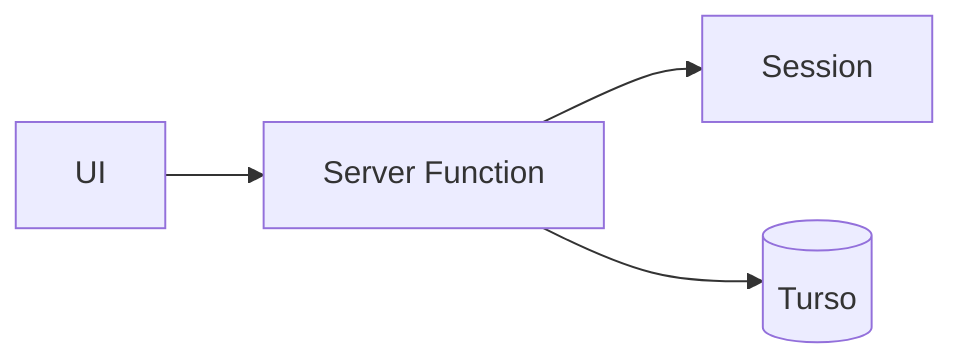
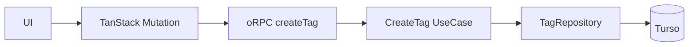

# アプリケーションアーキテクチャ改善設計

## 1. 結論

Pantry のバックエンド境界を、現在の TanStack Start Server Function 直結構成から、次の構成へ段階的に移行する。

1. **oRPC を型付き RPC 境界として導入する**
2. **TanStack Query をサーバー状態管理の標準経路として使う**
3. **UseCase 層を設け、アプリケーションロジックを transport から分離する**
4. **Expected Error は UseCase の戻り値として `Result` 型で表現する**
5. **認証・ロギング・エラー変換などの cross-cutting concern は RPC 境界へ集約する**
6. **Hono は現時点では導入しない**。oRPC だけでは HTTP ルーティング要件を扱いにくくなった時点で再評価する

この変更の主目的は「抽象化を増やすこと」ではなく、**テスタビリティ、エラー契約、横断的関心事の一貫性を改善し、機能追加時の変更範囲を小さくすること**である。

## 2. 背景

現在は `src/features/**/functions/` の TanStack Start Server Function が、複数の責務を同時に持っている。

代表的には次の処理が同一関数内に存在する。

- request からの認証セッション取得
- 入力 validation
- DB 接続取得
- ビジネスルールの判定
- Drizzle による query / transaction
- Expected Error の生成
- transport へ返す値の構築

小規模な段階では単純で分かりやすい一方、機能が増えるほど次の問題が出やすい。

- UseCase 単体テストでも request context や DB を必要とする
- 認証、ログ、計測、エラー変換が各 Server Function に散らばる
- Expected Error と Unexpected Error の境界が `throw` だけでは読み取りにくい
- UI 側の cache invalidation / query key / mutation 処理が機能ごとにばらつきやすい
- transport の都合がアプリケーションロジックへ侵入する

## 3. 目的

### 3.1 達成したいこと

- UseCase を request / framework から独立してテストできる
- Expected Error を型で列挙できる
- RPC procedure の責務を薄く保つ
- 認証や observability を共通 middleware として適用できる
- TanStack Query の query / mutation / invalidation を一貫した形で扱える
- Cloudflare Workers 上で不要な runtime / abstraction cost を増やさない

### 3.2 今回やらないこと

- マイクロサービス化
- 外部公開 API の設計
- すべての関数に interface を作ること
- すべての DB 操作を Repository Pattern に機械的に置き換えること
- Hono の導入
- ドメインイベントや CQRS の導入

「Clean Architecture の形を完成させること」は目的にしない。必要な境界だけを導入する。

## 4. 目標アーキテクチャ



依存方向は、原則として外側から内側へ向ける。



UseCase が Drizzle や oRPC の型を直接知る構成にはしない。

## 5. レイヤーごとの責務

### 5.1 UI / TanStack Query

TanStack Query はすでに Router に組み込まれているため、新規に「導入する」というより、**サーバー状態アクセスの標準経路として徹底する**。

責務:

- query / mutation の実行
- loading / pending / error state
- cache
- mutation 後の invalidation
- route loader と query cache の連携

UI component から oRPC client を直接呼ぶ経路は原則作らない。

### 5.2 oRPC procedure

procedure は transport adapter として薄くする。

責務:

- 入力 schema
- 認証済み context の受け取り
- UseCase の呼び出し
- UseCase の Expected Error (`Result.err`) を RPC error へ網羅的に変換
- Unexpected Error は procedure 内で try/catch せず、RPC middleware へ委譲する

procedure 内に SQL や主要なビジネスルールを書かない。
procedure は unexpected を Result から throw へ変換しない。Unexpected は UseCase が throw しており、Result には含まれない。

### 5.3 UseCase

UseCase は「ユーザーが行う操作」単位の application service とする。

例:

- `CreateBookmark`
- `UpdateBookmark`
- `DeleteBookmark`
- `CreateTag`
- `UpdateTag`

責務:

- 処理手順の組み立て
- ドメインルールの適用
- repository / service の協調
- transaction boundary の指定が必要なら、その意図を表現する
- Expected Error の返却

UseCase は HTTP、Cookie、TanStack Start、oRPC を知らない。

### 5.4 Infrastructure

Drizzle / Turso や外部 HTTP access は infrastructure に閉じ込める。

ただし Repository interface は「差し替えられる可能性があるから」ではなく、**UseCase のテストや責務分離に実際に価値がある箇所だけ**に導入する。

単純な read-only query まで一律に Repository 化して boilerplate を増やさない。

## 6. Expected Error と Result 型

### 6.1 方針

Expected Error は `throw` ではなく、UseCase の戻り値に含める。

Expected Error の例:

- 同名タグが存在する
- 対象ブックマークが存在しない
- URL がすでに登録されている
- 操作対象が現在のユーザーに属していない

Unexpected Error の例:

- DB 接続障害
- invariant violation
- 実装上ありえない状態
- ライブラリの予期しない例外

UseCase は Expected Error だけを `Result.err` で返す。未知の失敗は throw し、Result に折り畳まない。エラー union に `{ code: 'unexpected-error' }` を含めない。

UseCase が catch してよいのは次の2つに限る。

1. **Expected への分類** — 例: unique constraint を `{ code: 'tag-name-already-exists' }` へ写す。既知の infrastructure 信号を Expected Error に写す操作であり、unexpected を飲み込むことではない。
2. **Transaction rollback** — transaction 内で throw して rollback し、外側で **再 throw** する。これを `Result.err` に変換しない。

throw された Unexpected Error の catch は RPC middleware の1箇所に限る。middleware は request context 付きでログし、cause を剥がし、クライアント安全な 500 相当を返す。procedure は Expected Error の網羅変換だけを行い、unexpected を try/catch しない。ビジネス分岐は middleware に置かない。

Bookmark の現行 `{ code: 'unexpected-error' }` Result は Server Function 時代の中間形であり、移行時の残りである。UseCase を新経路へ移すときにその union から unexpected を外す。共通エラー処理として両方のモデルを残さない。

### 6.2 既存の Result 型を再利用する

新しい Result 型は追加しない。`src/shared/domain/result.ts` の `Result` / `ok` / `err` を使う。

形状は `{ ok: true, value }` / `{ ok: false, error }` である。`map` / `match` / `andThen` は意図的に置いておらず、呼び出し側は `if (!result.ok)` で分岐する。

Expected Error の判別子は既存 Application 層に合わせ、`code` + kebab-case にする。`type` や PascalCase は使わない。

UseCase の例:

```ts
type CreateTagError = { code: 'tag-name-already-exists' } | { code: 'tag-limit-exceeded' }

type CreateTagResult = Result<{ id: number }, CreateTagError>
```

この形にすることで、procedure は Expected Error の exhaustiveness を保ったまま transport error へ変換できる。



### 6.3 Expected Error を class にしない理由

Expected Error は制御フローの一部であり、stack trace を主目的にしない。

型付き union にすると次の利点がある。

- 呼び出し側が取り得る失敗を型から読める
- exhaustive check ができる
- transport 固有 error class に UseCase が依存しない
- テストで比較しやすい

既存の Error class は、一括置換せず migration の中で段階的に置き換える。

## 7. Cross-cutting concern

RPC 境界へ集約する対象:

- authentication
- authorization に必要な request context の構築
- request ID
- structured logging
- duration / tracing
- Unexpected Error の catch・ログ・cause の除去・クライアント安全な 500 相当への変換（RPC middleware）
- Expected Error から RPC error への変換補助
- 将来的な rate limit



各 UseCase や procedure が個別に同じ処理を実装し始めたら設計上の失敗とみなす。

Unexpected Error の共通処理は RPC middleware であり、第二の Result variant ではない。procedure は unexpected を try/catch しない。

## 8. Hono を今は導入しない理由

oRPC + Hono の組み合わせ自体は可能だが、Pantry の現状では Hono が解決する追加課題がまだ小さい。

Hono を追加すると次のコストが増える。

- request lifecycle の理解対象が増える
- TanStack Start / oRPC / Hono の境界設計が必要になる
- middleware の配置候補が増え、責務が曖昧になりやすい
- dependency と bundle surface が増える

次のいずれかが現れたら再評価する。

- RPC 以外の HTTP endpoint が多数必要になる
- webhook / callback / file response などを共通 router で扱いたい
- oRPC の adapter だけでは middleware / routing 要件を表現しにくい
- API surface を TanStack Start から独立させる必要が出る

現時点では **oRPC の導入価値はあるが、Hono の追加価値はまだ不足している**と判断する。

## 9. ディレクトリ構成案

機能単位のまとまりは維持する。

```text
src/
  features/
    tags/
      application/
        create-tag.ts
        update-tag.ts
      domain/
        ...
      infrastructure/
        tag-repository.server.ts
      rpc/
        create-tag.ts
        update-tag.ts
      queries/
        tag-query-options.ts
        tag-mutation-options.ts
```

厳密な層別ディレクトリを repository root に横並びさせるより、Pantry の規模では feature locality を優先する。

## 10. 具体例: CreateTag

### 現状



Server Function が認証、重複判定、insert、SQLite error の変換まで行う。

### 移行後



UseCase の interface イメージ:

```ts
type CreateTagInput = {
  userId: string
  name: TagName
  pinned?: boolean
  sortOrder?: number
  color?: string | null
}

type CreateTagError = { code: 'tag-name-already-exists' }

type CreateTag = (input: CreateTagInput) => Promise<Result<{ id: number }, CreateTagError>>
```

認証済み `userId` は RPC middleware / context から procedure が取り出して UseCase に明示的に渡す。

UseCase 内で global request context を参照しない。

## 11. テスト戦略

### UseCase test

最優先で増やす。

- in-memory fake / stub repository を注入
- HTTP runtime 不要
- Cloudflare Workers runtime 不要
- Turso 不要
- Expected Error を `Result` として直接 assert
- Unexpected Error は `rejects.toThrow`（または同等）で assert する。`err({ code: 'unexpected-error' })` では assert しない

### Infrastructure test

必要な query / constraint / transaction のみ Turso または test DB で確認する。

### RPC integration test

すべての組み合わせを RPC 層で再テストしない。

確認対象を次に限定する。

- validation
- auth context
- Expected Error mapping
- representative happy path

この分離により、テスト速度と失敗原因の局所性を改善する。

## 12. 移行手順

一括置換はしない。

1. oRPC の server/client 基盤を追加する
2. 共通 auth context と、Unexpected Error を catch する RPC middleware を構築する
3. 既存の `src/shared/domain/result.ts` を使う。第二の `Result` 型は追加しない
4. 小さい mutation である `CreateTag` を pilot として移行する
5. TanStack Query mutation から新しい RPC を呼ぶ
6. テストの書きやすさ、bundle、実装量を評価する
7. 問題がなければ Tag mutation を順次移行する
8. Bookmark mutation を移行する
9. read query は効果が大きいものから移行する
10. 旧 Server Function が不要になった時点で削除する

### 移行中のルール

- 新旧経路を同じ操作で二重に持つ期間を長くしない
- UseCase を新経路へ移すとき、エラー union から `{ code: 'unexpected-error' }` を外す
- 1 PR で全 feature を移行しない
- framework migration とドメイン仕様変更を同じ PR に混ぜない
- performance / bundle size の悪化を計測せずに受け入れない

## 13. 評価指標

移行を継続する価値があるか、pilot 後に次を確認する。

- UseCase test が Worker / DB なしで実行できるか
- mutation 追加時の boilerplate が許容範囲か
- Expected Error の分岐が以前より明確か
- auth / logging が procedure ごとに重複していないか
- client bundle / Worker bundle が不必要に増えていないか
- cold start / request latency に目立つ悪化がないか
- TanStack Query の invalidation が追いやすくなったか

これらが改善しない場合、アーキテクチャを増やしたこと自体を成果とみなさず、設計を縮小する。

## 14. Pros / Cons

### Pros

- UseCase の単体テストが容易になる
- Expected Error の契約が型として明示される
- transport と application logic の変更理由を分離できる
- cross-cutting concern を中央集約できる
- TanStack Query と RPC の責務が明確になる
- 将来 API client を追加する場合も application logic を再利用しやすい

### Cons

- ファイル数と概念数は増える
- 単純 CRUD では既存 Server Function より記述量が増える
- Result と RPC error の二段階 error model を理解する必要がある
- migration 中は新旧パターンが共存する
- Repository interface を過剰適用すると boilerplate が急増する

## 15. 採用判断

採用する。

ただし、採用対象は **oRPC + TanStack Query の標準化 + UseCase + Result + RPC middleware** までとする。

Hono、全面的な Repository Pattern、Clean Architecture の厳密な層分割は現段階では採用しない。

まず `CreateTag` を pilot にし、テスタビリティと実装コストを実測してから適用範囲を広げる。
