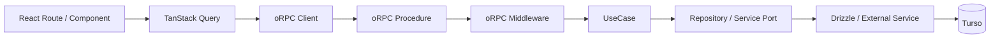
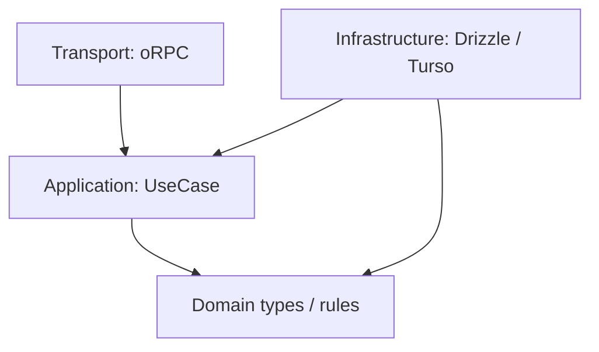
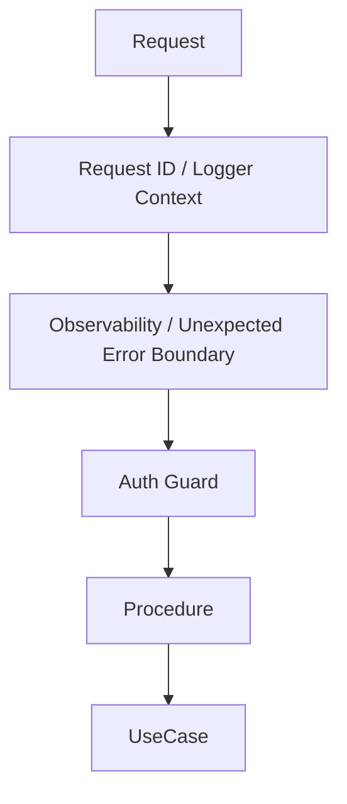
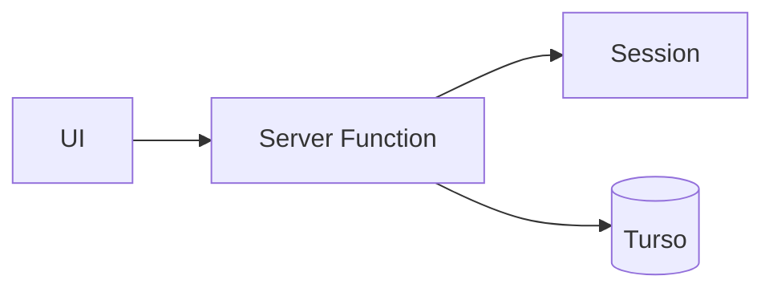
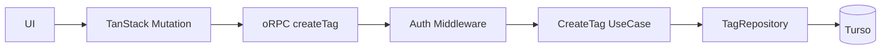

# アプリケーションアーキテクチャ改善設計

## 1. 結論

Pantry のバックエンド境界を、現在の TanStack Start Server Function 直結構成から、次の構成へ段階的に移行する。

1. **oRPC を型付き RPC 境界として導入する**
2. **TanStack Query をサーバー状態管理の標準経路として使う**
3. **UseCase 層を設け、アプリケーションロジックを transport から分離する**
4. **Expected Error は既存の `src/shared/domain/result.ts` の `Result` で表現する**
5. **失敗を Application Expected / Boundary Rejection / Unexpected の3種類に分ける**
6. **認証・request context・ロギング・計測・Unexpected Error の記録などの cross-cutting concern は RPC 境界へ集約する**
7. **Hono は現時点では導入しない**。oRPC だけでは HTTP ルーティング要件を扱いにくくなった時点で再評価する

この変更の主目的は「抽象化を増やすこと」ではなく、**テスタビリティ、エラー契約、横断的関心事の一貫性を改善し、機能追加時の変更範囲を小さくすること**である。

## 2. 背景

現在は `src/features/**/functions/` の TanStack Start Server Function が、複数の責務を同時に持っている。

代表例として `src/features/tags/functions/add-tag.ts` には、次の処理が同一関数内に存在する。

- request からの認証セッション取得
- 入力 validation
- DB 接続取得
- タグ名重複の判定
- Drizzle による insert
- SQLite unique constraint error の変換
- transport へ返す値の構築

小規模な段階では単純で分かりやすい一方、機能が増えるほど次の問題が出やすい。

- UseCase 単体テストでも request context や DB を必要とする
- 認証、ログ、計測、エラー変換が各 Server Function に散らばる
- 業務上予測可能な失敗と、インフラ・実装上の予期しない失敗の境界が読み取りにくい
- UI 側の cache invalidation / query key / mutation 処理が機能ごとにばらつきやすい
- transport の都合がアプリケーションロジックへ侵入する

## 3. 目的

### 3.1 達成したいこと

- UseCase を request / framework から独立してテストできる
- Application Expected Error を型で列挙できる
- 認証失敗などの protocol-level rejection を 4xx として明示できる
- Unexpected Error を一箇所で記録し、500 相当として扱える
- RPC procedure の責務を薄く保つ
- 認証や observability を共通 middleware として適用できる
- TanStack Query の query / mutation / invalidation を一貫した形で扱える
- Cloudflare Workers 上で不要な runtime / abstraction cost を増やさない

### 3.2 今回やらないこと

- マイクロサービス化
- 外部公開 API の設計
- すべての関数に interface を作ること
- すべての DB 操作を Repository Pattern に機械的に置き換えること
- Hono の導入
- ドメインイベントや CQRS の導入
- 独自 Result 型の追加

「Clean Architecture の形を完成させること」は目的にしない。必要な境界だけを導入する。

## 4. 目標アーキテクチャ



依存方向は、原則として外側から内側へ向ける。



UseCase が TanStack Start や oRPC の型を直接知る構成にはしない。

## 5. レイヤーごとの責務

### 5.1 UI / TanStack Query

TanStack Query はすでに Router に組み込まれているため、新規に「導入する」というより、**サーバー状態アクセスの標準経路として徹底する**。

責務:

- query / mutation の実行
- loading / pending / error state
- cache
- mutation 後の invalidation
- route loader と query cache の連携
- oRPC の defined error を画面用エラーへ変換

UI component から oRPC client を直接呼ぶ経路は原則作らない。

### 5.2 oRPC procedure

procedure は transport adapter として薄くする。

責務:

- 入力 schema
- 認証済み context の受け取り
- UseCase の呼び出し
- UseCase の `Result` を oRPC の defined error / response へ変換
- Unexpected Error は catch せず、外側の共通 middleware へ伝播させる

procedure 内に SQL や主要なビジネスルールを書かない。
procedure は unexpected を Result から throw へ変換しない。Unexpected は UseCase が throw しており、Result には含まれない。

### 5.3 UseCase

UseCase は「ユーザーが行う操作」単位の application service とする。

例:

- `CreateBookmark`
- `UpdateBookmark`
- `DeleteBookmark`
- `CreateTag`
- `UpdateTag`

責務:

- 処理手順の組み立て
- ドメインルールの適用
- repository / service の協調
- transaction boundary の指定が必要なら、その意図を表現する
- Application Expected Error の返却

UseCase は HTTP、Cookie、TanStack Start、oRPC を知らない。

### 5.4 Infrastructure

Drizzle / Turso や外部 HTTP access は infrastructure に閉じ込める。

ただし Repository interface は「差し替えられる可能性があるから」ではなく、**UseCase のテストや責務分離に実際に価値がある箇所だけ**に導入する。

単純な read-only query まで一律に Repository 化して boilerplate を増やさない。

## 6. エラーモデル

### 6.1 3分類を境界として固定する

失敗を次の3種類に分ける。

| 分類 | 例 | 発生箇所 | 表現 | transport |
| --- | --- | --- | --- | --- |
| Application Expected | 同名タグ、重複URL、対象なし | UseCase | `Result.err` | procedure が defined error へ変換 |
| Boundary Rejection | 未認証、入力不正、将来のrate limit | RPC boundary / middleware | oRPC defined error | 401 / 400 / 429 など |
| Unexpected | DB接続障害、invariant violation、未知の例外 | 任意 | `throw` | 共通 middleware で記録し 500 |

重要なのは、**未認証を Application Expected Error に入れないこと**と、**Unexpected Error にも入れないこと**である。

現在の `requireRequestSession()` は未認証時に `new Error('Unauthorized')` を throw する。この実装をそのまま auth middleware に移すと generic error として 500 相当に分類される危険がある。

移行後は auth middleware がセッション欠如を検出し、oRPC の `UNAUTHORIZED` defined error として 401 相当に変換する。

oRPC は `UNAUTHORIZED` を 401 に対応付け、middleware から認証 context を guard / inject できるため、この責務を UseCase へ持ち込まない。

参考:

- https://orpc.dev/docs/middleware
- https://orpc.dev/docs/error-handling
- https://orpc.dev/docs/openapi/error-handling

### 6.2 Application Expected Error は既存 Result を使う

Pantry にはすでに `src/shared/domain/result.ts` があるため、新しい Result 型は定義しない。

```ts
import { err, ok } from '../../../shared/domain/result'
import type { Result } from '../../../shared/domain/result'
```

Application Expected Error の判別子は既存コードに合わせ、**`code` + kebab-case** を使う。

CreateTag の Expected Error は現行仕様上、タグ名重複だけである。

```ts
type CreateTagError = {
  readonly code: 'tag-name-already-exists'
}

type CreateTagResult = Result<{ readonly id: number }, CreateTagError>
```

`tag-limit-exceeded` は採用しない。20件上限はブックマークに付与するタグ数の制約であり、ユーザーが作成できるタグ総数の制約ではない。

### 6.3 Expected と Unexpected を混ぜない

新規に移行する UseCase では、未知の DB error などを次のように `Result.err({ code: 'unexpected-error' })` へ潰さない。

```ts
// 採用しない
return err({ code: 'unexpected-error' })
```

Unexpected Error は `throw` のまま transport boundary まで上げる。

一方、SQLite unique constraint のように、インフラ例外から既知の業務上の意味へ安全に変換できるものは infrastructure / UseCase 境界で Application Expected Error に変換してよい。

例:

- tag name unique constraint -> `tag-name-already-exists`
- bookmark URL unique constraint -> `duplicate-url`

### 6.4 oRPC error contract への変換

Application Error の `code` は可能な限り transport でも同じ意味を保つ。

CreateTag では oRPC defined error として `tag-name-already-exists` を宣言し、409 を割り当てる。

```ts
const createTagProcedure = base
  .errors({
    'tag-name-already-exists': {
      status: 409
    }
  })
  .handler(async ({ input, context, errors }) => {
    const result = await createTag({
      actorId: context.session.user.id,
      input
    })

    if (!result.ok) {
      switch (result.error.code) {
        case 'tag-name-already-exists':
          throw errors['tag-name-already-exists']()
      }
    }

    return result.value
  })
```

これにより UI は Error class の `name` ではなく、型付き RPC error の `code` を見る。

### 6.5 Unexpected Error は一度だけ catch する

Unexpected Error の記録と 500 変換は、RPC 境界の最外周に近い共通 middleware で一度だけ行う。

procedure / UseCase / repository の各層で同じ例外を順番に catch + log しない。

概念例:

```ts
const observeErrors = base.middleware(async ({ next, context }) => {
  try {
    return await next()
  } catch (error) {
    if (error instanceof ORPCError) {
      throw error
    }

    context.logger.error({ error }, 'Unhandled RPC error')
    throw new ORPCError('INTERNAL_SERVER_ERROR', { cause: error })
  }
})
```

`ORPCError` をそのまま再 throw するのは、auth middleware の `UNAUTHORIZED` や procedure が生成した defined error を 500 に塗り替えないためである。

実装時は oRPC 自身の validation error も既分類エラーとして壊さないことを integration test で確認する。

## 7. Cross-cutting concern

RPC 境界へ集約する対象:

- authentication
- authorization に必要な request context の構築
- request ID
- structured logging
- duration / tracing
- Unexpected Error の記録
- 将来的な rate limit

Application Expected Error から procedure-specific defined error への対応付けは procedure に残す。機能固有の error mapping まで巨大な共通 middleware に集約しない。



### 7.1 middleware の失敗分類

- auth guard が失敗: `UNAUTHORIZED` を throwし 401
- validation が失敗: oRPC の validation error を維持
- rate limit が失敗: 将来 `TOO_MANY_REQUESTS` 相当
- procedure が defined error を throw: そのまま client へ
- plain `Error` / unknown が外まで到達: 一度だけ記録して 500

各 UseCase や procedure が認証・request ID・generic logging を個別実装し始めたら設計上の失敗とみなす。

Unexpected Error の共通処理は RPC middleware であり、第二の Result variant ではない。procedure は unexpected を try/catch しない。

## 8. Hono を今は導入しない理由

oRPC + Hono の組み合わせ自体は可能だが、Pantry の現状では Hono が解決する追加課題がまだ小さい。

Hono を追加すると次のコストが増える。

- request lifecycle の理解対象が増える
- TanStack Start / oRPC / Hono の境界設計が必要になる
- middleware の配置候補が増え、責務が曖昧になりやすい
- dependency と bundle surface が増える

次のいずれかが現れたら再評価する。

- RPC 以外の HTTP endpoint が多数必要になる
- webhook / callback / file response などを共通 router で扱いたい
- oRPC の adapter だけでは middleware / routing 要件を表現しにくい
- API surface を TanStack Start から独立させる必要が出る

現時点では **oRPC の導入価値はあるが、Hono の追加価値はまだ不足している**と判断する。

## 9. ディレクトリ構成案

機能単位のまとまりは維持する。

```text
src/
  features/
    tags/
      application/
        create-tag.ts
        update-tag.ts
      domain/
        ...
      infrastructure/
        tag-repository.server.ts
      rpc/
        create-tag.ts
        update-tag.ts
      queries/
        tag-query-options.ts
        tag-mutation-options.ts
```

厳密な層別ディレクトリを repository root に横並びさせるより、Pantry の規模では feature locality を優先する。

## 10. 具体例: CreateTag

### 10.1 現状



Server Function が認証、重複判定、insert、SQLite error の変換まで行う。

### 10.2 移行後



UseCase の interface イメージ:

```ts
type CreateTagInput = {
  readonly name: TagName
  readonly pinned?: boolean
  readonly sortOrder?: number
  readonly color?: string | null
}

type CreateTagError = {
  readonly code: 'tag-name-already-exists'
}

type CreateTag = (params: {
  readonly actorId: UserId
  readonly input: CreateTagInput
}) => Promise<Result<{ readonly id: number }, CreateTagError>>
```

認証済み `actorId` は RPC middleware / context から procedure が取り出して UseCase に明示的に渡す。

UseCase 内で global request context を参照しない。

### 10.3 CreateTag UI の移行

現行 CreateTag UI は次の2箇所で `TagNameAlreadyExistsError` の class name を見ている。

- `src/features/tags/components/new-tag-screen.tsx`
- `src/features/tags/components/inline-add-tag.tsx`

pilot では両方を oRPC + TanStack Query mutation へ移し、エラー判定を type-safe defined error の `code` へ変更する。

概念例:

```ts
if (isDefinedError(error) && error.code === 'tag-name-already-exists') {
  return 'そのタグ名は既に存在します'
}
```

`src/features/tags/components/edit-tag-form.tsx` も同じ `TagNameAlreadyExistsError` 判定を持つが、これは **UpdateTag** の UI であり CreateTag pilot の対象ではない。

したがって、CreateTag pilot の完了条件へ無理に含めず、UpdateTag 移行時の必須変更として追跡する。

## 11. テスト戦略

### 11.1 UseCase test

最優先で増やす。

- in-memory fake / stub repository を注入
- HTTP runtime 不要
- Cloudflare Workers runtime 不要
- Turso 不要
- `tag-name-already-exists` を `Result.err` として直接 assert
- Unexpected Error は Result に潰れず reject / throw することを確認

### 11.2 Infrastructure test

必要な query / constraint / transaction のみ Turso または test DB で確認する。

CreateTag では少なくとも unique constraint race が `tag-name-already-exists` へ変換されることを確認する。

### 11.3 RPC integration test

すべての組み合わせを RPC 層で再テストしない。

境界契約として次を確認する。

- invalid input -> 4xx validation error
- unauthenticated -> `UNAUTHORIZED` / 401
- duplicate tag name -> `tag-name-already-exists` / 409
- representative happy path
- unknown exception -> 500
- unknown exception の詳細が client へ漏れない
- defined error が outer error middleware で 500 に塗り替えられない

### 11.4 UI test

CreateTag pilot では次を確認する。

- `new-tag-screen.tsx` が重複エラーを `code` で判定し、既存メッセージを表示する
- `inline-add-tag.tsx` が重複エラーを `code` で判定し、既存メッセージを表示する
- generic / Unexpected Error では重複メッセージを表示しない

## 12. 移行手順

一括置換はしない。

1. oRPC の server/client 基盤を追加する
2. 共通 request context / auth guard / observability middleware を構築する
3. `src/shared/domain/result.ts` をそのまま Application Expected Error の共通 Result として使う
4. `CreateTag` UseCase を pilot として切り出す
5. CreateTag procedure で `tag-name-already-exists` を defined error に mapping する
6. `new-tag-screen.tsx` と `inline-add-tag.tsx` を TanStack Query mutation + oRPC へ移行する
7. UI の `TagNameAlreadyExistsError.name` 判定を typed `code` 判定へ置き換える
8. auth 401 / duplicate 409 / unknown 500 の RPC integration test を追加する
9. テストの書きやすさ、bundle、実装量、latency を評価する
10. 問題がなければ Tag mutation を順次移行する
11. `UpdateTag` 移行時に `edit-tag-form.tsx` の error mapping も `code` 契約へ変更する
12. Bookmark mutation を移行する
13. read query は効果が大きいものから移行する
14. 旧 Server Function が不要になった時点で削除する

### 12.1 CreateTag pilot の Definition of Done

- UseCase が TanStack Start / Cookie / oRPC に依存しない
- 既存 `Result` を再利用し、独自 Result を増やしていない
- CreateTag の Expected Error は `tag-name-already-exists` のみ
- 未認証は 500 ではなく 401
- 重複タグ名は type-safe defined error として 409
- Unexpected Error は一度だけ共通 middleware で記録され 500
- `new-tag-screen.tsx` と `inline-add-tag.tsx` が Error class name に依存しない
- UI が重複エラーの既存メッセージを維持する
- client / Worker bundle の増分を確認する
- request latency / cold start の目立つ悪化がない

### 12.2 移行中のルール

- 新旧経路を同じ操作で二重に持つ期間を長くしない
- UseCase を新経路へ移すとき、エラー union から `{ code: 'unexpected-error' }` を外す
- 1 PR で全 feature を移行しない
- framework migration とドメイン仕様変更を同じ PR に混ぜない
- performance / bundle size の悪化を計測せずに受け入れない
- migration の都合で新しい業務ルールを追加しない
- boundary error と application error を一つの巨大 union に統合しない

## 13. 評価指標

移行を継続する価値があるか、pilot 後に次を確認する。

- UseCase test が Worker / DB なしで実行できるか
- mutation 追加時の boilerplate が許容範囲か
- Application Expected / Boundary Rejection / Unexpected の区別が以前より明確か
- auth / request context / generic logging が procedure ごとに重複していないか
- client bundle / Worker bundle が不必要に増えていないか
- cold start / request latency に目立つ悪化がないか
- TanStack Query の invalidation が追いやすくなったか
- UI が transport error class の実装詳細ではなく型付き contract を参照できているか

これらが改善しない場合、アーキテクチャを増やしたこと自体を成果とみなさず、設計を縮小する。

## 14. Pros / Cons

### Pros

- UseCase の単体テストが容易になる
- Application Expected Error の契約が型として明示される
- auth 失敗を 500 と誤分類しにくくなる
- transport と application logic の変更理由を分離できる
- cross-cutting concern を中央集約できる
- TanStack Query と RPC の責務が明確になる
- UI が Error class serialization の挙動に依存しなくなる
- 将来 API client を追加する場合も application logic を再利用しやすい

### Cons

- ファイル数と概念数は増える
- 単純 CRUD では既存 Server Function より記述量が増える
- Application Result と oRPC defined error の二段階 error model を理解する必要がある
- Boundary Rejection を含めるとエラー分類の概念が一つ増える
- migration 中は新旧パターンが共存する
- Repository interface を過剰適用すると boilerplate が急増する

## 15. 採用判断

採用する。

ただし、採用対象は **oRPC + TanStack Query の標準化 + UseCase + 既存 Result + RPC middleware** までとする。

エラー境界は次の3分類を設計上の契約とする。

1. Application Expected -> `Result`
2. Boundary Rejection -> oRPC defined error
3. Unexpected -> `throw` + outer middleware で一度だけ記録

Hono、全面的な Repository Pattern、Clean Architecture の厳密な層分割は現段階では採用しない。

まず `CreateTag` を pilot にし、**認証401・重複409・Unexpected 500・UI code mapping** まで含めて成立させた上で、テスタビリティと実装コストを実測して適用範囲を広げる。
