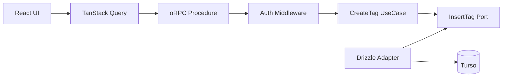

# CreateTag pilot アーキテクチャ RFC

## Status

Draft。

この RFC は Pantry 全体の最終アーキテクチャを定義しない。

**CreateTag を代表ユースケースとして、認証済みの単純 Command に対する新しい実装形を pilot する。**

pilot 完了後に `Adopt / Modify / Reject` を判断する。

## Goal

現在の CreateTag は TanStack Start Server Function の中に、認証・DB 操作・重複判定・エラー変換が集まっている。

この pilot では次を検証する。

- oRPC を型付き RPC 境界として使う価値があるか
- TanStack Query を browser 側の mutation 経路として使う価値があるか
- Application / UseCase を transport から分離するとテストしやすくなるか
- Expected Error を既存 `Result` で表現すると責務が明確になるか
- Application から Drizzle を narrow function port で分離する価値があるか
- その代わりに増える実装量・bundle・latency が許容できるか

## Non-goals

この RFC では次を決めない。

- Pantry 全体の最終レイヤリング
- transaction を伴う workflow
- read query 全体
- 外部 HTTP / Gateway
- Better Auth endpoint
- 全 Server Function の migration
- Hono
- 汎用 Repository / UnitOfWork

これらは pilot 成功後、実際に必要になった時点で設計する。

## Decision



| 層 | 責務 |
| --- | --- |
| UI / TanStack Query | submit、loading、表示用エラー |
| oRPC | input validation、認証、transport error |
| Application | Expected Error を `Result` で表現 |
| Port | UseCase が必要とする永続化能力だけを定義 |
| Drizzle Adapter | SQL、constraint の解釈、Turso access |

Application は oRPC、HTTP、Cookie、Drizzle、Turso、React を知らない。

## Error model

| 種類 | 例 | 扱い |
| --- | --- | --- |
| Application Expected Error | 同名タグが既に存在 | `Result.err` |
| Boundary Rejection | 未認証、input 不正 | oRPC error |
| Unexpected Error | DB 障害、未知の例外 | `throw` |

```ts
export type CreateTagError = {
  readonly code: 'tag-name-already-exists'
}
```

`unexpected-error` は `Result` に入れない。

## Application boundary

汎用 `TagRepository` は作らない。CreateTag が必要とする能力だけを port にする。

```ts
export type InsertTagOutcome =
  | { readonly kind: 'created'; readonly tag: CreatedTag }
  | { readonly kind: 'name-conflict' }

export type InsertTag = (input: InsertTagInput) => Promise<InsertTagOutcome>
```

UseCase は persistence outcome を Application Result へ変換する。

```ts
export function createCreateTagUseCase(insertTag: InsertTag) {
  return async (params: {
    readonly actorId: UserId
    readonly command: CreateTagCommand
  }): Promise<Result<CreatedTag, CreateTagError>> => {
    const outcome = await insertTag({
      actorId: params.actorId,
      ...params.command
    })

    if (outcome.kind === 'name-conflict') {
      return err({ code: 'tag-name-already-exists' })
    }

    return ok(outcome.tag)
  }
}
```

UseCase が薄いこと自体は問題にしない。**Drizzle から切り離した unit test の価値が追加ファイル数に見合うか**を pilot で評価する。

## Persistence

`tags` table の `(userId, normalizedName)` unique constraint を重複判定の正本にする。

```text
現在: SELECT duplicate -> INSERT
pilot: INSERT
```

事前 `SELECT` は race condition を防げず、正常系の DB round trip を1回増やすため削除する。

Adapter はタグ名の known unique violation だけを `name-conflict` へ変換し、その他は throw する。

```ts
try {
  const [created] = await db.insert(tagsTable).values(values).returning()

  return { kind: 'created', tag: toCreatedTag(created) }
} catch (error) {
  if (isTagNameUniqueConstraintError(error)) {
    return { kind: 'name-conflict' }
  }

  throw error
}
```

## RPC boundary

認証は RPC middleware で `actorId` に変換し、UseCase に session を持ち込まない。

```ts
const requireAuth = base.middleware(async ({ context, next }) => {
  const session = await getAuth().api.getSession({
    headers: context.headers
  })

  if (!session) {
    throw new ORPCError('UNAUTHORIZED')
  }

  return next({
    context: {
      actorId: v.parse(userIdSchema, session.user.id)
    }
  })
})
```

`context.headers` は各 server-side entry point から request ごとに渡す。Cookie を含む request headers を module-level の固定値として保持しない。

HTTP 経路では `request.headers` を渡す。

```ts
const handler = new RPCHandler(router)

const { response } = await handler.handle(request, {
  prefix: '/api/rpc',
  context: {
    headers: request.headers
  }
})
```

SSR direct client では現在の SSR request headers を関数で取得する。

```ts
const serverClient = createRouterClient(router, {
  context: async () => ({
    headers: getRequestHeaders()
  })
})
```

これにより HTTP と SSR のどちらでも session Cookie が auth middleware へ届く。

Procedure は Application Error を transport error へ変換する。

```ts
export const createTagProcedure = authed
  .input(createTagInputSchema)
  .errors({
    'tag-name-already-exists': { status: 409 }
  })
  .handler(async ({ input, context, errors }) => {
    const result = await createTag({
      actorId: context.actorId,
      command: input
    })

    if (!result.ok) {
      throw errors['tag-name-already-exists']()
    }

    return result.value
  })
```

Unexpected Error を独自の 500 error に包み直さない。logging も server-side entry point で一度だけ行う。

## Client boundary

TanStack Query は CreateTag mutation の状態管理に使う。

現在の shelf tags は TanStack Query ではなく TanStack Router loader の `fetchShelfTags()` が正本である。この pilot では read query architecture を移行しないため、存在しない `shelfTagsQueryOptions` は導入しない。

CreateTag 成功後は既存 loader data を stale のまま残さず、TanStack Router を invalidate して現在の read 経路から再取得する。

```ts
const router = useRouter()

const mutation = useMutation(
  orpc.tags.create.mutationOptions({
    onSuccess: async () => {
      await router.invalidate({ sync: true })
    }
  })
)
```

この refetch は pilot で意図的に許容する。shelf tags を TanStack Query へ移行して `setQueryData` する最適化は read query migration の検討時に行う。

UI error mapping は error code で行う。

```ts
export function getCreateTagErrorMessage(error: unknown): string | null {
  if (isDefinedError(error)) {
    if (error.code === 'UNAUTHORIZED') return null
    if (error.code === 'tag-name-already-exists') {
      return 'そのタグ名は既に存在します'
    }
  }

  return 'タグの作成に失敗しました'
}
```

401 は共通の sign-in 遷移で扱い、mutation は rejected のまま維持する。

## Performance guardrails

実装 PR で比較する。

- client / Worker bundle size
- CreateTag latency
- CreateTag write の DB query count

守ること:

- browser bundle に server-only code を混入させない
- CreateTag の正常系 write query は `INSERT` 1回を目標にする
- SSR で同一 Worker への不要な HTTP round trip を作らない

既存 Router loader を再取得するコストは測定する。read architecture を同時に変更して最適化しない。

性能劣化が保守性改善に見合わなければ設計を縮小する。

## Tests

最低限、次を確認する。

- Application unit test を Drizzle mock なしで書ける
- 同一 user + 同一 normalized name -> conflict
- 別 user -> 同名作成可能
- invalid input -> 4xx
- unauthenticated -> 401
- HTTP の認証済み request headers / Cookie が auth middleware へ届く
- SSR direct client の request headers / Cookie が auth middleware へ届く
- duplicate name -> 409
- unknown exception -> 500
- 401 で generic な作成失敗を表示しない
- success 後に Router loader が invalidate される
- `pnpm run format:check` が通る

## Pilot success criteria

1. Application unit test から Drizzle fluent API mock を排除できる
2. Expected / Boundary / Unexpected Error の責務が明確になる
3. UI の Error class name 依存を削除できる
4. CreateTag の正常系 write DB round trip が増えない
5. bundle / latency に許容できない劣化がない
6. 追加された port / adapter / procedure が保守性改善に見合う

pilot 完了後に `Adopt / Modify / Reject` を判断する。

## Open questions

実装時に確認するのは次の2点だけとする。

1. libSQL / Drizzle の unique constraint error をタグ名 constraint に限定して安全に識別できるか
2. SSR direct client で server-only module が browser bundle に混入しないか

それ以外はこの RFC のスコープ外とする。
