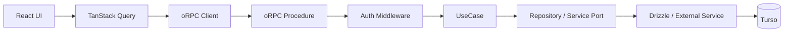
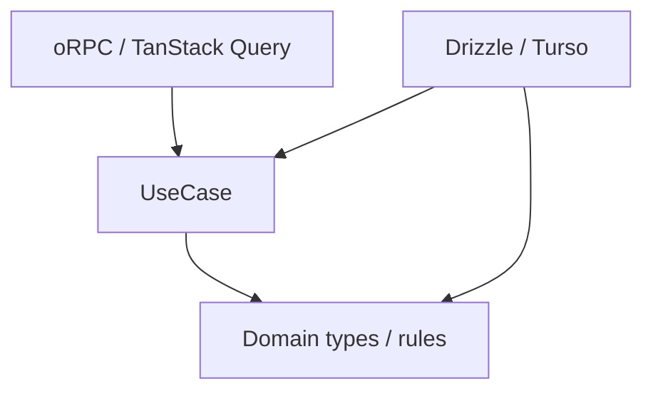
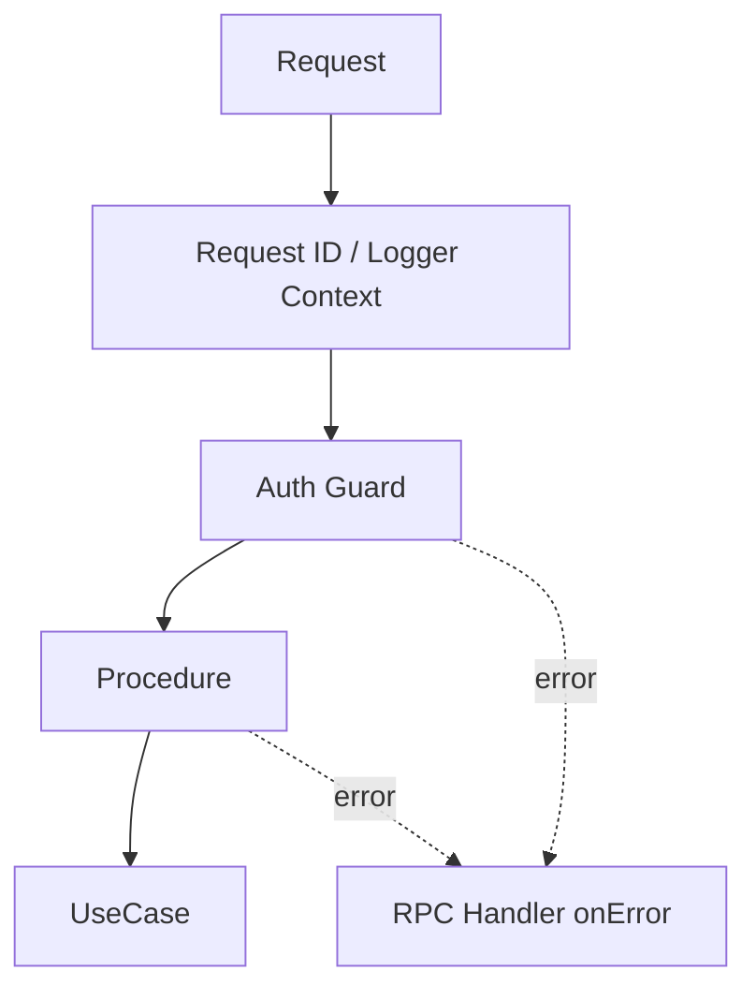
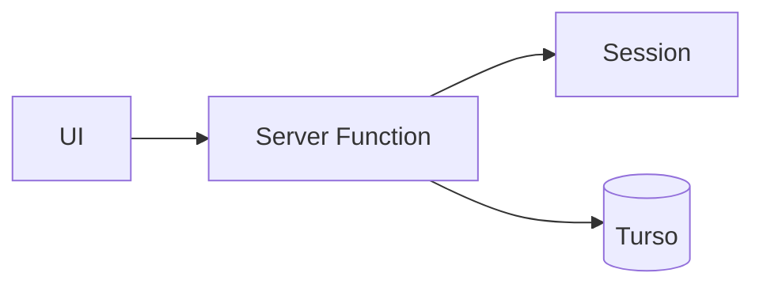
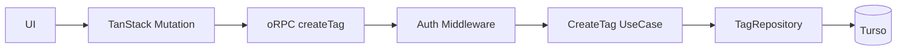

# アプリケーションアーキテクチャ改善設計

## 1. 結論

Pantry のバックエンド境界は、現在の TanStack Start Server Function 直結構成から、次の構成へ段階的に移行する。

1. **oRPC を型付き RPC 境界として導入する**
2. **TanStack Query をサーバー状態へアクセスする標準経路として使う**
3. **UseCase 層を設け、アプリケーションロジックを通信処理から分離する**
4. **業務上予想できる失敗は、既存の `src/shared/domain/result.ts` の `Result` で表現する**
5. **失敗を「業務上の失敗」「RPC 境界で拒否する失敗」「予期しない例外」の3種類に分ける**
6. **認証、request context、ロギング、計測などの横断処理を RPC 境界へ集約する**
7. **Hono は現時点では導入しない**。oRPC だけでは HTTP 要件を扱いにくくなった時点で再評価する

この変更の目的は、レイヤーやファイルを増やすことではない。

**テストしやすくすること、エラーの意味を明確にすること、認証やロギングの重複を減らすこと**が目的である。

---

## 2. 現在の問題

現在は `src/features/**/functions/` の TanStack Start Server Function が、多くの責務を同時に持っている。

たとえば `src/features/tags/functions/add-tag.ts` では、1つの Server Function の中で次を行っている。

- request からログイン情報を取得する
- 入力を検証する
- DB 接続を取得する
- 同名タグがあるか調べる
- DB にタグを追加する
- SQLite の unique constraint error を業務エラーへ変換する
- UI に返す値を作る

機能が少ない間は単純だが、機能が増えるほど次の問題が起きやすい。

- アプリケーションロジックだけをテストしたくても request や DB が必要になる
- 認証、ログ、計測、エラー変換が各 Server Function に散らばる
- 「ユーザー操作として普通に起こる失敗」と「本来起きてはいけない障害」の区別が曖昧になる
- UI 側の query / mutation / cache invalidation の書き方が機能ごとにばらつく
- TanStack Start の都合がアプリケーションロジックに入り込む

---

## 3. 目標

### 達成したいこと

- UseCase を TanStack Start や Cloudflare Workers なしで単体テストできる
- 業務上起こり得る失敗を TypeScript の型から読める
- 未認証を 500 ではなく 401 として正しく扱える
- 予期しない例外は一箇所でログに残す
- RPC procedure を薄く保つ
- 認証や request context の構築を共通化する
- TanStack Query の query / mutation / invalidation を同じ考え方で書ける
- bundle size、cold start、request latency を悪化させない

### 今回やらないこと

- マイクロサービス化
- 外部公開 API の設計
- すべての関数に interface を作ること
- すべての DB 操作を Repository Pattern にすること
- Hono の導入
- CQRS やドメインイベントの導入
- 新しい Result 型の追加
- Clean Architecture の形を厳密に再現すること

必要な境界だけを追加する。

---

## 4. 目標アーキテクチャ



依存関係は次を基本とする。



UseCase は TanStack Start、Cookie、oRPC を知らない。

---

## 5. 各層の責務

### 5.1 UI / TanStack Query

TanStack Query はすでに Router に組み込まれている。

そのため新しく導入するというより、**サーバー状態へアクセスする標準経路として統一する**。

責務は次のとおり。

- query / mutation の実行
- pending / error state の管理
- cache
- mutation 後の invalidation
- route loader と query cache の連携
- oRPC の型付きエラーを画面用のメッセージへ変換する

UI component から oRPC client を直接呼ぶ経路は原則作らない。

### 5.2 oRPC procedure

procedure は通信層と UseCase をつなぐ薄い adapter とする。

責務は次のとおり。

- 入力 schema を定義する
- 認証済み context を受け取る
- UseCase を呼ぶ
- UseCase の `Result` を oRPC の型付きエラーまたは成功レスポンスへ変換する

procedure に SQL や主要な業務ルールを書かない。

また、予期しない例外を procedure 内で `catch` して 500 へ変換しない。

### 5.3 UseCase

UseCase は「ユーザーが行う操作」単位で作る。

例:

- `CreateBookmark`
- `UpdateBookmark`
- `DeleteBookmark`
- `CreateTag`
- `UpdateTag`

責務は次のとおり。

- 処理手順を組み立てる
- 業務ルールを適用する
- repository / service を協調させる
- 必要なら transaction boundary を表現する
- 業務上予想できる失敗を `Result.err` で返す

UseCase は HTTP status や oRPC error code を知らない。

### 5.4 Infrastructure

Drizzle / Turso や外部 HTTP access は infrastructure に閉じ込める。

ただし Repository interface は機械的に作らない。

**UseCase のテストや責務分離に明確な価値がある場合だけ導入する。**

単純な read-only query まで一律に Repository 化すると、Pantry の規模では boilerplate の方が大きくなる。

---

## 6. エラー設計

### 6.1 失敗を3種類に分ける

| 種類 | 例 | どこで扱うか | 表現 |
| --- | --- | --- | --- |
| 業務上予想できる失敗 | 同名タグ、重複URL、対象なし | UseCase | `Result.err` |
| RPC 境界で拒否する失敗 | 未認証、入力不正、rate limit | oRPC / middleware | oRPC error |
| 予期しない例外 | DB障害、実装バグ、未知の例外 | oRPC handler まで伝播 | `throw` |

この3つを混ぜない。

特に、**未認証を UseCase の `Result` に入れない**。

未認証は「タグ作成という業務が失敗した」のではなく、その手前で request を受け付けられなかった状態だからである。

### 6.2 未認証は 401 にする

現在の `requireRequestSession()` は、セッションがなければ `new Error('Unauthorized')` を throw する。

この実装をそのまま新しい auth middleware に移すと、普通の `Error` として扱われ、500 になる危険がある。

移行後は auth middleware がセッション欠如を検出した時点で、oRPC の `UNAUTHORIZED` を返す。

oRPC は `UNAUTHORIZED` を HTTP 401 に対応付けている。

```ts
const requireAuth = base.middleware(async ({ context, next }) => {
  const session = await getSession(context)

  if (!session) {
    throw new ORPCError('UNAUTHORIZED')
  }

  return next({
    context: {
      session
    }
  })
})
```

これにより UseCase はログイン状態の確認を行わず、認証済みの `actorId` を受け取るだけになる。

### 6.3 業務エラーは既存 Result を使う

Pantry にはすでに `src/shared/domain/result.ts` がある。

新しい Result 型は作らない。

```ts
import { err, ok } from '../../../shared/domain/result'
import type { Result } from '../../../shared/domain/result'
```

業務エラーの判別子は既存コードに合わせて `code` + kebab-case を使う。

CreateTag の場合、現行仕様で必要な業務エラーはタグ名重複だけである。

```ts
type CreateTagError = {
  readonly code: 'tag-name-already-exists'
}

type CreateTagResult = Result<
  { readonly id: number },
  CreateTagError
>
```

`tag-limit-exceeded` は追加しない。

ブックマークに付与できるタグ数の上限と、ユーザーが作成できるタグ総数は別のルールだからである。

migration の都合で新しい業務ルールを作ってはいけない。

### 6.4 業務エラーを oRPC の型付きエラーへ変換する

UseCase のエラーは procedure で oRPC の型付きエラーへ変換する。

CreateTag では `tag-name-already-exists` を 409 Conflict に対応付ける。

```ts
const createTagProcedure = base
  .errors({
    'tag-name-already-exists': {
      status: 409
    }
  })
  .handler(async ({ input, context, errors }) => {
    const result = await createTag({
      actorId: context.session.user.id,
      input
    })

    if (!result.ok) {
      switch (result.error.code) {
        case 'tag-name-already-exists':
          throw errors['tag-name-already-exists']()
      }
    }

    return result.value
  })
```

この変換を procedure に置く理由は、HTTP status や oRPC error は transport の都合だからである。

UseCase に 409 という知識を持たせない。

### 6.5 予期しない例外は自前で 500 に変換しない

ここは重要である。

**Pantry 独自の outer middleware で `Error` を `INTERNAL_SERVER_ERROR` に包み直す処理は作らない。**

oRPC は通常の JavaScript `Error` が procedure から外へ出た場合、自身で `INTERNAL_SERVER_ERROR` に変換する。

したがって Pantry 側が行うべきことは「500 への変換」ではなく、**ログを一度だけ残すこと**である。

概念例:

```ts
const handler = new RPCHandler(router, {
  interceptors: [
    onError((error) => {
      logger.error({ error }, 'RPC request failed')
    })
  ]
})
```

この方が次の点で安全である。

- `UNAUTHORIZED` を誤って 500 に変換しない
- procedure の型付きエラーを誤って 500 に変換しない
- validation error を自前の catch 処理で壊さない
- oRPC が元々持っているエラー処理を二重実装しない

なお、同じ例外を repository、UseCase、procedure、handler の全層で繰り返しログに出さない。

ログの集約先は RPC handler 側を基本とする。

### 6.6 Unknown Error を `Result.err` にしない

新しく移行する UseCase では、未知の DB error などを次のように業務エラーへ潰さない。

```ts
// 採用しない
return err({ code: 'unexpected-error' })
```

未知の障害を `Result.err` にすると、「ユーザー操作として予想できる失敗」と「システム障害」の区別が消えるためである。

一方、SQLite unique constraint のように、インフラ例外から業務上の意味へ安全に変換できる場合は、既知の業務エラーへ変換してよい。

例:

- tag name unique constraint → `tag-name-already-exists`
- bookmark URL unique constraint → `duplicate-url`

---

## 7. 横断処理

RPC 境界へ集約する対象は次のとおり。

- authentication
- authorization に必要な request context の構築
- request ID
- structured logging
- duration / tracing
- 将来の rate limit

ただし、すべてを1つの巨大 middleware に入れない。

役割ごとに分ける。



業務エラーから procedure 固有の oRPC error への変換は procedure に残す。

機能固有のエラー変換まで共通 middleware に押し込まない。

---

## 8. Hono を今は導入しない

oRPC + Hono の組み合わせ自体には問題がない。

しかし現在の Pantry では、Hono を追加して解決したい課題がまだ少ない。

Hono を追加すると次のコストが増える。

- request lifecycle の理解対象が増える
- TanStack Start / oRPC / Hono の責務分担を決める必要がある
- middleware をどこに置くかの選択肢が増える
- dependency と bundle surface が増える

次のような要件が増えた場合に再評価する。

- RPC 以外の HTTP endpoint が多数必要になる
- webhook / callback / file response を共通 router で扱いたい
- oRPC の adapter だけでは routing / middleware 要件を表現しにくい
- API surface を TanStack Start から独立させたい

現時点では、**oRPC の導入価値はあるが Hono の追加価値はまだ小さい**と判断する。

---

## 9. ディレクトリ構成案

feature 単位のまとまりは維持する。

```text
src/
  features/
    tags/
      application/
        create-tag.ts
        update-tag.ts
      domain/
        ...
      infrastructure/
        tag-repository.server.ts
      rpc/
        create-tag.ts
        update-tag.ts
      queries/
        tag-query-options.ts
        tag-mutation-options.ts
```

repository root に Application / Domain / Infrastructure を大きく分けるより、Pantry の規模では feature locality を優先する。

---

## 10. CreateTag を pilot にする

### 10.1 現在



Server Function が認証、重複判定、insert、SQLite error の変換まで行う。

### 10.2 移行後



UseCase の interface イメージは次のとおり。

```ts
type CreateTagInput = {
  readonly name: TagName
  readonly pinned?: boolean
  readonly sortOrder?: number
  readonly color?: string | null
}

type CreateTagError = {
  readonly code: 'tag-name-already-exists'
}

type CreateTag = (params: {
  readonly actorId: UserId
  readonly input: CreateTagInput
}) => Promise<Result<{ readonly id: number }, CreateTagError>>
```

認証済み `actorId` は auth middleware が作った context から procedure が取り出し、UseCase に明示的に渡す。

UseCase が global request context を直接読む構成にはしない。

### 10.3 CreateTag UI も同時に移行する

現在 CreateTag UI では、次の2箇所が `TagNameAlreadyExistsError` の class name を見て重複エラーを判定している。

- `src/features/tags/components/new-tag-screen.tsx`
- `src/features/tags/components/inline-add-tag.tsx`

CreateTag pilot では、この2箇所も同時に変更する。

```ts
if (isDefinedError(error) && error.code === 'tag-name-already-exists') {
  return 'そのタグ名は既に存在します'
}
```

つまり、UI は JavaScript Error class の名前ではなく、RPC の型付き契約を見る。

`src/features/tags/components/edit-tag-form.tsx` にも同じ判定があるが、こちらは UpdateTag の UI である。

そのため CreateTag pilot には含めず、**UpdateTag を移行する PR で必ず変更する**。

---

## 11. テスト戦略

### 11.1 UseCase test

優先度を最も高くする。

確認する内容:

- request runtime なしで実行できる
- Cloudflare Workers runtime なしで実行できる
- Turso なしで実行できる
- `tag-name-already-exists` を `Result.err` として返す
- 未知の例外を `Result.err({ code: 'unexpected-error' })` に潰さない

### 11.2 Infrastructure test

DB 制約や transaction のように、実際の DB 挙動が重要な箇所だけテストする。

CreateTag では、unique constraint の race condition が `tag-name-already-exists` へ正しく変換されることを確認する。

### 11.3 RPC integration test

RPC 層ですべての業務パターンを再テストしない。

境界として重要なものだけ確認する。

- 不正な入力 → 4xx
- 未認証 → `UNAUTHORIZED` / 401
- タグ名重複 → `tag-name-already-exists` / 409
- 正常系の代表ケース
- 未知の例外 → `INTERNAL_SERVER_ERROR` / 500
- 未知の例外の詳細が client へ漏れない
- `UNAUTHORIZED` や型付き業務エラーが 500 に変わらない

### 11.4 UI test

CreateTag pilot では次を確認する。

- `new-tag-screen.tsx` が重複エラーを `code` で判定する
- `inline-add-tag.tsx` が重複エラーを `code` で判定する
- 重複時の既存メッセージ「そのタグ名は既に存在します」を維持する
- 500 系のエラーで重複メッセージを表示しない

---

## 12. 移行手順

一括置換はしない。

1. oRPC の server / client 基盤を追加する
2. request context と auth guard を追加する
3. RPC handler に一箇所だけ error logging を追加する
4. `src/shared/domain/result.ts` をそのまま利用する
5. `CreateTag` UseCase を切り出す
6. CreateTag procedure で `tag-name-already-exists` を 409 の型付きエラーへ変換する
7. `new-tag-screen.tsx` と `inline-add-tag.tsx` を TanStack Query mutation + oRPC へ移す
8. UI の `TagNameAlreadyExistsError.name` 判定を typed `code` 判定へ置き換える
9. 401 / 409 / 500 の RPC integration test を追加する
10. bundle size、latency、テストの書きやすさ、実装量を評価する
11. 問題がなければ Tag mutation を順番に移行する
12. UpdateTag 移行時に `edit-tag-form.tsx` の error mapping も変更する
13. Bookmark mutation を移行する
14. read query は効果が大きいものから移行する
15. 旧 Server Function が不要になった時点で削除する

### CreateTag pilot の Definition of Done

- UseCase が TanStack Start / Cookie / oRPC に依存しない
- 既存 `Result` を再利用している
- CreateTag の業務エラーは `tag-name-already-exists` のみ
- 未認証は 500 ではなく 401
- 重複タグ名は型付きエラーとして 409
- 未知の例外は oRPC により 500 として扱われる
- error logging を自前で各層に重複実装していない
- `new-tag-screen.tsx` と `inline-add-tag.tsx` が Error class name に依存しない
- UI が既存の重複エラーメッセージを維持する
- client / Worker bundle の増分を確認している
- request latency / cold start に目立つ悪化がない

### 移行中のルール

- 新旧経路を同じ操作で長期間二重に持たない
- 1 PR で全 feature を移行しない
- framework migration と業務仕様変更を同じ PR に混ぜない
- performance / bundle size の悪化を計測せずに受け入れない
- migration の都合で新しい業務ルールを追加しない
- 認証エラーと業務エラーを1つの巨大な union にまとめない
- oRPC が既に提供するエラー変換を独自 middleware で再実装しない

---

## 13. pilot 後の評価

次を確認し、移行を続ける価値があるか判断する。

- UseCase test が Worker / DB なしで書きやすくなったか
- mutation を追加するときの boilerplate が許容範囲か
- 業務エラー、認証エラー、予期しない例外の区別が明確になったか
- auth / request context / logging が procedure ごとに重複していないか
- client bundle / Worker bundle が不必要に増えていないか
- cold start / request latency が悪化していないか
- TanStack Query の invalidation が追いやすくなったか
- UI が Error class の実装詳細に依存しなくなったか

これらが改善しない場合、アーキテクチャを増やしたこと自体を成果とはみなさない。

必要なら設計を縮小する。

---

## 14. Pros / Cons

### Pros

- UseCase の単体テストが容易になる
- 業務エラーが型として明示される
- 未認証を 500 と誤分類しにくくなる
- transport と application logic の変更理由を分離できる
- 認証や logging を中央集約できる
- oRPC が持つ標準のエラー処理をそのまま利用できる
- TanStack Query と RPC の責務が明確になる
- UI が Error class serialization に依存しなくなる

### Cons

- ファイル数と概念数は増える
- 単純 CRUD では既存 Server Function より記述量が増える
- `Result` と oRPC error の2段階を理解する必要がある
- migration 中は新旧パターンが共存する
- Repository interface を過剰適用すると boilerplate が急増する

---

## 15. 最終判断

採用する。

ただし採用するのは、**oRPC + TanStack Query の標準化 + UseCase + 既存 Result + 必要最小限の RPC middleware / interceptor** までとする。

エラーについては次の責務分担に固定する。

1. **業務上予想できる失敗** → UseCase の `Result`
2. **未認証など RPC 境界の拒否** → oRPC error
3. **予期しない例外** → `throw` のまま oRPC に渡し、oRPC に 500 変換を任せる
4. **ログ** → RPC handler の共通 interceptor などで一度だけ記録する

Hono、全面的な Repository Pattern、厳密な Clean Architecture は現段階では採用しない。

まず `CreateTag` を pilot にし、**401、409、500、UI の error mapping、テスタビリティ、bundle / latency** まで確認してから適用範囲を広げる。

## 参考

- oRPC Middleware: https://orpc.dev/docs/middleware
- oRPC Error Handling: https://orpc.dev/docs/error-handling
- oRPC RPC Handler: https://orpc.dev/docs/rpc-handler
- oRPC OpenAPI Error Handling: https://orpc.dev/docs/openapi/error-handling
