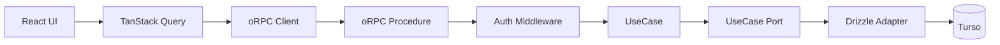
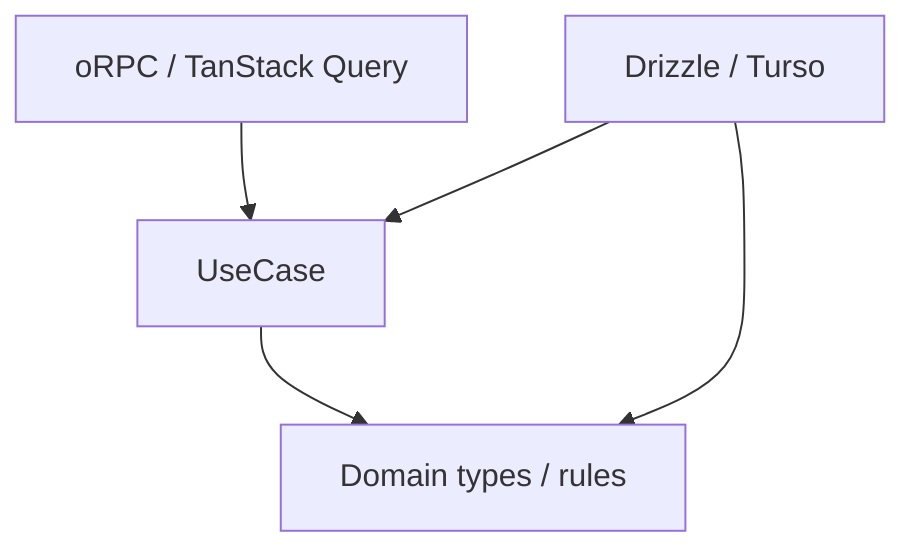
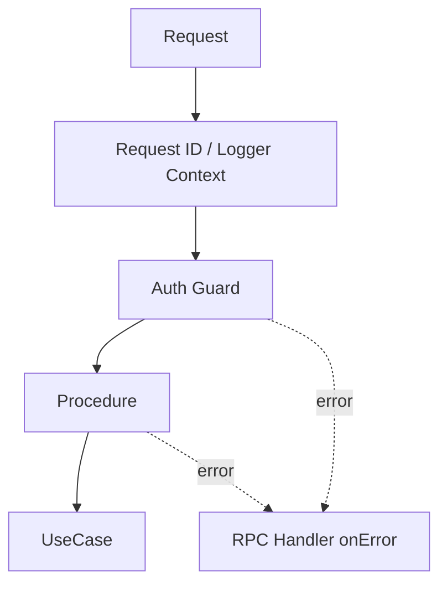
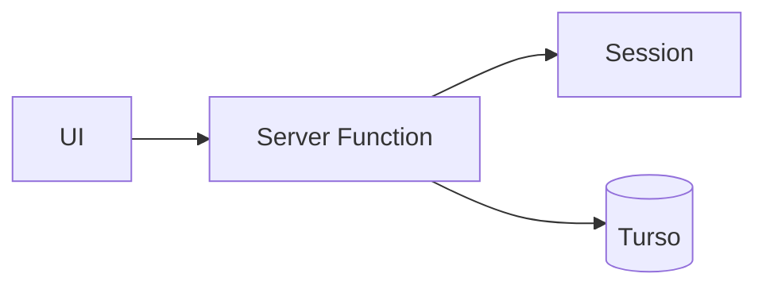
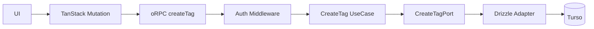

# アプリケーションアーキテクチャ改善設計

## 1. 結論

Pantry のバックエンド境界は、現在の TanStack Start Server Function 直結構成から、次の構成へ段階的に移行する。

1. **oRPC を型付き RPC 境界として導入する**
2. **TanStack Query をサーバー状態へアクセスする標準経路として使う**
3. **UseCase 層を設け、アプリケーションロジックを通信処理から分離する**
4. **業務上予想できる失敗は、既存の `src/shared/domain/result.ts` の `Result` で表現する**
5. **失敗を「業務上の失敗」「RPC 境界で拒否する失敗」「予期しない例外」の3種類に分ける**
6. **認証、request context、ロギング、計測などの横断処理を RPC 境界へ集約する**
7. **Hono は現時点では導入しない**。oRPC だけでは HTTP 要件を扱いにくくなった時点で再評価する
8. **SSR では可能なら server-side client を使い、同一 Worker 内で不要な HTTP 往復を発生させない**

この変更の目的は、レイヤーやファイルを増やすことではない。

**テストしやすくすること、エラーの意味を明確にすること、認証やロギングの重複を減らすこと**が目的である。

また、本設計のコード例は単なる擬似コードではなく、実装時の議論に使える程度まで具体化する。ただし、oRPC の導入時点の実際の型定義・APIとの差分は実装 PR で最終確認する。

---

## 2. 現在の問題

現在は `src/features/**/functions/` の TanStack Start Server Function が、多くの責務を同時に持っている。

たとえば `src/features/tags/functions/add-tag.ts` では、1つの Server Function の中で次を行っている。

- request からログイン情報を取得する
- 入力を検証する
- DB 接続を取得する
- 同名タグがあるか調べる
- DB にタグを追加する
- SQLite の unique constraint error を業務エラーへ変換する
- UI に返す値を作る

現在の概念構造は次に近い。

```ts
export const addTag = createServerFn({ method: 'POST' })
  .validator(addTagInputSchema)
  .handler(async (ctx) => {
    const session = await requireRequestSession()
    const db = getDB()

    // 業務ルール + DB query
    const [duplicate] = await db
      .select({ id: tagsTable.id })
      .from(tagsTable)
      .where(
        and(
          eq(tagsTable.normalizedName, ctx.data.name.normalized),
          eq(tagsTable.userId, session.user.id)
        )
      )
      .limit(1)

    if (duplicate != null) {
      throw new TagNameAlreadyExistsError()
    }

    // 永続化
    const [created] = await db
      .insert(tagsTable)
      .values({
        userId: session.user.id,
        name: ctx.data.name.display,
        normalizedName: ctx.data.name.normalized
      })
      .returning({ id: tagsTable.id })

    return created
  })
```

機能が少ない間は単純だが、機能が増えるほど次の問題が起きやすい。

- アプリケーションロジックだけをテストしたくても request や DB が必要になる
- 認証、ログ、計測、エラー変換が各 Server Function に散らばる
- 「ユーザー操作として普通に起こる失敗」と「本来起きてはいけない障害」の区別が曖昧になる
- UI 側の query / mutation / cache invalidation の書き方が機能ごとにばらつく
- TanStack Start の都合がアプリケーションロジックに入り込む

さらに CreateTag では、タグ名重複を事前 `SELECT` した後に `INSERT` している。

DB にはすでに `(user_id, normalized_name)` の unique constraint があるため、**重複確認のためだけに常に1回 SELECT を増やす価値があるかは疑わしい**。

事前確認をしても race condition は防げず、最終的には unique constraint error を処理する必要がある。pilot ではこの点も見直す。

---

## 3. 目標

### 達成したいこと

- UseCase を TanStack Start や Cloudflare Workers なしで単体テストできる
- 業務上起こり得る失敗を TypeScript の型から読める
- 未認証を 500 ではなく 401 として正しく扱える
- 予期しない例外は一箇所でログに残す
- RPC procedure を薄く保つ
- 認証や request context の構築を共通化する
- TanStack Query の query / mutation / invalidation を同じ考え方で書ける
- SSR で不要な HTTP round trip を作らない
- bundle size、cold start、request latency を悪化させない

### 今回やらないこと

- マイクロサービス化
- 外部公開 API の設計
- すべての関数に interface を作ること
- すべての DB 操作を Repository Pattern にすること
- Hono の導入
- CQRS やドメインイベントの導入
- 新しい Result 型の追加
- Clean Architecture の形を厳密に再現すること

必要な境界だけを追加する。

---

## 4. 目標アーキテクチャ



依存関係は次を基本とする。



UseCase は TanStack Start、Cookie、oRPC を知らない。

ただし `Infrastructure -> Application` は「Application が Infrastructure を import する」という意味ではない。

Application が port の型を定義し、Infrastructure がその契約を実装する。

---

## 5. 各層の責務

### 5.1 UI / TanStack Query

TanStack Query はすでに Router に組み込まれている。

そのため新しく導入するというより、**サーバー状態へアクセスする標準経路として統一する**。

責務は次のとおり。

- query / mutation の実行
- pending / error state の管理
- cache
- mutation 後の invalidation
- route loader と query cache の連携
- oRPC の型付きエラーを画面用のメッセージへ変換する

UI component から oRPC client を直接呼ぶ経路は原則作らない。

具体的には、コンポーネント内で次のように裸の RPC call を書くことは避ける。

```ts
// 原則採用しない
await client.tags.create(input)
```

TanStack Query integration を通す。

```ts
const mutation = useMutation(
  orpc.tags.create.mutationOptions()
)

await mutation.mutateAsync(input)
```

これにより pending、error、mutation key、cache invalidation を同じ仕組みに乗せられる。

### 5.2 oRPC procedure

procedure は通信層と UseCase をつなぐ薄い adapter とする。

責務は次のとおり。

- 入力 schema を定義する
- 認証済み context を受け取る
- UseCase を呼ぶ
- UseCase の `Result` を oRPC の型付きエラーまたは成功レスポンスへ変換する

procedure に SQL や主要な業務ルールを書かない。

また、予期しない例外を procedure 内で `catch` して 500 へ変換しない。

理想形は次程度の厚さである。

```ts
export const createTagProcedure = authed
  .input(createTagInputSchema)
  .errors({
    'tag-name-already-exists': {
      status: 409
    }
  })
  .handler(async ({ input, context, errors }) => {
    const result = await createTag({
      actorId: context.actorId,
      input
    })

    if (!result.ok) {
      throw errors['tag-name-already-exists']()
    }

    return result.value
  })
```

### 5.3 UseCase

UseCase は「ユーザーが行う操作」単位で作る。

例:

- `CreateBookmark`
- `UpdateBookmark`
- `DeleteBookmark`
- `CreateTag`
- `UpdateTag`

責務は次のとおり。

- 処理手順を組み立てる
- 業務ルールを適用する
- port / service を協調させる
- 必要なら transaction boundary を表現する
- 業務上予想できる失敗を `Result.err` で返す

UseCase は HTTP status や oRPC error code を知らない。

### 5.4 Infrastructure

Drizzle / Turso や外部 HTTP access は infrastructure に閉じ込める。

ただし Repository interface は機械的に作らない。

**UseCase のテストや責務分離に明確な価値がある場合だけ導入する。**

単純な read-only query まで一律に Repository 化すると、Pantry の規模では boilerplate の方が大きくなる。

CreateTag pilot では、この判断自体を検証対象にする。

---

## 6. エラー設計

### 6.1 失敗を3種類に分ける

| 種類 | 例 | どこで扱うか | 表現 |
| --- | --- | --- | --- |
| 業務上予想できる失敗 | 同名タグ、重複URL、対象なし | UseCase | `Result.err` |
| RPC 境界で拒否する失敗 | 未認証、入力不正、rate limit | oRPC / middleware | oRPC error |
| 予期しない例外 | DB障害、実装バグ、未知の例外 | oRPC handler まで伝播 | `throw` |

この3つを混ぜない。

特に、**未認証を UseCase の `Result` に入れない**。

未認証は「タグ作成という業務が失敗した」のではなく、その手前で request を受け付けられなかった状態だからである。

### 6.2 未認証は 401 にする

現在の `requireRequestSession()` は、セッションがなければ `new Error('Unauthorized')` を throw する。

この実装をそのまま新しい auth middleware に移すと、普通の `Error` として扱われ、500 になる危険がある。

移行後は auth middleware がセッション欠如を検出した時点で、oRPC の `UNAUTHORIZED` を返す。

oRPC は `UNAUTHORIZED` を HTTP 401 に対応付けている。

```ts
import { ORPCError, os } from '@orpc/server'
import * as v from 'valibot'

import { userIdSchema } from '../../features/auth/domain/auth-values'
import { getAuth } from '../../features/auth/functions/get-auth.server'

type RpcInitialContext = {
  readonly headers: Headers
}

const base = os.$context<RpcInitialContext>()

const requireAuth = base.middleware(async ({ context, next }) => {
  const session = await getAuth().api.getSession({
    headers: context.headers
  })

  if (!session) {
    throw new ORPCError('UNAUTHORIZED')
  }

  return next({
    context: {
      actorId: v.parse(userIdSchema, session.user.id)
    }
  })
})

export const authed = base.use(requireAuth)
```

これにより UseCase はログイン状態の確認を行わず、認証済みの `actorId` を受け取るだけになる。

### 6.3 業務エラーは既存 Result を使う

Pantry にはすでに `src/shared/domain/result.ts` がある。

新しい Result 型は作らない。

```ts
import { err, ok } from '../../../shared/domain/result'
import type { Result } from '../../../shared/domain/result'
```

業務エラーの判別子は既存コードに合わせて `code` + kebab-case を使う。

CreateTag の場合、現行仕様で必要な業務エラーはタグ名重複だけである。

```ts
type CreateTagError = {
  readonly code: 'tag-name-already-exists'
}

type CreateTagResult = Result<
  { readonly id: TagId },
  CreateTagError
>
```

`tag-limit-exceeded` は追加しない。

ブックマークに付与できるタグ数の上限と、ユーザーが作成できるタグ総数は別のルールだからである。

migration の都合で新しい業務ルールを作ってはいけない。

### 6.4 業務エラーを oRPC の型付きエラーへ変換する

UseCase のエラーは procedure で oRPC の型付きエラーへ変換する。

CreateTag では `tag-name-already-exists` を 409 Conflict に対応付ける。

```ts
const createTagProcedure = authed
  .input(createTagInputSchema)
  .errors({
    'tag-name-already-exists': {
      status: 409
    }
  })
  .handler(async ({ input, context, errors }) => {
    const result = await createTag({
      actorId: context.actorId,
      input
    })

    if (!result.ok) {
      switch (result.error.code) {
        case 'tag-name-already-exists':
          throw errors['tag-name-already-exists']()
      }
    }

    return result.value
  })
```

この変換を procedure に置く理由は、HTTP status や oRPC error は transport の都合だからである。

UseCase に 409 という知識を持たせない。

### 6.5 予期しない例外は自前で 500 に変換しない

ここは重要である。

**Pantry 独自の outer middleware で `Error` を `INTERNAL_SERVER_ERROR` に包み直す処理は作らない。**

oRPC は通常の JavaScript `Error` が procedure から外へ出た場合、自身で `INTERNAL_SERVER_ERROR` に変換する。

したがって Pantry 側が行うべきことは「500 への変換」ではなく、**ログを一度だけ残すこと**である。

```ts
import { onError } from '@orpc/server'
import { RPCHandler } from '@orpc/server/fetch'

const handler = new RPCHandler(router, {
  interceptors: [
    onError((error) => {
      logger.error({ error }, 'RPC request failed')
    })
  ]
})
```

この方が次の点で安全である。

- `UNAUTHORIZED` を誤って 500 に変換しない
- procedure の型付きエラーを誤って 500 に変換しない
- validation error を自前の catch 処理で壊さない
- oRPC が元々持っているエラー処理を二重実装しない

同じ例外を repository、UseCase、procedure、handler の全層で繰り返しログに出さない。

### 6.6 Unknown Error を `Result.err` にしない

新しく移行する UseCase では、未知の DB error などを次のように業務エラーへ潰さない。

```ts
// 採用しない
return err({ code: 'unexpected-error' })
```

未知の障害を `Result.err` にすると、「ユーザー操作として予想できる失敗」と「システム障害」の区別が消えるためである。

一方、SQLite unique constraint のように、インフラ例外から業務上の意味へ安全に変換できる場合は、既知の業務エラーへ変換してよい。

---

## 7. 横断処理

RPC 境界へ集約する対象は次のとおり。

- authentication
- authorization に必要な request context の構築
- request ID
- structured logging
- duration / tracing
- 将来の rate limit

ただし、すべてを1つの巨大 middleware に入れない。

役割ごとに分ける。



機能固有の業務エラー mapping は procedure に残す。

たとえば、次のような巨大 middleware は作らない。

```ts
// 採用しない
const mapEveryApplicationError = base.middleware(async ({ next }) => {
  try {
    return await next()
  } catch (error) {
    // Tag / Bookmark / Auth / ... の全エラーをここで判定
  }
})
```

機能を追加するたびに中央 middleware を修正する構造になり、変更理由が集中しすぎるためである。

---

## 8. Hono を今は導入しない

oRPC + Hono の組み合わせ自体には問題がない。

しかし現在の Pantry では、Hono を追加して解決したい課題がまだ少ない。

Hono を追加すると次のコストが増える。

- request lifecycle の理解対象が増える
- TanStack Start / oRPC / Hono の責務分担を決める必要がある
- middleware をどこに置くかの選択肢が増える
- dependency と bundle surface が増える

次のような要件が増えた場合に再評価する。

- RPC 以外の HTTP endpoint が多数必要になる
- webhook / callback / file response を共通 router で扱いたい
- oRPC の adapter だけでは routing / middleware 要件を表現しにくい
- API surface を TanStack Start から独立させたい

現時点では、**oRPC の導入価値はあるが Hono の追加価値はまだ小さい**と判断する。

---

## 9. ディレクトリ構成案

feature 単位のまとまりは維持する。

```text
src/
  features/
    tags/
      application/
        create-tag.ts
        create-tag-port.ts
      domain/
        tag-values.ts
      infrastructure/
        drizzle-create-tag-port.server.ts
      rpc/
        create-tag.ts
      queries/
        create-tag-mutation.ts

  rpc/
    base.server.ts
    router.server.ts
    client.ts

  routes/
    api/
      rpc.$.ts
```

repository root に Application / Domain / Infrastructure を大きく分けるより、Pantry の規模では feature locality を優先する。

---

## 10. CreateTag を pilot にする

### 10.1 現在



Server Function が認証、重複判定、insert、SQLite error の変換まで行う。

### 10.2 移行後



以下は実装案を議論するための具体コードである。

### 10.3 入力 schema

既存 `tagNameSchema` は `string` から `{ display, normalized }` の `TagName` へ変換するため、そのまま RPC input に使う。

```ts
// src/features/tags/rpc/create-tag.ts
import * as v from 'valibot'

import { tagNameSchema } from '../domain/tag-values'

export const createTagInputSchema = v.object({
  name: tagNameSchema,
  pinned: v.optional(v.boolean()),
  sortOrder: v.optional(v.number()),
  color: v.optional(v.nullable(v.string()))
})

export type CreateTagInput = v.InferOutput<typeof createTagInputSchema>
```

これにより UseCase は raw string ではなく、正規化済み `TagName` を受け取れる。

### 10.4 Application 側の port

CreateTag 用に、まずは必要最小限の書き込み port を置く案とする。

```ts
// src/features/tags/application/create-tag-port.ts
import type { Result } from '../../../shared/domain/result'
import type { UserId } from '../../auth/domain/auth-values'
import type { TagId, TagName } from '../domain/tag-values'

export type CreateTagConflict = {
  readonly code: 'tag-name-already-exists'
}

export type InsertTagParams = {
  readonly actorId: UserId
  readonly name: TagName
  readonly pinned?: boolean
  readonly sortOrder?: number
  readonly color?: string | null
}

export type CreateTagPort = {
  readonly insert: (
    params: InsertTagParams
  ) => Promise<Result<{ readonly id: TagId }, CreateTagConflict>>
}
```

ここで重要なのは `CreateTagPort` に `findDuplicate()` を生やしていないことである。

DB の unique constraint が重複禁止の最終的な正本なので、正常系で毎回重複確認 SELECT を打たず、**INSERT 1回で完結させる**。

### 10.5 Drizzle adapter

Infrastructure は SQLite の unique constraint error を、Application が理解できる `tag-name-already-exists` へ変換する。

```ts
// src/features/tags/infrastructure/drizzle-create-tag-port.server.ts
import * as v from 'valibot'

import type { AppDb } from '../../../db/app-db'
import { tagsTable } from '../../../db/schema/tag'
import { err, ok } from '../../../shared/domain/result'
import { tagIdSchema } from '../domain/tag-values'
import type { CreateTagPort } from '../application/create-tag-port'
import { isSqliteUniqueConstraintError } from '../lib/is-sqlite-unique-constraint-error'

export function createDrizzleCreateTagPort(db: AppDb): CreateTagPort {
  return {
    async insert(params) {
      try {
        const [created] = await db
          .insert(tagsTable)
          .values({
            userId: params.actorId,
            name: params.name.display,
            normalizedName: params.name.normalized,
            ...(params.pinned !== undefined ? { pinned: params.pinned } : {}),
            ...(params.sortOrder !== undefined ? { sortOrder: params.sortOrder } : {}),
            ...(params.color !== undefined ? { color: params.color } : {})
          })
          .returning({ id: tagsTable.id })

        if (created == null) {
          throw new Error('Tag insert returned no row')
        }

        return ok({
          id: v.parse(tagIdSchema, created.id)
        })
      } catch (error) {
        if (isSqliteUniqueConstraintError(error)) {
          return err({ code: 'tag-name-already-exists' })
        }

        throw error
      }
    }
  }
}
```

この adapter は SQLite / Drizzle の事情を知ってよい。

逆に UseCase が `SQLITE_CONSTRAINT_UNIQUE` を知る構造にはしない。

### 10.6 CreateTag UseCase

最小案は次の形になる。

```ts
// src/features/tags/application/create-tag.ts
import type { Result } from '../../../shared/domain/result'
import type { UserId } from '../../auth/domain/auth-values'
import type { TagId } from '../domain/tag-values'
import type {
  CreateTagConflict,
  CreateTagPort,
  InsertTagParams
} from './create-tag-port'

export type CreateTagResult = Result<
  { readonly id: TagId },
  CreateTagConflict
>

export type CreateTag = (params: {
  readonly actorId: UserId
  readonly input: Omit<InsertTagParams, 'actorId'>
}) => Promise<CreateTagResult>

export function createCreateTagUseCase(port: CreateTagPort): CreateTag {
  return async ({ actorId, input }) => {
    return port.insert({
      actorId,
      ...input
    })
  }
}
```

#### このコードに対する重要な疑問

この UseCase は非常に薄い。

これは欠陥とは限らないが、**「この程度の処理に port + UseCase を置く価値が本当にあるか」**は pilot で厳しく評価する。

CreateTag が今後も単なる insert のままなら、次のより小さい構成の方がよい可能性もある。

```ts
// 比較案: Application service に AppDb を直接注入する
export async function createTag(params: {
  readonly db: AppDb
  readonly actorId: UserId
  readonly input: CreateTagInput
}): Promise<CreateTagResult> {
  // Drizzle query
}
```

こちらはファイル数が減る一方、Application が Drizzle の DB 型を知る。

pilot では「理論上きれいか」ではなく、次で判断する。

- fake を使ったテストが本当に書きやすくなるか
- boilerplate がどれだけ増えるか
- CreateTag 以外でも同じ port が再利用できるか
- Drizzle 依存を Application に残すデメリットが実際に問題になるか

**Repository Pattern を採用すること自体を成功条件にはしない。**

### 10.7 UseCase の composition

依存を procedure 内で毎回手組みするのではなく、composition root を作る。

```ts
// src/features/tags/application/create-tag.server.ts
import { getDB } from '../../../db/get-db.server'
import { createCreateTagUseCase } from './create-tag'
import { createDrizzleCreateTagPort } from '../infrastructure/drizzle-create-tag-port.server'

const port = createDrizzleCreateTagPort(getDB())

export const createTag = createCreateTagUseCase(port)
```

`getDB()` のライフサイクルや Cloudflare Workers 上での安全性は既存実装に合わせる。

重い client / handler を request ごとに作る構造にはしない。

### 10.8 oRPC procedure

```ts
// src/features/tags/rpc/create-tag.ts
import * as v from 'valibot'

import { authed } from '../../../rpc/base.server'
import { createTag } from '../application/create-tag.server'
import { tagNameSchema } from '../domain/tag-values'

const createTagInputSchema = v.object({
  name: tagNameSchema,
  pinned: v.optional(v.boolean()),
  sortOrder: v.optional(v.number()),
  color: v.optional(v.nullable(v.string()))
})

export const createTagProcedure = authed
  .input(createTagInputSchema)
  .errors({
    'tag-name-already-exists': {
      status: 409
    }
  })
  .handler(async ({ input, context, errors }) => {
    const result = await createTag({
      actorId: context.actorId,
      input
    })

    if (!result.ok) {
      switch (result.error.code) {
        case 'tag-name-already-exists':
          throw errors['tag-name-already-exists']()
      }
    }

    return result.value
  })
```

procedure がやっていることは次だけである。

1. transport input を検証する
2. 認証済み `actorId` を UseCase に渡す
3. Application Error を RPC Error に変換する
4. 成功値を返す

### 10.9 Router

```ts
// src/rpc/router.server.ts
import { createTagProcedure } from '../features/tags/rpc/create-tag'

export const router = {
  tags: {
    create: createTagProcedure
  }
}

export type AppRouter = typeof router
```

### 10.10 TanStack Start の RPC endpoint

oRPC には TanStack Start 用の公式 adapter 例があるため、それに寄せる。

```ts
// src/routes/api/rpc.$.ts
import { onError } from '@orpc/server'
import { RPCHandler } from '@orpc/server/fetch'
import { createFileRoute } from '@tanstack/react-router'

import { router } from '../../rpc/router.server'

const handler = new RPCHandler(router, {
  interceptors: [
    onError((error) => {
      console.error(error)
    })
  ]
})

export const Route = createFileRoute('/api/rpc/$')({
  server: {
    handlers: {
      ANY: async ({ request }) => {
        const { response } = await handler.handle(request, {
          prefix: '/api/rpc',
          context: {
            headers: request.headers
          }
        })

        return response ?? new Response('Not Found', { status: 404 })
      }
    }
  }
})
```

`RPCHandler` は module scope に置く。

request ごとに router / handler を再生成する理由はない。

### 10.11 oRPC client と SSR

ブラウザでは `RPCLink` を使う。

一方、SSR 中に同じ Worker の `/api/rpc` へ HTTP request を投げ直すのは余計なコストになる。

そのため oRPC 公式の TanStack Start adapter が示す `createRouterClient` を使う案を優先する。

```ts
// src/rpc/client.ts
import { createORPCClient } from '@orpc/client'
import { RPCLink } from '@orpc/client/fetch'
import { createRouterClient } from '@orpc/server'
import type { RouterClient } from '@orpc/server'
import { createIsomorphicFn } from '@tanstack/react-start'
import { getRequestHeaders } from '@tanstack/react-start/server'

import { router } from './router.server'

const getClient = createIsomorphicFn()
  .server(() =>
    createRouterClient(router, {
      context: async () => ({
        headers: getRequestHeaders()
      })
    })
  )
  .client((): RouterClient<typeof router> => {
    const link = new RPCLink({
      url: `${window.location.origin}/api/rpc`
    })

    return createORPCClient(link)
  })

export const client: RouterClient<typeof router> = getClient()
```

この形の狙いは次である。

```mermaid
flowchart LR
  SSR[SSR / loader]
  DIRECT[createRouterClient]
  UC[UseCase]
  Browser[Browser]
  HTTP[/api/rpc]

  SSR --> DIRECT --> UC
  Browser --> HTTP --> UC
```

ただし、`router.server` が client bundle に混入しないことは build artifact で確認する。

もし server-only module の混入が起きるなら、contract/type の分離や dynamic import を検討する。

### 10.12 TanStack Query integration

oRPC の現在の TanStack Query integration は `createTanstackQueryUtils` を提供する。

```ts
// src/rpc/query.ts
import { createTanstackQueryUtils } from '@orpc/tanstack-query'

import { client } from './client'

export const orpc = createTanstackQueryUtils(client)
```

CreateTag mutation は次のように書ける。

```ts
// src/features/tags/queries/create-tag-mutation.ts
import { useMutation, useQueryClient } from '@tanstack/react-query'

import { orpc } from '../../../rpc/query'

export function useCreateTagMutation() {
  const queryClient = useQueryClient()

  return useMutation(
    orpc.tags.create.mutationOptions({
      onSuccess: async () => {
        await queryClient.invalidateQueries({
          queryKey: orpc.tags.key()
        })
      }
    })
  )
}
```

Tag の query が細分化された場合は `orpc.tags.key()` が広すぎる可能性がある。

その場合は一覧だけを invalidate するなど、cache key の粒度を調整する。

### 10.13 CreateTag UI

現在 CreateTag UI では、次の2箇所が `TagNameAlreadyExistsError` の class name を見て重複エラーを判定している。

- `src/features/tags/components/new-tag-screen.tsx`
- `src/features/tags/components/inline-add-tag.tsx`

pilot では class name 判定をやめる。

```ts
import { isDefinedError } from '@orpc/client'

export function getCreateTagErrorMessage(error: unknown): string {
  if (
    isDefinedError(error) &&
    error.code === 'tag-name-already-exists'
  ) {
    return 'そのタグ名は既に存在します'
  }

  return 'タグの作成に失敗しました'
}
```

`NewTagScreen` は概念上、次のようになる。

```tsx
export function NewTagScreen() {
  const navigate = useNavigate()
  const createTag = useCreateTagMutation()

  return (
    <TagForm
      initialValues={{
        name: '',
        pinned: false,
        color: null,
        sortOrder: 0
      }}
      onSubmit={async ({ name, pinned, color, sortOrder }) => {
        const { id } = await createTag.mutateAsync({
          name,
          pinned,
          color,
          sortOrder
        })

        await navigate({
          to: '/tags/$id',
          params: { id: String(id) },
          state: { newTagCreated: true }
        })
      }}
      mapError={getCreateTagErrorMessage}
    />
  )
}
```

`InlineAddTag` も同じ `getCreateTagErrorMessage` を使う。

エラー文言の変換を2画面で重複させない。

`src/features/tags/components/edit-tag-form.tsx` にも同じ class name 判定があるが、こちらは UpdateTag の UI である。

そのため CreateTag pilot には含めず、**UpdateTag を移行する PR で必ず変更する**。

---

## 11. テスト戦略

### 11.1 UseCase test

port を採用する場合、request / Worker / Turso なしでテストできることを実証する。

```ts
import { describe, expect, it } from 'vitest'

import { err, ok } from '../../../shared/domain/result'
import { createCreateTagUseCase } from './create-tag'
import type { CreateTagPort } from './create-tag-port'

function createFakePort(
  insert: CreateTagPort['insert']
): CreateTagPort {
  return { insert }
}

describe('createCreateTagUseCase', () => {
  it('作成した TagId を返す', async () => {
    const port = createFakePort(async () => ok({ id: 1 as never }))
    const createTag = createCreateTagUseCase(port)

    const result = await createTag({
      actorId: 'user-1' as never,
      input: {
        name: {
          display: 'TypeScript',
          normalized: 'typescript'
        }
      }
    })

    expect(result.ok).toBe(true)
  })

  it('同名タグを業務エラーとして返す', async () => {
    const port = createFakePort(async () =>
      err({ code: 'tag-name-already-exists' })
    )
    const createTag = createCreateTagUseCase(port)

    const result = await createTag({
      actorId: 'user-1' as never,
      input: {
        name: {
          display: 'TypeScript',
          normalized: 'typescript'
        }
      }
    })

    expect(result).toEqual({
      ok: false,
      error: { code: 'tag-name-already-exists' }
    })
  })

  it('未知の例外を Result に変換しない', async () => {
    const port = createFakePort(async () => {
      throw new Error('database unavailable')
    })
    const createTag = createCreateTagUseCase(port)

    await expect(
      createTag({
        actorId: 'user-1' as never,
        input: {
          name: {
            display: 'TypeScript',
            normalized: 'typescript'
          }
        }
      })
    ).rejects.toThrow('database unavailable')
  })
})
```

実装時は `as never` を避け、既存 schema helper から brand 付き値を作る。

ここではテストの依存関係を示すために簡略化している。

### 11.2 Infrastructure test

Drizzle adapter では、DB 固有の契約を確認する。

特に CreateTag では次を確認する。

- 同じ `actorId + normalizedName` の2回目の insert は `tag-name-already-exists`
- 別ユーザーなら同じ normalized name を作成できる
- `display` の大小文字は保持される
- DB 接続障害など unique constraint 以外は throw のまま伝播する

事前 SELECT を削除するなら、**正常系が INSERT 1回で完了していること**も必要なら query log で確認する。

### 11.3 RPC integration test

RPC 層ですべての業務パターンを再テストしない。

境界として重要なものだけ確認する。

- 不正な入力 → 4xx
- 未認証 → `UNAUTHORIZED` / 401
- タグ名重複 → `tag-name-already-exists` / 409
- 正常系の代表ケース
- 未知の例外 → `INTERNAL_SERVER_ERROR` / 500
- 未知の例外の詳細が client へ漏れない
- `UNAUTHORIZED` や型付き業務エラーが 500 に変わらない

HTTP status まで確認するテストは、`RPCHandler` に `Request` を渡す形で行う。

```ts
const request = new Request('http://localhost/api/rpc/tags/create', {
  method: 'POST',
  headers: {
    'content-type': 'application/json'
  },
  body: JSON.stringify({
    name: 'TypeScript'
  })
})

const { response } = await handler.handle(request, {
  prefix: '/api/rpc',
  context: {
    headers: request.headers
  }
})

expect(response?.status).toBe(401)
```

実際の RPC protocol body 形式は oRPC の test helper / handler 契約に合わせて実装時に確定する。

### 11.4 UI test

CreateTag pilot では次を確認する。

- `new-tag-screen.tsx` が重複エラーを `code` で判定する
- `inline-add-tag.tsx` が重複エラーを `code` で判定する
- 重複時の既存メッセージ「そのタグ名は既に存在します」を維持する
- 500 系のエラーで重複メッセージを表示しない
- mutation 成功時に必要な Tag query が invalidate される

---

## 12. パフォーマンス上の確認事項

Pantry は Cloudflare Workers 上で動くため、「型安全になった」だけでは採用理由として不十分である。

### 12.1 正常系 DB query 数

現在の CreateTag は概念上、正常系で次の2 query を行う。

```text
SELECT duplicate
INSERT tag
```

pilot 案では unique constraint を正本にして次の1 query にできる。

```text
INSERT tag
```

これは oRPC 導入による overhead を一部相殺できる可能性がある。

### 12.2 SSR の HTTP round trip

SSR から `/api/rpc` へ Fetch し直す構成は、同一 Worker 内で不要な protocol encode/decode と routing を増やす。

そのため server-side client の直接呼び出しを優先する。

ただし、client bundle に server code が混入するなら本末転倒なので build artifact を確認する。

### 12.3 測るもの

pilot 前後で最低限次を比較する。

- client bundle size
- Worker bundle size
- CreateTag の request latency
- cold start に目立つ差がないか
- DB query 数
- SSR loader / prefetch 時の HTTP request 数

測定値が悪化し、その悪化を上回る保守性の改善も確認できないなら設計を縮小する。

---

## 13. 移行手順

一括置換はしない。

1. oRPC の server / client 基盤を追加する
2. request context と auth guard を追加する
3. RPC handler に一箇所だけ error logging を追加する
4. `src/shared/domain/result.ts` をそのまま利用する
5. `CreateTag` UseCase を切り出す
6. port を置く案と `AppDb` 直接注入案を、実装量とテスト容易性で比較する
7. CreateTag procedure で `tag-name-already-exists` を 409 の型付きエラーへ変換する
8. `new-tag-screen.tsx` と `inline-add-tag.tsx` を TanStack Query mutation + oRPC へ移す
9. UI の `TagNameAlreadyExistsError.name` 判定を typed `code` 判定へ置き換える
10. 401 / 409 / 500 の RPC integration test を追加する
11. SSR で server-side client を使い、不要な HTTP round trip がないことを確認する
12. bundle size、DB query 数、latency、テストの書きやすさ、実装量を評価する
13. 問題がなければ Tag mutation を順番に移行する
14. UpdateTag 移行時に `edit-tag-form.tsx` の error mapping も変更する
15. Bookmark mutation を移行する
16. read query は効果が大きいものから移行する
17. 旧 Server Function が不要になった時点で削除する

### CreateTag pilot の Definition of Done

- UseCase が TanStack Start / Cookie / oRPC に依存しない
- 既存 `Result` を再利用している
- CreateTag の業務エラーは `tag-name-already-exists` のみ
- 未認証は 500 ではなく 401
- 重複タグ名は型付きエラーとして 409
- 未知の例外は oRPC により 500 として扱われる
- error logging を自前で各層に重複実装していない
- `new-tag-screen.tsx` と `inline-add-tag.tsx` が Error class name に依存しない
- UI が既存の重複エラーメッセージを維持する
- 正常系 CreateTag の不要な重複確認 SELECT を残すか削除するか、計測と実装単純性で判断している
- SSR で不要な RPC HTTP round trip を発生させていない
- client / Worker bundle の増分を確認している
- request latency / cold start に目立つ悪化がない
- port / Repository の抽象化が実装コストに見合っているかを評価している

### 移行中のルール

- 新旧経路を同じ操作で長期間二重に持たない
- 1 PR で全 feature を移行しない
- framework migration と業務仕様変更を同じ PR に混ぜない
- performance / bundle size の悪化を計測せずに受け入れない
- migration の都合で新しい業務ルールを追加しない
- 認証エラーと業務エラーを1つの巨大な union にまとめない
- oRPC が既に提供するエラー変換を独自 middleware で再実装しない
- 「Clean Architecture だから」という理由だけで interface を増やさない

---

## 14. pilot 後の評価

次を確認し、移行を続ける価値があるか判断する。

- UseCase test が Worker / DB なしで書きやすくなったか
- mutation を追加するときの boilerplate が許容範囲か
- 業務エラー、認証エラー、予期しない例外の区別が明確になったか
- auth / request context / logging が procedure ごとに重複していないか
- client bundle / Worker bundle が不必要に増えていないか
- cold start / request latency が悪化していないか
- TanStack Query の invalidation が追いやすくなったか
- UI が Error class の実装詳細に依存しなくなったか
- DB query 数が不必要に増えていないか
- SSR が無駄な HTTP request を増やしていないか
- port / Repository が単なる forwarding layer になっていないか

これらが改善しない場合、アーキテクチャを増やしたこと自体を成果とはみなさない。

必要なら設計を縮小する。

---

## 15. Pros / Cons

### Pros

- UseCase の単体テストが容易になる
- 業務エラーが型として明示される
- 未認証を 500 と誤分類しにくくなる
- transport と application logic の変更理由を分離できる
- 認証や logging を中央集約できる
- oRPC が持つ標準のエラー処理をそのまま利用できる
- TanStack Query と RPC の責務が明確になる
- UI が Error class serialization に依存しなくなる
- server-side client により SSR の不要な HTTP 往復を避けられる
- CreateTag では重複確認 SELECT を削減できる可能性がある

### Cons

- ファイル数と概念数は増える
- 単純 CRUD では既存 Server Function より記述量が増える
- `Result` と oRPC error の2段階を理解する必要がある
- migration 中は新旧パターンが共存する
- Repository / port を過剰適用すると boilerplate が急増する
- SSR client の構成を誤ると server code が client bundle に混ざる危険がある

---

## 16. 最終判断

採用する。

ただし採用するのは、**oRPC + TanStack Query の標準化 + UseCase + 既存 Result + 必要最小限の RPC middleware / interceptor** までとする。

エラーについては次の責務分担に固定する。

1. **業務上予想できる失敗** → UseCase の `Result`
2. **未認証など RPC 境界の拒否** → oRPC error
3. **予期しない例外** → `throw` のまま oRPC に渡し、oRPC に 500 変換を任せる
4. **ログ** → RPC handler の共通 interceptor などで一度だけ記録する

Hono、全面的な Repository Pattern、厳密な Clean Architecture は現段階では採用しない。

CreateTag の port / Repository についても、上記コード案を無条件に確定案とはしない。

**UseCase を framework から分離する価値と、抽象化のコストを pilot の実コードで比較して決める。**

まず `CreateTag` を pilot にし、**401、409、500、UI の error mapping、SSR、DB query 数、テスタビリティ、bundle / latency** まで確認してから適用範囲を広げる。

## 参考

- oRPC Procedure: https://orpc.dev/docs/procedure
- oRPC Middleware: https://orpc.dev/docs/middleware
- oRPC Error Handling: https://orpc.dev/docs/error-handling
- oRPC TanStack Start Adapter: https://orpc.dev/docs/adapters/tanstack-start
- oRPC TanStack Query Integration: https://orpc.dev/docs/integrations/tanstack-query
- oRPC RPC Link: https://orpc.dev/docs/client/rpc-link
