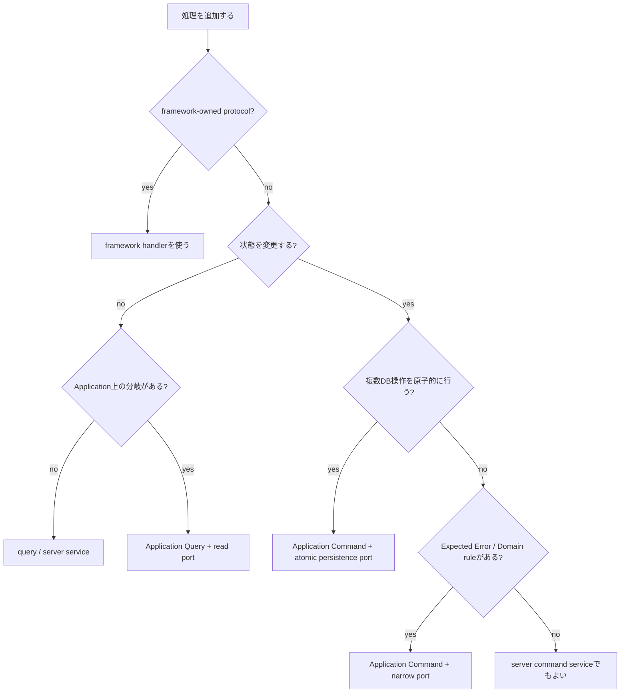

# アプリケーションアーキテクチャ ユースケース適用方針

この文書は `2026-08-22-application-architecture-evolution-design.md` の補足である。

CreateTag pilot で決めた境界を Pantry 全体へ展開できるかを、現在の Server Function / Application 実装と突き合わせて整理する。

## 1. 結論

基本原則は Pantry 全体へ適用できる。

ただし、すべての処理を次の1パターンへ押し込める設計にはしない。

```text
RPC
  -> UseCase
  -> 1つの port
  -> DB
```

Pantry の処理には性質の違うユースケースがあるため、次の6類型を使い分ける。

| 類型 | 例 | 基本形 |
| --- | --- | --- |
| 単一リソース command | CreateTag / UpdateTag / DeleteBookmark | RPC -> Application Command -> narrow port |
| 複数DB操作を原子的に行う command | AddBookmark / UpdateBookmark | RPC -> Application Command -> atomic persistence port -> transaction |
| 単純 projection query | shelfTags / bookmark list / tag list | RPC -> query service -> Drizzle |
| Application semantics を持つ query | loadBookmarkForEdit / resource not-found | RPC -> Application Query -> narrow read port |
| 外部I/O | fetchBookmarkTitle | RPC -> server service、必要なら gateway port |
| framework-owned protocol endpoint | Better Auth `/api/auth/*` | framework handlerを維持。oRPCへ包まない |

重要なのは「全部をUseCaseにする」ことではなく、**変更理由とテスト境界が違う処理を同じ形に無理やり揃えないこと**である。

---

## 2. 現行ユースケースの適用マトリクス

### Tags

| 現行処理 | 分類 | 移行先 |
| --- | --- | --- |
| `add-tag.ts` | 単一リソース command | `executeCreateTag` + `InsertTag` |
| `update-tag.ts` | 単一リソース command | `executeUpdateTag` + narrow update port |
| `touch-tag-last-used.ts` | 小さい command | Expected Error が必要なら Application Command。純粋なbest-effort telemetryならserver command serviceも可 |
| `get-tag.ts` | resource query | not-foundを画面/API契約として扱うなら Application Query |
| `fetch-tags.ts` | projection query | query service |
| `fetch-shelf-tags.ts` | projection query | query service + TanStack Query cache |

### Bookmarks

| 現行処理 | 分類 | 移行先 |
| --- | --- | --- |
| `add-bookmark.ts` | 複数DB操作 command | `executeCreateBookmark` + atomic persistence port |
| `update-bookmark.ts` | 複数DB操作 command | `executeUpdateBookmark` + atomic persistence port |
| `delete-bookmark.ts` | 単一リソース command | `executeDeleteBookmark` + narrow delete port |
| `get-bookmark.ts` | resource query | Application Query または用途専用 query service |
| `load-bookmark-for-edit.ts` | Application semantics を持つ query | Application Query + narrow read port |
| `fetch-bookmarks.ts` | 複雑 projection query | query service |
| `fetch-bookmark-title.ts` | 外部I/O | server service。Application orchestration が増えたら gateway port |

### Auth

Better Auth が所有する `/api/auth/*` は oRPC 化しない。

Pantry の Application API と、外部ライブラリが所有する protocol endpoint は分ける。

```text
/api/rpc/*
  -> Pantry application API

/api/auth/*
  -> Better Auth protocol endpoint
```

「バックエンド処理は全部 oRPC」というルールにはしない。

---

## 3. 単一リソース command

CreateTag はこの代表例である。

```text
RPC
  -> Application Command
  -> narrow port
  -> Drizzle adapter
```

```ts
export type UpdateTag = (
  input: UpdateTagInput
) => Promise<
  | { readonly kind: 'updated' }
  | { readonly kind: 'not-found' }
  | { readonly kind: 'name-conflict' }
>
```

Application は persistence outcome を業務エラーへ変換する。

```ts
export async function executeUpdateTag(params: {
  readonly updateTag: UpdateTag
  readonly actorId: UserId
  readonly command: UpdateTagCommand
}): Promise<UpdateTagResult> {
  const outcome = await params.updateTag({
    actorId: params.actorId,
    ...params.command
  })

  switch (outcome.kind) {
    case 'not-found':
      return err({ code: 'tag-not-found' })
    case 'name-conflict':
      return err({ code: 'tag-name-already-exists' })
    case 'updated':
      return ok(undefined)
  }
}
```

Drizzle / SQLite の constraint code は Application へ漏らさない。

---

## 4. 複数DB操作の transaction boundary

ここが CreateTag だけでは説明できていなかった重要な補足である。

現行 UpdateBookmark は、次を同一 transaction で行う。

- 対象Bookmark確認
- URL重複確認
- タグ存在・所有確認
- Bookmark更新
- bookmark-tags差し替え
- Tag `lastUsedAt` 更新

これを複数の独立 port に分けて、UseCase から順番に呼ぶだけではいけない。

```ts
// 採用しない
await updateBookmarkRow(...)
await replaceBookmarkTags(...)
await touchTags(...)
```

それぞれが別transactionなら、途中失敗で部分更新になる。

### 4.1 基本方針: transaction boundary と port boundary を揃える

同一DB transactionで原子的に完了すべき処理は、**1つの use-case-specific atomic persistence port** にまとめる。

```ts
export type PersistBookmarkUpdateInput = {
  readonly actorId: UserId
  readonly bookmarkId: BookmarkId
  readonly url: BookmarkUrl
  readonly title: BookmarkTitle
  readonly note: BookmarkNote
  readonly tagIds: readonly TagId[]
}

export type PersistBookmarkUpdateOutcome =
  | { readonly kind: 'updated' }
  | { readonly kind: 'bookmark-not-found' }
  | { readonly kind: 'duplicate-url' }
  | { readonly kind: 'tag-not-found'; readonly tagId: TagId }
  | { readonly kind: 'tag-not-owned'; readonly tagId: TagId }

export type PersistBookmarkUpdate = (
  input: PersistBookmarkUpdateInput
) => Promise<PersistBookmarkUpdateOutcome>
```

UseCase は純粋なDomain規則を先に適用する。

```ts
export async function executeUpdateBookmark(params: {
  readonly persist: PersistBookmarkUpdate
  readonly actorId: UserId
  readonly command: UpdateBookmarkCommand
}): Promise<UpdateBookmarkResult> {
  const uniqueTagIds = assertUniqueTagIds(params.command.tagIds)
  if (!uniqueTagIds.ok) {
    return err(uniqueTagIds.error)
  }

  const outcome = await params.persist({
    actorId: params.actorId,
    ...params.command
  })

  switch (outcome.kind) {
    case 'bookmark-not-found':
      return err({ code: 'bookmark-not-found' })
    case 'duplicate-url':
      return err({ code: 'duplicate-url' })
    case 'tag-not-found':
      return err({
        code: 'invalid-tag',
        field: 'tags',
        cause: { code: 'tag-not-found', tagId: outcome.tagId }
      })
    case 'tag-not-owned':
      return err({
        code: 'invalid-tag',
        field: 'tags',
        cause: { code: 'tag-not-owned', tagId: outcome.tagId }
      })
    case 'updated':
      return ok({ bookmarkId: params.command.bookmarkId })
  }
}
```

Infrastructure adapter が transaction を所有する。

```ts
export const persistBookmarkUpdate: PersistBookmarkUpdate = async (input) => {
  const db = getDB()

  return db.transaction(async (tx) => {
    const existing = await findBookmark(tx, input.actorId, input.bookmarkId)
    if (existing === undefined) {
      return { kind: 'bookmark-not-found' }
    }

    const duplicate = await findDuplicateUrl(tx, input.actorId, input.bookmarkId, input.url)
    if (duplicate) {
      return { kind: 'duplicate-url' }
    }

    const tagCheck = await checkTags(tx, input.actorId, input.tagIds)
    if (tagCheck.kind !== 'ok') {
      return tagCheck
    }

    try {
      await updateBookmarkRow(tx, input)
      await replaceBookmarkTags(tx, input.bookmarkId, input.tagIds)
      await touchTags(tx, input.actorId, input.tagIds)
    } catch (error) {
      if (isBookmarkUrlUniqueViolation(error)) {
        // transaction callbackからthrowしてrollbackさせる。
        throw new DuplicateBookmarkUrlRaceError()
      }
      throw error
    }

    return { kind: 'updated' }
  }).catch((error) => {
    if (error instanceof DuplicateBookmarkUrlRaceError) {
      return { kind: 'duplicate-url' }
    }
    throw error
  })
}
```

### 4.2 なぜ generic UnitOfWork を作らないか

次のような全機能共通の巨大 transaction API は作らない。

```ts
// 採用しない
interface UnitOfWork {
  bookmarks: BookmarkRepository
  tags: TagRepository
  users: UserRepository
  commit(): Promise<void>
}
```

理由:

- Drizzle の再包装になりやすい
- UseCase が必要としない能力まで露出する
- transaction lifecycle の理解コストが増える
- Cloudflare Workers + Turso で abstraction cost に見合う利点が薄い

**transaction が必要な workflow ごとに atomic port を切る**のを標準とする。

Application が transaction 内で細かく処理を交互に組み立てる必要が本当に出た場合だけ、use-case-specific な `RunXTransaction` port を検討する。

---

## 5. AddBookmark は移行時に atomicity を改善する

現行 AddBookmark は、

```text
INSERT bookmarks
INSERT bookmark_tags
UPDATE tags.last_used_at
```

を別々に実行している。

2つ目以降で失敗すると Bookmark 本体だけ作られる可能性がある。

移行後は CreateBookmark の persistence port 全体を1transactionにする。

```ts
export type PersistBookmarkCreation = (
  input: PersistBookmarkCreationInput
) => Promise<
  | { readonly kind: 'created'; readonly bookmarkId: BookmarkId }
  | { readonly kind: 'duplicate-url' }
  | { readonly kind: 'tag-not-found'; readonly tagId: TagId }
  | { readonly kind: 'tag-not-owned'; readonly tagId: TagId }
>
```

CreateTag と同様に、URL重複の最終的な正本は `(user_id, url)` unique constraint とする。

事前確認だけでは race condition は防げない。

---

## 6. Read は2種類に分ける

### 6.1 Projection Query

一覧や画面表示用集計で、業務上の分岐をほぼ持たないもの。

例:

- shelf tags
- bookmark list
- tag list

```text
RPC
  -> server-only query service
  -> Drizzle
```

```ts
export async function listBookmarks(params: {
  readonly db: AppDb
  readonly actorId: UserId
  readonly query: BookmarkListQuery
}): Promise<BookmarkListItem[]> {
  // 検索、tag AND/OR、sort、pagination
}
```

複雑なSQLであること自体は UseCase を置く理由ではない。

### 6.2 Application Query

読み取りでも、Application上の結果・権限・状態判定を持つもの。

例:

- bookmark editor data
- resource not-found
- 編集可能性の判定

```text
RPC
  -> Application Query
  -> narrow read port
  -> Drizzle adapter
```

```ts
export type LoadBookmarkForEdit = (
  input: {
    readonly actorId: UserId
    readonly bookmarkId: BookmarkId
  }
) => Promise<
  | { readonly kind: 'found'; readonly value: BookmarkEditorData }
  | { readonly kind: 'not-found' }
>
```

DB障害や不正なDB値は `unexpected-error` Result に変換せず throw する。

これは main design の Error model と揃える。

---

## 7. 外部HTTPは Gateway / Server Service として扱う

`fetchPageTitle` は外部サイトへアクセスし、次の infrastructure policy を持つ。

- SSRF防止
- timeout
- redirect上限
- response size上限
- content type判定

これらはDomain / Applicationへ移さない。

単独の補助機能なら、RPC procedure から server service を呼ぶだけでよい。

```text
RPC
  -> fetchPageTitle server service
  -> fetch
```

Application workflow の一部として外部I/Oを差し替えてテストしたくなった場合だけ gateway port を切る。

```ts
export type FetchPageMetadata = (
  url: URL
) => Promise<{
  readonly title: string | null
}>
```

```ts
export async function enrichBookmarkDraft(params: {
  readonly fetchPageMetadata: FetchPageMetadata
  readonly url: BookmarkUrl
}) {
  const metadata = await params.fetchPageMetadata(new URL(params.url))
  // Application orchestration
  return metadata
}
```

「外部HTTPだから必ずRepository」は採用しない。

---

## 8. Authorization は auth middleware だけでは完結しない

auth middleware が保証するのは、

```text
request に認証済み actorId がある
```

までである。

「このBookmark/Tagを操作してよいか」は Application / persistence query の責務である。

DB query は原則として resource id だけでなく actorId も条件へ入れる。

```ts
where(
  and(
    eq(bookmarkTable.id, bookmarkId),
    eq(bookmarkTable.userId, actorId),
    isNull(bookmarkTable.deletedAt)
  )
)
```

他ユーザーのリソース存在をクライアントへ漏らす必要がない場合は、`not-owned` と `not-found` を外部契約上分けないことも検討する。

内部診断と公開エラー契約は別物として扱う。

---

## 9. Unexpected Error を Result に戻さない

現行の一部 Application には、

```ts
{ code: 'unexpected-error' }
```

が Result union に含まれている。

新設計ではこれは移行時に削除する。

```ts
export type UpdateBookmarkError =
  | { readonly code: 'bookmark-not-found' }
  | { readonly code: 'duplicate-url' }
  | { readonly code: 'duplicate-tag-id'; readonly tagId: TagId }
  | { readonly code: 'invalid-tag'; readonly tagId: TagId }
```

DB接続失敗、invariant violation、未知のlibrary errorは throw のまま RPC boundary へ伝播する。

```ts
try {
  return await persistBookmarkUpdate(input)
} catch (error) {
  // Expectedへ変換できる既知constraint raceだけ変換する。
  if (isKnownDuplicateRace(error)) {
    return err({ code: 'duplicate-url' })
  }

  throw error
}
```

catch-allで `unexpected-error` に潰さない。

---

## 10. Mutation後のcache policy

CreateTag の `setQueryData` は全mutationの標準ではない。

mutationごとに「影響するquery」を明示する。

### CreateTag

mutation output だけで shelf projection を完全に構築できる。

```text
CreateTag
  -> setQueryData(shelfTags)
```

### UpdateTag

name / pinned / sortOrder / color はpatch可能だが、影響queryが増えたら局所的invalidateを選ぶ。

```text
UpdateTag
  -> patch shelfTags
  -> patch tag detail if cached
```

### Create / Update / Delete Bookmark

bookmark list は、

- search query
- tag filter AND/OR
- sort
- pagination

で多数のcache entryを持ち得る。

すべてをclientで安全にpatchする価値は低い。

```text
CreateBookmark
  -> invalidate bookmark-list family
  -> invalidate shelfTags if bookmarkCount / lastUsedAt changed

UpdateBookmark
  -> patch/invalidate bookmark detail
  -> invalidate bookmark-list family
  -> invalidate shelfTags when tag association changes

DeleteBookmark
  -> remove/invalidate bookmark detail
  -> invalidate bookmark-list family
  -> invalidate shelfTags because bookmarkCount changes
```

規約:

```text
mutation outputだけで、影響する全cacheを正確かつ安価に再構築できる
  -> setQueryData

filter / pagination / derived countなどにより安全な再構築が難しい
  -> invalidateQueries
```

「refetchは遅いから全部手動patch」にはしない。

複雑なcache整合性コードは、DB query 1回より高くつくことがある。

---

## 11. UseCaseを置かない条件

UseCaseを置くこと自体を目的にしない。

次をすべて満たす処理は、薄いserver service / query serviceでよい。

- Application固有の分岐がない
- Expected Application Errorがない
- 複数の外部能力を協調させない
- transaction orchestrationがない
- infrastructureを差し替えたunit testに大きな価値がない

逆に、次のどれかがあればApplication層を置く価値が高い。

- Expected Errorがある
- Domain ruleを適用する
- 複数stepを順序づける
- authorization結果を業務結果へ変換する
- persistence / external service outcomeを業務上の意味へ変換する
- transportとは別にunit testしたい

---

## 12. 全体の判断フロー



外部HTTPは上記のどこからでも利用できるが、Applicationが差し替え可能な能力として必要とする場合だけ gateway port にする。

---

## 13. 現時点のカバレッジ評価

この補足を含めれば、現在 Pantry に存在するバックエンド処理は次の枠で説明できる。

1. Create / Update / Delete
2. transactionを伴うBookmark workflow
3. list / search / projection
4. not-foundなどを持つApplication Query
5. 外部HTTP
6. 認証 protocol endpoint
7. authn / authorization
8. Expected / Boundary / Unexpected Error
9. mutation後cache整合性
10. SSR / browserのRPC境界

したがって、**現在存在するユースケースについては設計上の置き場所を定義できる状態**にする。

ただし将来、次の要件が追加された場合は別設計が必要になる可能性がある。

- 長時間ジョブ / queue
- scheduled task
- webhook処理
- file upload / streaming
- 複数DBや外部サービスを跨ぐ分散transaction
- realtime collaboration

これらまで今の段階で抽象化しない。

「将来何でも対応できるArchitecture」ではなく、**現在のPantryを漏れなく説明でき、次の要件が出たときに境界を追加できるArchitecture** を目標にする。
