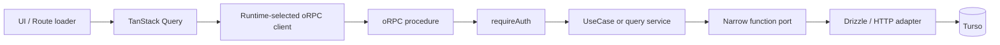

# 全画面 oRPC 移行設計

## Status

Approved。

PR #224 で確立した CreateTag pilot を、残る全 TanStack Start Server Function へ展開する。

本設計は、2026-08-23 の対話で承認された PR 分割、SSR 方針、mutation 契約、read cache ownership、検証手順を記録する。

## 目的

`src/features/**/functions/*.ts` を撤廃し、ブラウザと SSR の全データ経路を oRPC 契約へ統一する。

Application を transport と永続化実装から分離し、Expected Error、Boundary Rejection、Unexpected Error の責務を固定する。

Server Function と oRPC の共存期間を、独立してレビュー可能な 6 PR の範囲に限定する。

## 先行設計

次を正本として再利用する。

- PR #224 `feat: send CreateTag through oRPC instead of a Server Function`
- `docs/superpowers/specs/2026-08-22-application-architecture-evolution-design.md`
- `src/rpc/create-app-router.ts`
- `src/rpc/client.ts`
- `src/rpc/router.server.ts`
- `src/rpc/handle-request.server.ts`
- `src/rpc/query.ts`
- `src/features/tags/application/create-tag.ts`
- `src/features/tags/persistence/insert-tag.ts`

新しい汎用 Repository、独自 Result、Hono、`@orpc/valibot` は導入しない。

## 棚卸し

PR #224 merge 後に残る `createServerFn` は次の 13 件である。

| Topic     | Server Function                                                                                                                 |
| --------- | ------------------------------------------------------------------------------------------------------------------------------- |
| auth      | `getSession`, `ensureSession`                                                                                                   |
| tags      | `fetchShelfTags`, `fetchTags`, `getTag`, `touchTagLastUsed`, `updateTag`                                                        |
| bookmarks | `addBookmark`, `updateBookmark`, `deleteBookmark`, `fetchBookmarks`, `getBookmark`, `loadBookmarkForEdit`, `fetchBookmarkTitle` |

`functions/` 配下には Server Function 以外に `get-auth.server.ts`、`request-session.server.ts`、`fetch-page-title.server.ts` とその test も存在する。

Done 条件はディレクトリ自体の撤廃であるため、これらは責務に合う `server/` または `persistence/` へ移動する。

## PR 分割と順序

1. `feat/orpc-tags-update`
2. `feat/orpc-tags-read`
3. `feat/orpc-tags-touch`
4. `feat/orpc-bookmarks-create`
5. `feat/orpc-bookmarks-update`
6. `feat/orpc-bookmarks-read-delete`

第 1 波は tags の 3 PR とする。

3 PR は同じ時点の `main` から独立して分岐し、相互の branch を base にしない。

第 2 波は tags の 3 PR が `main` へ merge されたあと、bookmarks create と update をその時点の `main` から分岐する。

最終 PR は前 5 PR が merge されたあとに分岐する。

最終 PR が bookmark read、delete、title fetch、残る server helper の移動、`docs/architecture.md` の更新を担当し、単独で `functions/*.ts` が 0 件であることを証明する。

各 PR は `herdr worktree create --branch feat/orpc-<topic> --base main --no-focus` で作成する。

1 worktree は 1 topic と 1 PR だけを所有する。

## 目標経路



Application は `AppDb`、Drizzle、oRPC、HTTP、Cookie、React、TanStack Query を import しない。

Mutation は必要な能力だけを表す function port を持つ。

単純 read は UseCase や Repository を追加せず、Drizzle を閉じ込めた query service とする。

外部 HTTP と Expected Error の写像を持つ title fetch だけは、narrow port を持つ Application use case とする。

## Client と SSR

ブラウザ client は PR #224 の構成を維持する。

- `RPCLink`
- lazy `window.location.origin + '/api/rpc'`
- server 実行時は明示的に throw
- `ORPCError` かつ `UNAUTHORIZED` のときだけ sign-in へ redirect
- `createORPCClient(link)`
- `createTanstackQueryUtils(rpcClient)`

TanStack Router の loader は、初回 SSR では server、client navigation では browser で実行される。

SSR を維持するため、server-only module に request headers 付きの direct oRPC client を置く。

runtime client factory は server で direct client、browser で既存 `rpcClient` を返す。

両者は同じ `AppRouter` 型、procedure、TanStack Query key を使う。

server router、Drizzle、libsql、Better Auth server implementation は browser から runtime import しない。

`RPCHandler` の Strict GET 保護は無効化しない。

## Auth と protected shell

public `auth.session` procedure を追加する。

出力は次の安全な projection に限定する。

```ts
type SessionOutput = {
  readonly user: {
    readonly id: string
    readonly name: string
    readonly email: string
  }
} | null
```

session token や Better Auth 内部 session を client へ返さない。

`/_protected.beforeLoad` は runtime client で `auth.session` を呼ぶ。

未認証なら現在地を `redirect` に載せて sign-in へ移動する。

認証済み user は route context へ一度だけ載せ、子 loader の `ensureSession` 重複呼び出しを削除する。

`get-auth.server.ts` と request header を扱う helper は `src/features/auth/server/` へ移動する。

## Mutation 共通契約

全 mutation は `requireAuth` middleware を通す。

| 分類                          | 表現                             | HTTP |
| ----------------------------- | -------------------------------- | ---- |
| 未認証                        | `UNAUTHORIZED`                   | 401  |
| input validation              | oRPC validation error            | 4xx  |
| 名前、URL、タグ集合などの衝突 | procedure-specific defined error | 409  |
| 対象なし                      | procedure-specific defined error | 404  |
| 未知障害                      | throw                            | 500  |

Unknown Error を `Result.err` に潰さない。

procedure は Unknown Error を catch しない。

client へ内部 message、cause、SQLite error を返さない。

UI は `ORPCError.code` だけを表示用メッセージへ写す。

`UNAUTHORIZED` の mapper は `null` を返し、redirect とフォームエラーを重ねない。

`Error.name` と Application Error class 名による分岐は削除する。

mutation 成功後の refresh は `void router.invalidate().catch(console.error)` とし、DB commit 済みの成功を refresh failure で覆さない。

## UpdateTag

Application は `UpdateTag` function port だけに依存する。

port output は `updated`、`name-conflict`、`not-found` とする。

Application は `name-conflict` を `tag-name-already-exists`、`not-found` を `tag-not-found` へ写す。

Drizzle の update builder には `onConflictDoNothing` がない。

そのため update adapter は SQLite の `UPDATE OR IGNORE ... RETURNING` を使う。

重複名の事前 SELECT は行わない。

存在・所有権の SELECT は 404 判定にだけ使う。

実際の `(userId, normalizedName)` 制約で update が無視され、target が存在するのに returning が空なら `name-conflict` とする。

SQLite error code や message による分類は行わない。

## TouchTagLastUsed

Application は `TouchTag` function port だけに依存する。

adapter は actor の tag だけを update し、returning の有無を `touched` または `not-found` で返す。

UI は oRPC mutation として fire-and-forget し、session expiry は共通 interceptor に任せる。

## CreateBookmark

Application は transactional `InsertBookmark` function port だけに依存する。

adapter は次を同一 transaction で実行する。

1. 指定 tag の存在と actor ownership を検証する。
2. `(userId, url)` を conflict target に `onConflictDoNothing` で bookmark を insert する。
3. returning が空なら `duplicate-url` を返す。
4. bookmark-tag を insert する。
5. actor が所有する tag の `lastUsedAt` を更新する。

transaction 内の未知障害は rollback のため throw し、外側でも再 throw する。

別 user の tag を関連付けない。

## UpdateBookmark

現行 Application の `AppDb` と Drizzle import を削除する。

Application は transactional `UpdateBookmark` function port だけに依存する。

既存の `unexpected-error` Result variant は削除する。

Application は duplicate tag ID を domain rule で判定し、adapter output の `bookmark-not-found`、`duplicate-url`、`invalid-tag` を Expected Error へ写す。

adapter は actor ownership、tag ownership、bookmark update、bookmark-tag 全置換、tag `lastUsedAt` 更新を同一 transaction で実行する。

URL の重複事前 SELECT は削除する。

URL 更新は `UPDATE OR IGNORE ... RETURNING` とし、存在する target の returning が空なら `duplicate-url` とする。

## DeleteBookmark

Application は `SoftDeleteBookmark` function port だけに依存する。

adapter は actor が所有し、未削除の bookmark だけへ `deletedAt` と `updatedAt` を設定する。

returning が空なら `bookmark-not-found`、成功なら plain string ID を procedure から返す。

## Read queries

次の procedure を追加する。

- `tags.shelf`
- `tags.list`
- `tags.byId`
- `bookmarks.list`
- `bookmarks.detail`
- `bookmarks.editor`

query service は `UserId` と validation 済み input を受け、画面に必要な projection だけを返す。

branded ID は procedure 出口で number または string に戻す。

query service が対象なしを `null` で返した場合、procedure が 404 defined error へ変換する。

DB failure や不正な保存済み row は throw して 500 にする。

## Bookmark title fetch

title fetch は user action による POST procedure とし、`requireAuth` を通す。

Application は外部 fetch adapter の narrow port に依存する。

禁止 URL は `url-not-allowed` defined 4xx へ写す。

取得不能、title なし、対応外 content type は `null` 成功とし、手入力を継続できる。

未知障害だけを throw して 500 にする。

`fetch-page-title.server.ts` と test は `src/features/bookmarks/server/` へ移動する。

## TanStack Query ownership

`/_protected.loader` は `tags.shelf` の query options を `queryClient.ensureQueryData` で prefetch する。

`staleTime` は 5 秒とする。

初回 hydration 直後の重複 refetch を抑えつつ、tag 更新後の明示 invalidation を妨げない長さである。

sidebar、mobile shelf、bookmark list、`/tags` は同じ query key と cache を読む。

`/tags` loader の `fetchShelfTags` 重複呼び出しは削除する。

bookmark list、detail、editor も route loader で prefetch し、component は同じ query cache を読む。

load-more は offset 別 query key を `queryClient.fetchQuery` で取得し、既存の append UI を維持する。

この移行で `useInfiniteQuery` への作り替えは行わない。

## Test strategy

全 production behavior は test first で追加する。

各 test は実装前に期待理由で失敗することを確認する。

### Application

- narrow function port stub を使う。
- Drizzle fluent mock を使わない。
- success と全 Expected Error mapping を検証する。
- Unknown Error は `rejects.toThrow` で検証する。

### Persistence

- Vitest Node project で `:memory:` libsql を使う。
- 本番と同じ unique constraint と foreign key を作る。
- actor ownership を検証する。
- create conflict は actual `onConflictDoNothing` を検証する。
- update conflict は actual `UPDATE OR IGNORE ... RETURNING` を検証する。
- transaction failure で部分書き込みが残らないことを検証する。

### RPC

- 実 `RPCLink` の `fetch` を `handleRpcRequest` へ接続する。
- Cookie が `getSession(headers)` へ届くことを検証する。
- 401、該当 mutation の 409、404、500 を status と code で検証する。
- 500 response に内部 message と cause が含まれないことを検証する。
- branded ID が wire output に残らないことを type test する。
- SSR direct client に request headers が届くことを検証する。

### UI and source boundary

- `error.name` と旧 Error class 名が残らないことを source scan する。
- Server Function import が残らないことを source scan する。
- `UNAUTHORIZED` が汎用フォームエラーを返さないことを検証する。
- refresh rejection が mutation success を reject に変えないことを検証する。
- shelf の全 consumer が同じ query key を使うことを検証する。

## Verification

各 worktree で次を実行する。

```bash
pnpm run format:check
pnpm run lint
pnpm run typecheck
pnpm run test
pnpm run build
```

build 後の client chunks に次が含まれないことを確認する。

- `drizzle-orm`
- `@libsql`
- Better Auth server implementation
- `createAppRouter`
- `getDB`
- persistence adapter runtime code

対象画面では次を手動確認する。

- 正常系
- 名前または URL の 409
- session expiry の 401 と sign-in redirect
- 500 の詳細非漏洩と汎用表示
- desktop と mobile の主要操作

## Review workflow

Herdr の各実装 agent は TDD、全 check、self-review、commit、push、PR 作成まで担当する。

実装完了後、別 agent が spec compliance を review する。

spec review が通ったあと、さらに別 agent が code quality を review する。

指摘は元の実装 agent が修正し、同じ review を再実行する。

各 PR 本文は PR #224 の `Summary`、`Test plan`、`Auth / security`、`Server Function / domain`、`UI` を踏襲する。

実行した command、手動確認、bundle scan、削除した Server Function を本文へ記録する。

## Done

- `src/features/**/functions/*.ts` が存在しない。
- 全 browser/SSR data path が oRPC 契約を通る。
- Application が framework、transport、DB implementation を import しない。
- Application test に Drizzle fluent mock がない。
- mutation の 401、該当する 409、404、500 code 契約が統一されている。
- `UNAUTHORIZED` は client interceptor だけが redirect として扱う。
- UI の Error class 名分岐が 0 件である。
- shelf query の二重取得がない。
- browser bundle に server-only code がない。
- 既存 check がすべて成功する。
- 6 topic がそれぞれ独立した PR になっている。
